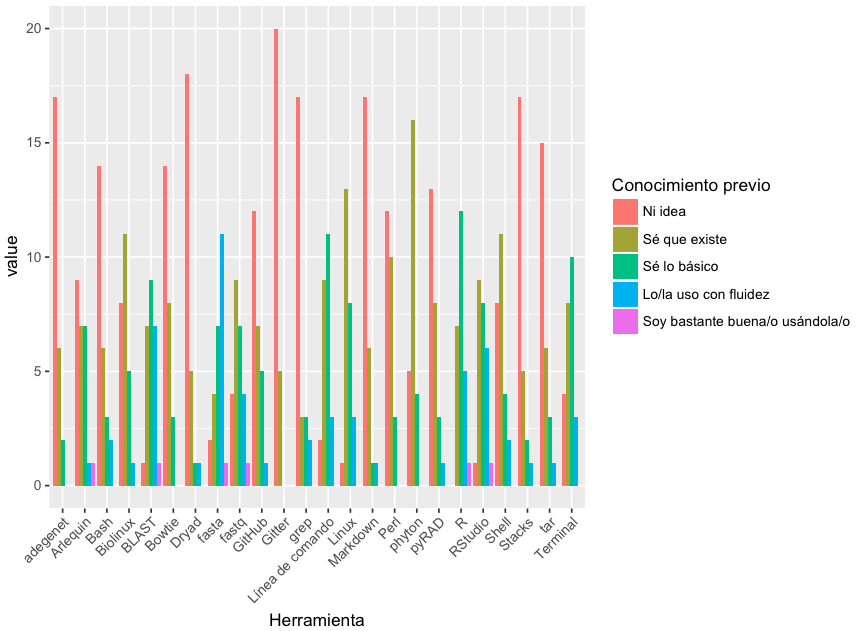
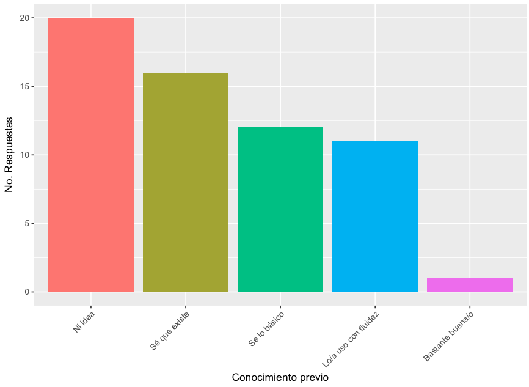
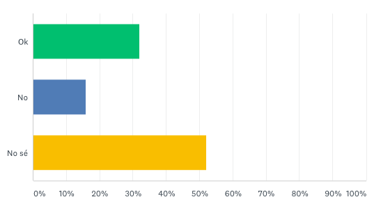
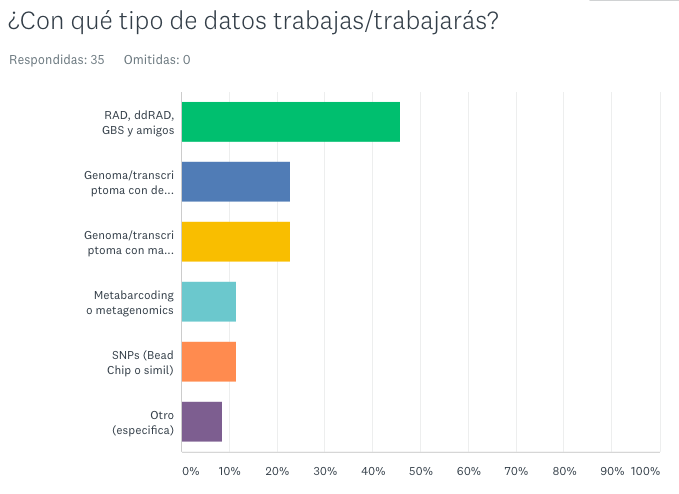
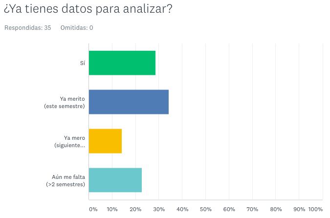
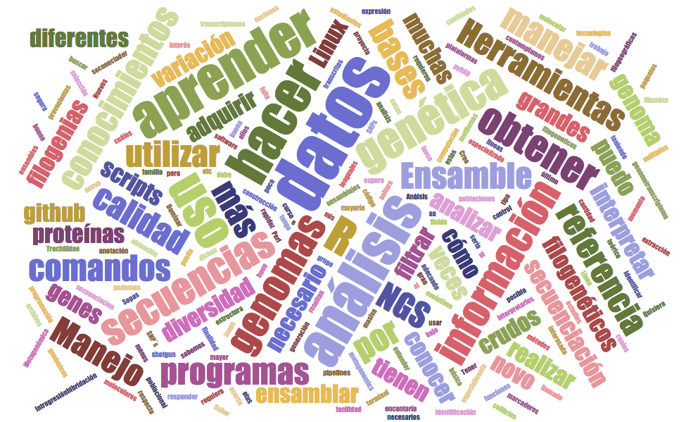
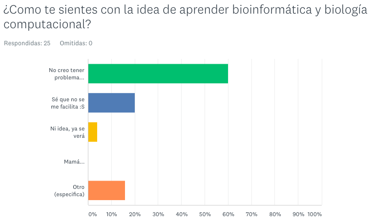

# Bienvenida

Quienes estudiamos biología y decidimos dedicarnos al estudio de la evolución, o cualquier tema que involucre datos genéticos, necesitamos utilizar herramientas de cómputo y lenguajes de programación. Sin embargo nuestros planes de estudio no contemplan esta formación y de algún modo se pretende que aprendamos por nosotras mismas lo que en otras carreras (matemáticas, ciencias de la computación, genómicas y varios otros) es enseñado en varios semestres. 

Este fenómeno se extiende a través de universidades por todo el mundo. Una historia común es que los investigadores (sean estos asesore/as o estudiantes) deciden que tal o cual técnica de obtención de datos genómicos es ideal para responder tales o cuales preguntas biológicas, realizan el trabajo de laboratorio, una empresa les entrega los datos genómicos y luego pasa el tiempo sin que nadie sepa bien a bien cómo masticar los datos. O peor aún, los datos son analizados al *ahí se va*, están llenos de ruido que pudo haber sido filtrado y terminan en una publicación irreproducible y sin mucho significado biológico. En una versión un poco más feliz de la historia, una o un estudiante logra aprender sobre la marcha las herramientas que necesita y realiza los análisis. Meses después de lo planeado, pero lo logra. Historia feliz, salvo que esos meses después de lo planeado podrían haberse acortado significativamente con un poco de enseñanza formal y recomendaciones de que sí hacer y que no. 

**Bienvenidas y bienvenidos**, ojalá que les sirva este curso.

### Que sí es este curso

* Una introducción a los métodos y mejores prácticas de la biología computacional, los análisis bioinformáticos y la ciencia reproducible.
* Un resumen general de los tipos de datos utilizados en genómica y las herramientas computacionales para analizarlos.
* Una introducción para saber utilizar la línea de comando y R de forma fluida a través de mucha práctica. **Muchos cursos enfocados en análisis de datos genómicos asumen que ya sabes esto, o dan una introducción flash y luego saltan al otro tema, lo que hace  _muy difícil_ realmente aprovechar el otro tema o te deja con malas prácticas difíciles de borrar.**
* El lenguaje para aprender a entender los manuales de cualquier software bioinformático para poder utilizarlo a fondo por cuenta propia.
* Un curso con mucha práctica de R enfocado en ciencia reproducible, limpieza y graficación de datos biológicos y genéticos.
* El piso básico para poder tomar un curso más avanzado o adentrarse por uno mismo en algún análisis concreto (ensamblado de genomas, análisis transcriotómicos, filogenética con métodos Bayesianos, etc).

### Que NO es este curso

* La respuesta a qué tienes que hacer en tu proyecto de tesis. 
* Una discusión profunda de los diferentes softwares para analizar datos GBS, RAD, genomas, transcriptomas, metabarcoding, etc.

En otras palabras en este curso no te vamos a decir qué programa utilizar ni discutir a profundidad métodos de ensamblado etc. Para eso hay cursos especializados intensivos de un par de días que asumen ya sabes usar chido la terminal.

Algunos ejemplos:

* [Curso Bioinformática Instituto de Biotecnología, Cuernavaca](http://uusmd.unam.mx/curso/).
* [Talleres Internacionales de Genómica del Centro de Ciencias Genómicas, Cuernavaca](http://congresos.nnb.unam.mx/TIB2017/)

## ¿De dónde empezamos?

Aquí algunos resultados del sondeo que les pedí contestaran:

El conocimiento con el que llegan:

**sudo make me a sanwich**

La naturaleza de sus datos:

Sus expectativas del curso:

Cómo se sienten:

Ya veremos a donde llegamos.

