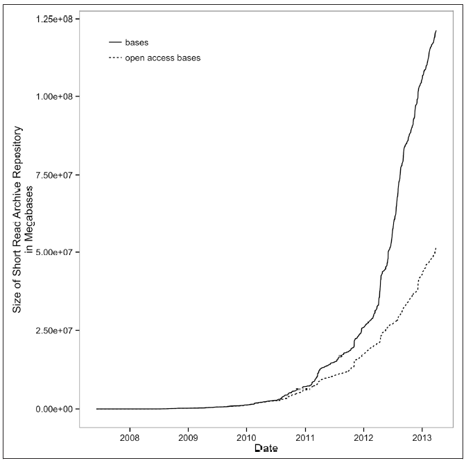
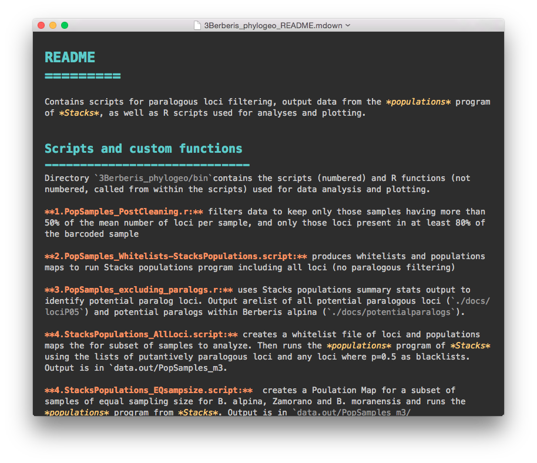

# Unidad 1 Bioinformática e investigación reproducible 


Lecturas para esta unidad: 

* Ideology: Data Skills for Robust and Reproducible Bioinformatics. Capítulo 1 de Buffalo V (2015) Bioinformatics data skills.
    
* [Guía ROpenSci de reproducibilidad](http://ropensci.github.io/reproducibility-guide/sections/checklist/)


## Biología y computadoras:

* **Biología Computacional**: estudio dela biología utilizando cómputo. Su objetivo es generar conocimiento biológico. 
    * Utilizar las herramientas hechas por alguien más para contestar tus preguntas.

* **Bioinformática**: creación de herramientas (algoritmos, software) para solucionar problemas con datos biológicos. 
    * Generar tus propias herramientas para contestar tus preguntas.


Como biólogo/as evolutivos utilizamos ambas:

 La mayoría de la investigación que se publica recientemente utilizó una mezcla de los programas de alguien más (sobretodo en los primeros pasos del procesamiento de datos) y después se utilizan **funciones**  propias para realizar análisis más específicos. 

Este curso empieza por biología computacional y deriba en la posibilidad de que crees tu propio código para analizar tus datos. 

Aunque la Biología Computacional y la Bioinformática no son lo mismo, tienen mucho en común y se apreden juntas. De aquí en adelante me referiré a análisis bioinformáticos, pero implica ambos tipos de disciplinas.


## 1.1. Reproducibilidad y documentación de análisis bioinformáticos


#### Investigación reproducible

Que dos personas hagan el mismo experimiento y obtengan el mismo resultado es parte del corazón mismo de la ciencia.

Hacer **investigación reproducible** es poder repetir y obtener los mismos resultados de un trabajo científico. Para esto es necesario **que el producto de la investigación incluya**:

* Artículo científico (o tesis),
* Descripción de materiales y métodos,
* Datos utilizados,
* Código de cómputo utilizado,
* Versión del software utilizado,
* Cualquier otra información necesaria para repetir los experimentos y análisis


#### La crisis de la reproducibilidad

Vamos a ver [qué se ha publicado al respecto](https://scholar.google.com/scholar?q=reproducibility%20crisis&btnG=Search&as_sdt=800000000001&as_sdtp=on).

[The science ‘reproducibility crisis’ – and what can be done about it, The Conversation 2017](https://theconversation.com/the-science-reproducibility-crisis-and-what-can-be-done-about-it-74198) es un buena síntesis comentada de la situación. En resumen, en cuanto la comunidad científica de diferentes áreas nos sentamos a intentar repetir experimentos y análisis publicados, descrubrimos que los resultados no son reproducibles. Una [encuesta en Nature](https://www.nature.com/polopoly_fs/1.19970.1469695948!/menu/main/topColumns/topLeftColumn/pdf/533452a.pdf?origin=ppub) encontró que 52% de lxs investigadorxs creen que hay una crisis significativa de reproducibilidad, y 32% que hay una crisis menor.  


Esto no sólo es una pérdida de esfuerzo de investigación y dinero, sino que puede llevar a "perseguir" explicaaciones erroneas e incluso desarrolar tratamientos médicos que no funcionan. Por ejemplo el [Reproducibility Project: Cancer Biology](https://elifesciences.org/collections/9b1e83d1/reproducibility-project-cancer-biology) ha encontrado que artículos claves para el desarrollo de nuevos tratamientos vs cáncer no son reproducibles.


**Lo que las revistas dicen al respecto**

**Fragmentos de [Berg (2018) Progress on reproducibility *Science*](http://science.sciencemag.org/content/359/6371/9.full).**

(**negritas mías**)

_A framework has been developed to promote transparency and openness in scientific publications—the [Transparency and Openness Promotion (TOP) guidelines](http://science.sciencemag.org/content/348/6242/1422.full) [...]
**The editors at Science have adjusted practices based on these policies** and have gained experience with many of these issues. We fully support the principles behind these guidelines, including the centrality and benefits of transparency, as captured in our editorial principle that “all data and materials necessary to understand, assess, and extend the conclusions of the manuscript must be available to any reader”_

[...]

_**Over the past year, we have retracted three papers previously published in Science. The circumstances of these retractions highlight some of the challenges connected to reproducibility policies**. In one case, the authors failed to comply with an agreement to post the data underlying their study. Subsequent investigations concluded that one of the authors did not conduct the experiments as described and fabricated data. Here, the lack of compliance with the data-posting policy was associated with a much deeper issue and highlights one of the benefits of policies regarding data transparency. In a second case, some of the authors of a paper requested retraction after they could not reproduce the previously published results. Because all authors of the original paper did not agree with this conclusion, they decided to attempt additional experiments to try to resolve the issues. These reproducibility experiments did not conclusively confirm the original results, and the editors agreed that the paper should be retracted. This case again reveals some of the subtlety associated with reproducibility. In the final case, the authors retracted a paper over extensive and incompletely described variations in image processing. This emphasizes the importance of accurately presented primary data._


**Fragmentos del [Author Guidelines de Molecular Ecology](http://onlinelibrary.wiley.com/journal/10.1111/(ISSN)1365-294X/homepage/ForAuthors.html)**


*Data Storage and Documentation*

*Archiving of data in a publicly accessible repository is mandatory for publication in Molecular Ecology.*

[...] 

*Molecular Ecology requires authors to archive the data supporting their results and conclusions along with sufficient details so that a third party can interpret them correctly. Papers with exemplary data and code archiving are more valuable for future research, and, all else being equal, will be given higher priority for publication.*

_Good practices:_

* _Data should be archived in an appropriate public archive, such as GenBank, Gene Expression Omnibus, TreeBASE, Dryad, FigShare, the Knowledge Network for Biocomplexity, your own institutional or funder repository, or as Supporting Information on the Molecular Ecology web site._
*    _The utility of archived data is greatly enhanced when the scripts and input files used in the analyses are also made available._
*    _Given that scripts may be a mix of proprietary and freely available code, their deposition is not compulsory, but we nonetheless strongly encourage authors to make these scripts available whenever possible._
*    _Software and documentation may be made accessible from a long-term server (e.g., github), however, at least a snapshot of these resources must be posted on Dryad, CRAN (or similar academic/publishing archiving sites) with a link to a long-term server where software development and future releases can be found such that continued access to these resources is ensured._ 


#### Reproducibilidad en bioinformática 

* Datos genéticos: 
    * Big Data
    * Mucha información, y creciendo

*Crecimiento del Short Read Archive. Tomado de Buffalo (2015)*

    * Requieren procesamiento intermedio de datos crudos a los datos en las figuras.
* Análisis de datos genéticos requieren forzosamente bioinformática y/o biología computacional. 
* Por lo tanto:
   - Depeden de software especializado 
   - Sus resultados pueden varias dependiendo de las (muchas) opciones y parámetros utilizados
   - La descripción en "Métodos" no basta para poder repetir el análisis
* **El código** 
   - Es indispensable para poder **repetir** y **mejorar** los análisis 
   - Puede arrojar errores "silenciosos" que sin embargo afecten significativamente los resultados

* Dos reglas de la bioinformática:
   - Si entra basura, basura sale.
   - Jamás de los jamaces confíes en tus herramientas (*The Golden Rule of Bioinformatics* de Buffalo).

 
#### ¿Reproducible para quién?

**1. Quién hizo la investigación, 6 meses (ó 6 días) después**

Evitar:

* ¿Cómo chingaos era esto?
* El archivo bueno es final.xlsx. No, espera, tal vez sea final_elbueo.xlsx. Deja reviso la última fecha de modificación. Hum....
* Ahorita me acuerdo.

Ganar:

* Volver a correr fácilmente los mismos datos con pequeñas modificaciones a los parámetros o datos input.
* Reutilizar código o datos para nuevos análisis
* Confianza en tus resultados

**2. Tus colegas y asesor/a**

No temer decir que sí a:

* ¿Me ayudas a hacer este análisis?
* ¿Puedes repetir esta gráfica agregando este dato nuevo? 

**3. La comunidad científica**

* Corroborar resultados
* Construir sobre lo construido


## 1.2. Repositorios de datos

### ¿Materiales suplementarios?

Contras:

* Limitación de tamaño (MB) o número de archivos
* Complicados para conjuntos de datos grandes y de formatos específicos
* Oscuros y difíciles de rastrear y citar


### Especializados en datos genéticos
* [NCBI Gene Bank](http://www.ncbi.nlm.nih.gov/genbank/). Banco de datos genéticos desde la secuenciación Sanger. Seguor ya lo conocen.
* [Sequence Read Archive (SRA)](http://www.ncbi.nlm.nih.gov/sra). Rama de NCBI dedicada a datos de secuenciación masiva. 
* [BOLD](http://www.boldsystems.org/). Dedicado a datos del "barcode de la vida".
* Y varios más 


### Dryad
[Dryad Digital Repository](http://datadryad.org/) es un repositorio de datos digitales de *cualquier tipo* siempre y cuando sean parte de una publicación científica. 

Acepta archivos excel, scripts, alineamientos de secuencias de ADN, datos semi-crudos y cualquier archivo digital que sea necesario para repetir una investigación.

Muchas revistas científicas piden como requisito que los datos estén en Dryad además de en NCBI o símil.


### Otros
Checa otros repositorios de datos [aquí](http://ropensci.github.io/reproducibility-guide/sections/dataStorage/).


### Artículos de datos
Son artículos enfocados en describir un **set de datos**, incluyendo todos los aspectos técnicos y formatos para que puedan ser fácilmente reutilizados. 

Ejemplos:

* [Scientific data](http://www.nature.com/sdata/about/principles)

* [Data Report en Frontiers](http://journal.frontiersin.org/journal/genetics#article-types)

* [Genomics Data](http://www.journals.elsevier.com/genomics-data/)

### Un buen README 

* "Leeme".
* Un archivo de texto (no Word, pero puede ser MarkDown) que detalla:
   * **Qué hay** dentro del repositorio (y cada uno de sus directorios).
   * **Qué hacen** cada una de las funciones/scripts del repositorio
   * **Cómo y en qué órden** deben ocuparse los scripts para realizar los análisis
* Ejemplo:
    * [Este](http://datadryad.org/resource/doi:10.5061/dryad.n3jk5) repositorio de datos está dividido en varias secciones. La 3ra se ve así:


Y si abres el README.mdwon verás algo así (los colores y el fondo negro son porque lo abrí con el editor MacDown, pero es un vil archivo de texto):

 

## 1.3. Código en computación

* Instrucciones escritas **para una computadora** en un **lenguaje de cómputo**   
* Paso por paso hasta una solución.
* El código es uno o varios **archivos de texto** (¡NO WORD!, *plain text*).
* El código puede ser muy largo y formar un programa (**software**) entero o de una sóla línea para realizar una única operación.
* Escribir código para que lo ejecuten las computadoras y **comentado** para seres humanos.


## 1.4. Scripts y repositorios de código

Un **script** es un archivo de nuestros análisis que es:

* un archivo de texto plano (**¡¡NO WORD!!**)
* permanente,
* repetible,
* antoado,
* compartible y 
* compatible con otras plataformas

En otras palabras, un script es una recopilación por escrito de las instrucciones que queremos que la computadora corra, de modo que al tener esas instrucciones cualquiera pueda repetir el análisis tal cual se hizo. 

El script consta de dos tipos de texto: 

**1.** El **código** (comandos) que queremos que se ejecute, en el órden que queremos que lo ejecute.

Es decir lo mismo que escribiríamos en la Terminal para hacer un análisis, pero guardado en un archivo de texto que tiene todos los comandos juntos y que podemos abrir para **repetir** o **compartir** el análisis.

**2.** Comentarios escritos **para un ser humano** en un **lenguaje de humanos**, dígase no solo en español, sino que nos permita entender qué hace el código, qué tipo de información requiere y cualquier otra cosa que una persona cualquiera necesite para poder utilizar el código del script de forma correcta.


Para que la computadora distinga entre el código y los comentarios para humanos se utiliza el símbolo `#`. Todo el texto a la *derecha* del símbolo `#` será ignorado por la computadora, aunque sí "se imprima" en la Consola. 

Por ejemplo, el texto siguiente es un estracto de un script para correr Admixture:

```
# run admixture using K=3  multithreaded mode, fixed random seed and bootstraping to estimate standar erros.
cd ../admixture
./admixture_macosx-1.23/admixture ../data/SNPs/nuevos_final.bed 3 -j4 -s 21 -B
```


### ¿Por qué compartir nuestro código?

* Reproducibilidad de la cienica
* Construir sobre lo construído y hacer mejor el código antes. Más en el artículo: 
 [Openness makes software better sooner](http://www.nature.com/news/2003/030623/full/news030623-6.html)

### Excusas comunes para no compartir nuestro código
* Me da pena que vean mi código
* No quiero que otros saquen provecho de mi código, me pertenece o a mi institución
* Otros no publican su código ¿por qué yo sí?
* Me da flojera pulir mi código para publicarlo
* Si publico mi código le van a encontrar errores y demandar correcciones o ayuda

Si respondiste sí (o tus colaboradores) a cualquiera de los anteriores checa esta lectura recomendada: [Publish your computer code: it is good enough](http://www.nature.com/news/2010/101013/full/467753a.html) de Nick Barnes.


### ¿Cómo compartir código?

* Scripts **comentados** y con un **README**
* Repositorio de código
   * Dryad (como parte del repositorio de datos)
   * [GitHub](https://github.com/) (mejor para funciones y projectos que continuarán actualizándose).


### GitHub
 
Es un repositorio de código que:

* Utiliza `git` para llevar un sistema de **control de versiones**,
* Tiene una interfase Web pública
* Permite escribir/revisar código en equipo
* Su símbolo es un gatopulpo. 


## 1.5. Una *habilidad* indispensable en bioinformática

El objetivo de esta clase no es darte un manual completo para resolver cualquier cuestión bioinformática, sino darte las habilidades y herramientas para que llegues por tí misma a las soluciones. Para esto hay una habilidad indispensable: **buscar ayuda en internet**. La enorme mayoría de las preguntas que te hagas sobre bioinformática y programación en general, sobre todo al principio, **son las mismas dudas que tuvieron otros antes** y, casi seguro **las respuestas ya están en algún lugar del internet**. Y si nadie a escrito con tu duda, puedes preguntar. 

Las respuestas a muchas de las tareas que dejaré aparecen en los primeros resultados si haces la búsqueda correcta en internet. De hecho, a veces parte de la tarea será que *se te ocurra cómo buscar* la solución en internet. Esto está perfectamente bien y es muuuy distinto a copiarle a un compañero. Saber buscar ayuda e información en interent es una habilidad básica del siglo XXI. 

Por esto estoy 100% de acuerdo con xkcd, no tienes que saberlo todo de memoria. Se vale tener una *Mente extendida* llamada internet:


**¿Dónde pedir ayuda?**

* Google o Duckgogo o el motor de búsqueda que uses.

* [Stacksoverflow](https://stackoverflow.com/): es un foro de ayuda para programación en general, viene dividido por lenguajes. La gente hace preguntas y contesta. Es como un yahoo answers super pro, lxs programadorxs con muchas preguntas respondidas ganan puntos que son algo muy visible para un CV con ese perfil. Este foro es mejor para dudas de bash, R, python y no de programas genéticos.

* [Biostars](https://www.biostars.org/) es parecido a Stacksoverflow un foro de ayuda especializado en Bioinformática. Aquí sí puedes hacer preguntas enfocadas en datos y software genético, por ejemplo cómo mover de un formato de genomas a otro.

* Grupos de usuarios de un software. Por ejemplo [este de Stacks](https://groups.google.com/forum/#!forum/stacks-users). Son ideales para aclarar detalles específicos y mensajes de error de **ese** software (ie, no de dudas de cómo usar la línea de comando). La comunidad es súper chida y muchas veces lxs autores del software son quiénes responden. 


**Tips sobre cómo pedir/buscar ayuda**

* Busca en inglés

* Piensa bien cuáles son las **palabras clave de tu pregunta** y cómo **generalizar** tu caso a algo que cualquiera entienda y que no sea específico a tu computadora. Por ejemplo "How to list files in a directory using the Terminal?" es mucho mejor mejor que "which files are in Manzanas" (tu y yo sabemos que Manzanas es un directorio, pero no el mundo).

* Si vas a pedir ayuda en un foro, lee las reglas y tipo de preguntas atentidas por el foro antes de preguntar. 

* Sigue estas recomendaciones de Stacksoverflow sobre [cómo redactar una buena pregunta](https://stackoverflow.com/help/how-to-ask)

* Si recibes un mensaje de error en la Terminal, R, etc. Copia-pégalo a tu motor de búsqueda favorito.


<div style="page-break-after: always;"></div>
