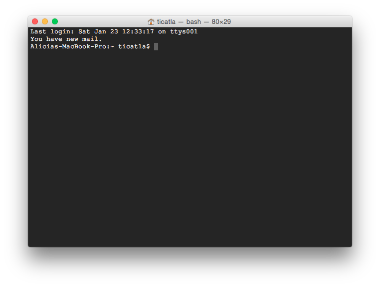
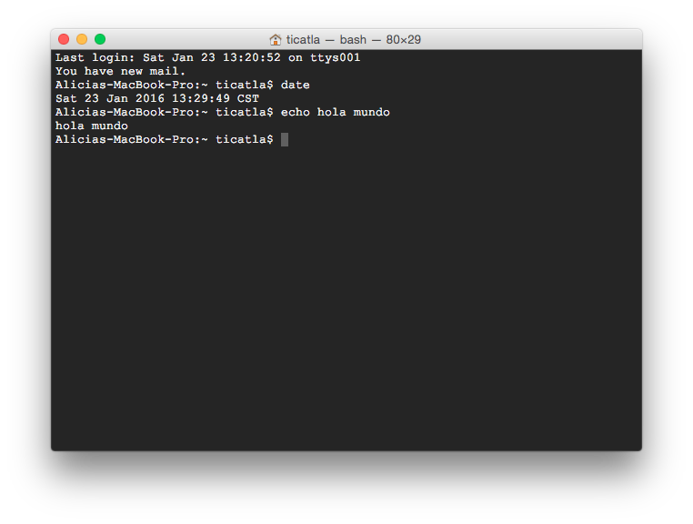
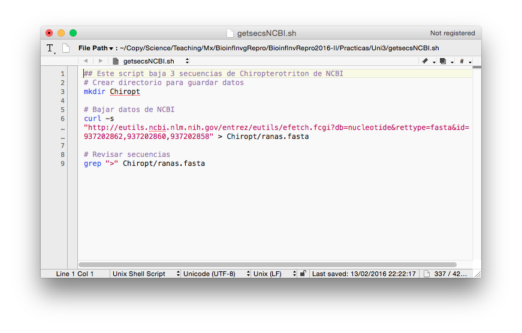
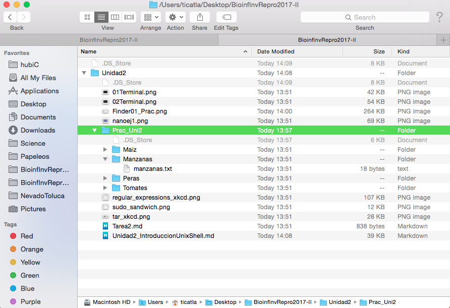
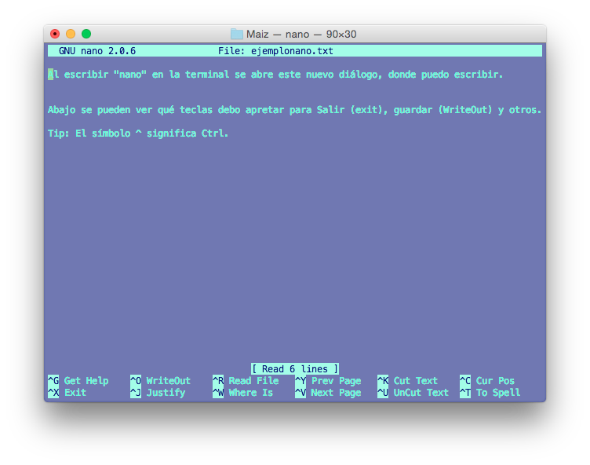

# Unidad 1: Introducción a la programación


## Código en computación

* Instrucciones escritas **para una computadora** en un **lenguaje de cómputo**   
* Paso por paso hasta una solución.
* El código puede ser muy largo y formar un programa (**software**) entero o de una sóla línea para realizar una única operación.
* Escribir código para que lo ejecuten las computadoras y **comentado** para seres humanos.


## Cómo buscar ayuda (permanentemente)

Una *habilidad* indispensable en bioinformática

El objetivo de esta clase no es darte un manual completo para resolver cualquier cuestión bioinformática, sino darte las habilidades y herramientas para que llegues por tí misma a las soluciones. Para esto hay una habilidad indispensable: **buscar ayuda en internet**. La enorme mayoría de las preguntas que te hagas sobre bioinformática y programación en general, sobre todo al principio, **son las mismas dudas que tuvieron otros antes** y, casi seguro **las respuestas ya están en algún lugar del internet**. Y si nadie a escrito con tu duda, puedes preguntar. 

Las respuestas a muchas de las tareas que dejaré aparecen en los primeros resultados si haces la búsqueda correcta en internet. De hecho, a veces parte de la tarea será que *se te ocurra cómo buscar* la solución en internet. Esto está perfectamente bien y es muuuy distinto a copiarle a un compañero. Saber buscar ayuda e información en interent es una habilidad básica del siglo XXI. 

Por esto estoy 100% de acuerdo con xkcd, no tienes que saberlo todo de memoria. Se vale tener una *Mente extendida* llamada internet:


* Google o Duckgogo o el motor de búsqueda que uses.

* [Stacksoverflow](https://stackoverflow.com/): es un foro de ayuda para programación en general, viene dividido por lenguajes. La gente hace preguntas y contesta. Es como un yahoo answers super pro, lxs programadorxs con muchas preguntas respondidas ganan puntos que son algo muy visible para un CV con ese perfil. Este foro es mejor para dudas de bash, R, python y no de programas genéticos.

* [Biostars](https://www.biostars.org/) es parecido a Stacksoverflow un foro de ayuda especializado en Bioinformática. Aquí sí puedes hacer preguntas enfocadas en datos y software genético, por ejemplo cómo mover de un formato de genomas a otro.

* Grupos de usuarios de un software. Por ejemplo [este de Stacks](https://groups.google.com/forum/#!forum/stacks-users). Son ideales para aclarar detalles específicos y mensajes de error de **ese** software (ie, no de dudas de cómo usar la línea de comando). La comunidad es súper chida y muchas veces lxs autores del software son quiénes responden. 


**Tips sobre cómo pedir/buscar ayuda**

* Busca en inglés

* Piensa bien cuáles son las **palabras clave de tu pregunta** y cómo **generalizar** tu caso a algo que cualquiera entienda y que no sea específico a tu computadora. Por ejemplo "How to list files in a directory using the Terminal?" es mucho mejor mejor que "which files are in Manzanas" (tu y yo sabemos que Manzanas es un directorio, pero no el mundo).

* Si vas a pedir ayuda en un foro, lee las reglas y tipo de preguntas atentidas por el foro antes de preguntar. 

* Sigue estas recomendaciones de Stacksoverflow sobre [cómo redactar una buena pregunta](https://stackoverflow.com/help/how-to-ask)

* Si recibes un mensaje de error en la Terminal, R, etc. Copia-pégalo a tu motor de búsqueda favorito.


## Introducción a la consola y línea de comando de bash y R

Vamos a abrir la terminal. Debe ser un ícono parecido a este. En Ubuntu debe estar por default en tu dock. Si no lo encuentras tanto en Mac como en Ubuntu prueba buscar "Terminal" o "Console".


Tu terminal abierta debe verse parecida a esta:



La primera línea dice la fecha y hora y "ttys001". ttys viene de "Teletype" ([un poco de historia aquí](http://stackoverflow.com/questions/4532413/what-is-tty-on-freebsd)) y significa que el *input* es nuestro teclado, identificado como ttys001. 

En mi caso la segunda línea me dice que tengo correo. Uds probablemente no tengan esto.

La tercera línea es la más importante: dice el **nombre del equipo** (Alicas-MacBook-Pro en este caso), el **directorio** donde estoy (`~` significa "home directory", lo veremos más adelante) y el **nombre del usuario** con quién estoy en la terminal (en mi caso ticatla). 

Notarás que la tercera línea termina en `$`

`$` significa que la terminal está corriendo con un interpretador Shell o Bash y por un usuario sin mayores privilegios. Si termina en `#` significa que la estás corriendo como **root** que es un "súper usuario" con permisos para desconfigurarlo todo, ten cuidado. 


#### ¿Qué significa que La Terminal tenga un interpretador? 

Que le damos comandos y nos responde. 

El la Terminal no existe el *point and click*. El que funcione como una Línea de Comando significa que tienes que darle comandos de qué hacer línea por línea. 

Por ejemplo:

`date` nos responde la fecha actual

`echo algo` nos responde el texto "algo". También lo puedes utilizar con más de una palabra. 

`echo hello world`

Algo así debe verse tu terminal:



Pero por practicidad y para facilitar el copiar-pegar en vez de la imágen de la Terminal pondré los comandos (código) y sus resultados, así:

```
Alicias-MacBook-Pro:~ ticatla$ date
Sat 23 Jan 2016 14:46:06 CST
Alicias-MacBook-Pro:~ ticatla$ echo algo
algo
Alicias-MacBook-Pro:~ ticatla$ echo hello world
hello world
```

Que es lo mismo que:

```
$ date
Sat 23 Jan 2016 14:46:06 CST
$ echo algo
algo
$ echo hello world
hello world
``` 
 
Para facilidad visual, de aquí en adelante utilizaremos la opción con el texto a partir de `$` (al menos que sea pertinente ver lo que hay antes). Este tipo de formato te lo encontrarás en diversos foros de ayuda, libros de textos y manuales.

**Ojo** Se pone `$` solo para **distinguir** que lo que sigue es un comando que debes poner en la Terminal, por lo que **NO** debes copiar los comandos a tu terminal incluyendo el `$`.
 

**Pregunta**: ¿Qué pasa si intentas correr el comando  `algo`?:

La terminal dirá:

    -bash: algo: command not found

Que quiere decir que no existe el comando `algo`. 

De igual forma si corres `$ date` (incluyendo el `$`) te dirá que no existe el comando `$`, aunque `date` sí sea un comando.


La práctica hace al maestro. A continuación veremos algunos de los comandos básicos, pero para practicar más parte de la tarea será resolver los siguientes cursos prácticos:

* Terminar el curso [Learn the Command Line de CodeAcademy](https://www.codecademy.com/learn/learn-the-command-line).

* Adentrarse en el bosque con este [juego de bash](http://web.mit.edu/mprat/Public/web/Terminus/Web/main.html).

### La terminal de R

`R` es un programa que funciona con la línea de comando y por lo tanto puede correrse desde la terminal de varias formas o en su propia terminal.

```{bash}
$ R
R version 3.2.2 (2015-08-14) -- "Fire Safety"
Copyright (C) 2015 The R Foundation for Statistical Computing
Platform: x86_64-apple-darwin13.4.0 (64-bit)

R is free software and comes with ABSOLUTELY NO WARRANTY.
You are welcome to redistribute it under certain conditions.
Type 'license()' or 'licence()' for distribution details.

  Natural language support but running in an English locale

R is a collaborative project with many contributors.
Type 'contributors()' for more information and
'citation()' on how to cite R or R packages in publications.

Type 'demo()' for some demos, 'help()' for on-line help, or
'help.start()' for an HTML browser interface to help.
Type 'q()' to quit R.

> 1+1
[1] 2
> quit()
```

Con `quit()` salgo de la Terminal de R y vuelvo a la Terminal de bash.

R también tiene su propia terminal (lo que sale cuando abres R via su ícono). Sin embargo, nosotros ocuparemos RStudio, que es una interfaz visual que integra la terminal de R con varias funcionalidades útiles e intuitivas.

 
## Introducción a los Scripts

Un **script** es un archivo de nuestros análisis que es:

* un **archivo de texto plano** (¡¡NO WORD!!)
* permanente,
* repetible,
* anotado,
* compartible 

En otras palabras, un script es una recopilación por escrito de las instrucciones que queremos que la computadora corra, de modo que al tener esas instrucciones cualquiera pueda repetir el análisis tal cual se hizo. 

El script consta de dos tipos de texto: 

**1.** El **código** (comandos) que queremos que se ejecute, en el órden que queremos que lo ejecute.

Es decir lo mismo que escribiríamos en la Terminal para hacer un análisis, pero guardado en un archivo de texto que tiene todos los comandos juntos y que podemos abrir para **repetir** o **compartir** el análisis.

**2.** Comentarios escritos **para un ser humano** en un **lenguaje de humanos**, dígase no solo en español, sino que nos permita entender qué hace el código, qué tipo de información requiere y cualquier otra cosa que una persona cualquiera necesite para poder utilizar el código del script de forma correcta.


Para que la computadora distinga entre el código y los comentarios para humanos se utiliza el símbolo `#`. Todo el texto a la *derecha* del símbolo `#` será ignorado por la computadora, aunque sí "se imprima" en la Consola. 

Por ejemplo, el texto siguiente es un estracto de un script para correr Admixture:


```
#### Admixture

## For Juniperus
mkdir -p ../genetic/JmINGP/out.noreplicates/popstructure
cd ../genetic/JmINGP/out.noreplicates/popstructure

# recode plink to needed formats
cp ../batch_1.plink.* ./
plink --file batch_1.plink --maf 0.05 --geno .2 --make-bed --out batch_1.plink --noweb --allow-no-sex

# run admixture using multithreaded mode, fixed random seed and corss-validation procedure to choose the correct value 
for K in 1 2 3 4 5 6 7 8 9 10 11 12 13;
do ../../../../bin/admixture --cv batch_1.plink.bed  $K -j4  -s 21 | tee log${K}.out; done

# Check CV
grep -h CV log*.out

# back to bin
cd ../../../../bin

```

El script completo está en un **archivo de texto** llamado [example_script_runadmixture.sh](./Prac_Uni1/example_script_runadmixture.sh)


### Cómo hacer un script

Ya hemos visto que un script es un archivo de texto con código y comentarios. Esta es una generalidad cierta para cualquier lenguaje de programación (aunque los comentarios no son obligatorios se recomienda mucho).

Sin embargo los scripts que corremos desde la Terminal Unix, es decir scripts de *Bash* o *Shell* requiren de 3 pasos para **convertirse en software**:

1. Escribir los comandos a un archivo de texto (escribir el script).
2. Indicarle al sistema operativo (computadora) que programa (lenguaje) debe utilizar para *interpretar* los comandos
3. Darle al *archivo* los *permisos* que necesita para poder ser *ejecutado por Shell*.

### Escribir el script

Escribir un script es escribir en un **editor de texto** los comandos para resolver un problema, de preferencia comentando cada paso.

Una buena forma de escribir un script es:

1. Escribir el algoritmo, es decir los pasos que queremos hacer.
2. Marcar dichos pasos como comentarios (recuerda el uso de `#` para indicar que el texto a su derecha es un comentario, no un comando).
3. Escribir el código para hacer cada paso debajo del comentario correspondiente. 

Ejemplo:

* Algoritmo para guardar secuencias de *Chiropterotriton*
 
```
Definir secuencias a bajar desde NCBI
Crear directorio para guardar datos
Bajar datos al directorio deseado
Revisar secuencias
Fin
```

* Algoritmo + código para bajar secuencias de *Chiropterotriton*:

```
## Este script baja 3 secuencias de Chiropterotriton de NCBI
# Crear directorio para guardar datos
mkdir Chiropt

# Bajar datos de NCBI 
curl -s "https://eutils.ncbi.nlm.nih.gov/entrez/eutils/efetch.fcgi?db=nucleotide&rettype=fasta&id=937202862,937202860,937202858" > Chiropt/ranas.fasta

# Revisar qué secuencias se bajaron
grep ">" Chiropt/ranas.fasta
```

**Observación**: una ventaja de los scripts es que nos permiten tener en un solo documento *varios* comandos que se utilizaron para hacer algo, es decir, conforme se complican los análisis necesitamos más de una línea de comando para realizarlos.

Si haces los análisis de tu trabajo en la terminal sin tenerlos en un script es como platicar la introducción de tu tesis sin haberla escrito nunca. Considera el correr comandos en la terminal como una **prueba** y ya que todo funcione, pon todos los comandos juntos en **uno más scripts documentados** y deja que corra el análisis de principio a fin solito (veremos adelante cómo).


Editores de texto recomendados:

* Mac y Linux (y hasta Windows): [Atom](https://atom.io/)
* Linux: [Gedit](http://sourceforge.net/projects/gedit/)


**NOTA IMPORTANTE**: el workingdirectory de un script siempre es el directorio donde está guardado dicho script. Entonces, es importante que si tu script va a manejar directorios (`cd` a algún lugar) lo planees todo con **rutas relativas** empezando en el directorio donde guardarás el script. ¿Dónde es un buen lugar para guardar el script? Lo veremos con detalle en otra unidad, pero en resumen el mejor lugar es en el mismo directorio que los datos, o en uno muy cercano.

El ejemplo que vimos antes, abierto en un editor de texto se ve así:



La terminación `.sh` indica que es un archivo Shell (es decir el interpretador de la Terminal, equivalente a decir Bash, recordemos la Unidad 1). Y al darle esta terminación de archivo, o señalar el tipo de lenguaje en el menú de opciones, el editor de texto nos ayuda a leer el código coloreando los comandos, los flags, las variables y los comentarios.

En este momento ya podemos correr nuestro script. Sólo hay que ir a la Terminal, `cd` al directorio donde esté nuestro script y utilizar el comando `bash`:

```
$ bash getsecsNCBI.sh 
>gi|937202862|gb|KT820711.1| Chiropterotriton sp. SMR-2015b voucher MVZ:Herp:269665 cytochrome b (cytb) gene, partial cds; mitochondrial
>gi|937202860|gb|KT820710.1| Chiropterotriton sp. SMR-2015a voucher IBH:28182 cytochrome b (cytb) gene, partial cds; mitochondrial
>gi|937202858|gb|KT820709.1| Chiropterotriton sp. SMR-2015a voucher IBH:28178 cytochrome b (cytb) gene, partial cds; mitochondrial

```

`bash` es un comando que a su vez ejecuta comandos de un stdinput o de un archivo, en este caso nuestro script.

Sin embargo este script **aún no está listo para ser un ejecutable**. La terminación `.sh` podría o podría no existir y a `bash` le daría lo mismo para correr el ejemplo anterior. Para hacer de nuestro script un ejecutable es necesario:

### Indicar con qué programa *interpretar* el script: `#!`

**`#!`** Se lee cómo "Shebang".

Se pone en la **primera línea** de un script seguido del nombre (path) del programa (lenguaje, para bash `/bin/bash`) con el que está escrito el script, para indicarle a la computadora que debe interpretar el script en dicho lenguaje.

Memotecnica: *She bangs* de Ricky Martin.

**Ojo**: el shebang **no** es un comentario aunque empiece con `#`, pues en realidad el símbolo `#!` considera a los caracteres `#` y `!` juntos.


Por ejemplo, para decir que estamos escribiendo un script de Bash que queremos correr en la Terminal la primera línea tendría que decir:

```
#!/bin/bash
```
Ejemplos en otros lenguajes:

```
#!/usr/bin/env python
```

Nuestro script entonces se verá así:


Podemos correr este script con `bash` como antes. Sin embargo, si **hacemos el archivo ejecutable** ya no será necesario ejecutarlo a través de bash, ya que será un *programa* por sí mismo.


### Hacer ejecutable el archivo

`ls -l` nos enlista los archivos (`ls`) y la banera `-l`) nos da información extendida cada archivo, incluyendo los *permisos*.

Por ejemplo: 

```
$ ls -l 
total 8
drwxr-xr-x  3 ticatla  staff  102 13 Feb 23:09 Chiropt
-rw-r--r--@ 1 ticatla  staff  350 13 Feb 23:05 getsecsNCBI.sh

``` 

Veamos cómo leerse (imagen cortesía de [aquí](https://www.samba.org/samba/docs/man/Samba-HOWTO-Collection/AccessControls.html)):

.

`chmod` es el comando para cambiar estos permisos, lo cual nos permite volver un archivo ejecutable:

```
$ chmod u+x getsecsNCBI.sh
$ ls -l
total 8
drwxr-xr-x  3 ticatla  staff  102 13 Feb 23:09 Chiropt
-rwxr--r--@ 1 ticatla  staff  350 13 Feb 23:05 getsecsNCBI.sh
```

¿Notas que ahora dice -rwxr? La nueva x quiere decir que ahora el archivo es un ejecutable, para correrlo:

```
$ ./getsecsNCBI.sh
>gi|937202862|gb|KT820711.1| Chiropterotriton sp. SMR-2015b voucher MVZ:Herp:269665 cytochrome b (cytb) gene, partial cds; mitochondrial
>gi|937202860|gb|KT820710.1| Chiropterotriton sp. SMR-2015a voucher IBH:28182 cytochrome b (cytb) gene, partial cds; mitochondrial
>gi|937202858|gb|KT820709.1| Chiropterotriton sp. SMR-2015a voucher IBH:28178 cytochrome b (cytb) gene, partial cds; mitochondrial
```

**Ojo:** hay un `./` antes del nombre del script, esto sirve para decirle dónde está dicho script, ya que por default la Terminal busca los comandos en los directorios enlistados en tu PATH (`echo $PATH`) para saber cuales son. 

**Comentario:** si tienes una serie de scripts que usas mucho, vale la pena ponerlos todos juntos en una carpeta y volver a esta carpeta parte de tu PATH. Checa el Capítulo 6 de Haddock & Dunn (2011) para cómo.


 
## Funciones básicas de navegación y manejo de archivos con bash

Windows, Mac y las interfaces gráficas de Linux (como Ubuntu y Biolinux) tienen un sistema de archivos que estamos acostumbrados a explorar a través carpetas y subcarpetas que podemos ver en una ventana. Por ejemplo así:

 

A continuación vamos a ver cómo navegar por este **mismo** sistema de archivos, pero desde la Terminal y con el teclado en vez de desde una ventana y con clicks.

### `pwd`

`pwd` nos da el directorio en donde estamos (viene de print **working directory**). 

El directorio de trabajo es **dónde estamos**, equivalente a tener una ventana abierta del explorador en una carpeta determinada. Al menos que le indiques lo contrario, todo archivo que se genere como parte de la ejecución de un programa se guardará aquí. También este será el lugar donde cualquier programa/script buscará los archivos que le pidas, y NO los encontrará si no están exactamente ahí. Claro que es posible decirle que busque en otro directorio, lo veremos adelante.  

El working directory de base es la carpeta "home" del usuario de la computadora. En mi caso:

    $ pwd
    /Users/ticatla
 
La diagonal **/** es el símbolo que separa los directorios en niveles jerárquicos. Es decir `ticatla` es un subdirectorio de `Users` que a su vez es un subdirectorio de `root` (simbolizado aquí como una sola /), la raíz de todos los directorios.

### `cd`

`cd` viene de **change directory** y sirve para movernos a otro directorio. Por ejemplo:

```
Alicias-MacBook-Pro:~ ticatla$ cd Desktop/
Alicias-MacBook-Pro:Desktop ticatla$ 
```

**Pregunta:** ¿Qué pasa con el texto antes del nombre de usuario?

Como se explicó antes, el texto antes de `$` nos indica el nombre del equipo, el directorio actual y el nombre del usuario. El directorio actual cambió de "ticatla" (home) a "Desktop". 

Ahora vamos a navegar al directorio del repositorio. La navegación se puede hacer de diferentes maneras:


Para esto hay varias opciones:

#### Moverse hacia adelante/abajo (i.e. adentro de subdirectorios):

* **Absolute path** que es dar la ruta (dirección) completa **desde root** hasta el directorio que queremos.

* **Relative path** que es dar la ruta **desde donde estamos** hasta el directorio que queremos.

Ejemplo de ruta absoluta:

```
Alicias-MacBook-Pro:~ ticatla$ cd /Users/ticatla/Desktop/BioinfInvRepro/Unidad1/Prac_Uni1
Alicias-MacBook-Pro:Prac_Uni1 ticatla$

```

Háganlo en sus sistemas. Noten que `ticatla` es **mi** nombre de usuario, entonces el path absoluto tiene que llevar **su nombre de usuario**. 

Para bajar el repo de la clase a sus compus vayan al [home del repo](https://github.com/AliciaMstt/BioinfinvRepro) y den click en el botón verde que dice **Clone or download**. Guarda el zip en algún lugar fácil (e.g. escritorio) y descomprímelo. Si tienes problemas haciendo esto en Linux avísame o checa [esto](https://askubuntu.com/questions/660846/how-to-zip-and-unzip-a-directory-and-its-files-in-linux).


#### Moverse a home:

`~` es una especie de ruta corta a la ruta absoluta de tu directorio home. No importa dónde estés `cd ~` te llevará a home. 


```
Alicias-MacBook-Pro:Prac_Uni1 ticatla$ cd ~
Alicias-MacBook-Pro:~ ticatla$ 
```

Ejemplo de ruta relativa:

```
Alicias-MacBook-Pro:Prac_Uni1 ticatla$ cd ~
Alicias-MacBook-Pro:~ ticatla$ cd Desktop/BioinfInvRepro/Unidad1/Prac_Uni1

Alicias-MacBook-Pro:Prac_Uni1 ticatla$ 
```

#### Moverse para atrás (hacia el directorio raíz):

Igual puede ser con rutas absolutas o relativas, pero utilizando `..` que representa **parent directory**, es decir el directorio arriba (o atrás, como le entiendas mejor):

`cd ..` por lo tanto te lleva a un directorio arriba de donde estés.

Ejemplo:


```

$ pwd
/Users/ticatlaDesktop/BioinfInvRepro/Prac_Uni1
$ cd ..
$ pwd
/Users/ticatla/Desktop/BioinfInvRepro


```

#### Moverse para atrás y para adelante en la misma línea

Puedes usar `..` muchas veces. Ojo con incluir `/` para separar niveles. 

Ejemplo:

```
$pwd
/Users/ticatla/Desktop/BioinfInvRepro/Unidad1/Prac_Uni1/Tomates/VerdesFritos
$ cd ../../Manzanas/
$ pwd
/Users/ticatla/Desktop/BioinfInvRepro/Unidad1/Prac_Uni1/Manzanas

```

Es decir `../` se puede combinar con una ruta relativa. Ejemplo:

```
$ pwd
/Users/ticatla/Desktop/BioinfInvRepro/Prac_Uni1/Tomates/VerdesFritos
Alicias-MacBook-Pro:VerdesFritos ticatla$ cd ../../Manzanas
Alicias-MacBook-Pro:Manzanas ticatla$ 
```

#### No moverse
O en otras palabras ir al directorio donde ya estás. Suena inútil, y en general lo es si lo hace con `cd`, pero el concepto es importante para otros comandos que veremos más adelante. 

`cd ./` te lleva al directorio en el que estás. Lo importante a recordar es que `.` significa "el directorio actual". 


#### Errores comunes al usar `cd`


* `-bash: cd: manzanas: No such file or directory`

 ¿Escribiste bien Manzanas? Ups. No. Es Manzanas no manzanas. Ojo con las mayúsculas. También aguas con  los errores de dedo (e.g. Manzaanas arrojaría el mismo error)

* `-bash: cd: ../Manzanas: No such file or directory`


  Sí está bien escrito, el directorio Manzanas existe y no lo encuentra. Ok, existe, pero NO en el directorio inmediatamente arriba. Checa dónde estás y a dónde dirigen tus `cd ..`

* `-bash: cd..: command not found`. 
  
  Ojo, con tus espacios `cd..` no es lo mismo que `cd ..`. Otro clásico es poner `cd ...`


En resumen: checa que esté bien escrito y que puedas ir a ese directorio con la ruta que le estás pidiendo. 

#### Tips de acceso rápido en la Terminal

**Flecha arriba/abajo** para acceder a los últimos comandos utilizados
**TAB** para "completar" la escritura del path o nombre de archivos.


### `ls`

Enlista los archivos y directorios presentes en un directorio. Ejemplo:

```
$ cd Maiz
$ ls
nuevos_final.bed	nuevos_final.fam
nuevos_final.bim	nuevos_final.log
```

Nota que los enlista en orden alfabético. 

Para tener más info de los archivos:

`ls -l` brinda la misma lista, pero con datos sobre: 
si es un directorio (d) o un archivo (-), permisos (si es sólo lectura, editable, etc y por quién, detalles más adelante), número de links al archivo, qué usuario es el dueño, a qué grupo pertenece dicho usuario, tamaño en bytes, fecha-hora en que se modificó y el nombre del directorio o archivo.

Ejemplo:

```
$ ls -l
total 5216
-rwx------  1 ticatla  staff  1551105  6 May  2015 nuevos_final.bed
-rwx------  1 ticatla  staff  1109078  6 May  2015 nuevos_final.bim
-rwx------  1 ticatla  staff     3604  6 May  2015 nuevos_final.fam
-rwx------  1 ticatla  staff     1825  6 May  2015 nuevos_final.log

```

Pero se pueden ordenar por fecha (y hora, aunque no se vea) de modificación, por ejemplo:

```
$ ls -lt
total 5216
-rwx------  1 ticatla  staff     1825  6 May  2015 nuevos_final.log
-rwx------  1 ticatla  staff     3604  6 May  2015 nuevos_final.fam
-rwx------  1 ticatla  staff  1551105  6 May  2015 nuevos_final.bed
-rwx------  1 ticatla  staff  1109078  6 May  2015 nuevos_final.bim
```


`man ls` abre el manual de `ls` (**o de cualquier otro comando**), donde vienen muchas más opciones para usar este comando.

**Tip**: presiona "q" para salir de la pantalla de `man`. 

**Ejercicio**:
* Enlista el contenido de `Maiz` por tamaño del archivo y has que el tamaño del archivo se lea en KB y MB (ie reducido en vez de todos los bytes).

### `mkdir`

Crea un directorio. 

```
$ mkdir Prueba
$ ls
Prueba			nuevos_final.bim	nuevos_final.log
nuevos_final.bed	nuevos_final.fam
```

Nota: Se puede combinar con paths absolutos o relativos para crearlo en un directorio diferente al WD.


**Ejercicio:** ¿Qué pasa si intentas crear un directorio que ya existe? ¿Para qué sirve el flag `-p`?


### `cp`

Copia un archivo o directorio de lugar A a lugar B.

```
$ cp -r Prueba ../
$ ls ../
Maiz		Manzanas	Peras		Prueba		Tomates
```

¿Por qué utilicé el flag `-r` en el ejemplo anterior?


### `mv`

Mueve un archivo o directorio de lugar A a lugar B. Equivalente a "cut-paste".

```
$ mv ../Prueba ../Manzanas
$ ls ../
Maiz		Manzanas	Peras		Tomates
$ ls ../Manzanas
Prueba

```

Nota que con `mv` no es necesario utilizar `-r` para borrar directorios.


### `rm`

Borra (**AGUAS al usar esto**) archivos o directorios.

```
$ rm -r Prueba
$ rm -r ../Manzanas/Prueba
```

**Pregunta:** ¿Si borras un directorio se borra su contenido? 


### `tar`

Es un método de ultra comprensión (más que zip) utilizado por sistemas Linux/Unix. Viene de "*tape archive*" y originalmente surgió para comprimir archivos para los discos "tape" de respaldo. 

La compresión tar genera archivos "tarball", gzip y bzip. Con terminaciones como `.tar.gz`. Este tipo de compresión es muy utilizada en datos genómicos.

#### Crear un tar.gz

Imaginemos que queremos comprimir la carpeta `Maiz`

```
cd ..
$ ls
Maiz		Manzanas	Peras		Tomates
tar cvzf Maiz.tar.gz Maiz
Maiz/
Maiz/.DS_Store
Maiz/nuevos_final.bed
Maiz/nuevos_final.bim
Maiz/nuevos_final.fam
Maiz/nuevos_final.log
$ls -lhS
total 2528
-rw-r--r--  1 ticatla  staff   1.2M  3 Feb 08:27 Maiz.tar.gz
drwxr-xr-x  7 ticatla  staff   238B  3 Feb 08:11 Maiz
drwxr-xr-x  4 ticatla  staff   136B 23 Jan 14:59 Tomates
drwxr-xr-x  2 ticatla  staff    68B  3 Feb 08:12 Manzanas
drwxr-xr-x  2 ticatla  staff    68B 23 Jan 14:19 Peras

```
¿Qué hacen los flags de `tar` que utilizamos?

`c`  Crea un nuevo archivo .tar.

`v`  Muestra "*Verbosely*" el progreso de la compresión.

`z`  Especifica que queremos un `.gzip`.

`f`  Nombre del archivo tar que queremos como resultado.

#### Descomprimir (Untar) archivos .tar.gz

```
$ rm -r Maiz
$ tar -xvf Maiz.tar.gz
Maiz/
Maiz/.DS_Store
Maiz/nuevos_final.bed
Maiz/nuevos_final.bim
Maiz/nuevos_final.fam
Maiz/nuevos_final.log
$ ls
Maiz		Maiz.tar.gz	Manzanas	Peras		Tomates
```

**Pregunta:** ¿Qué hacen las flags `-xvf`?

#### Ver el contenido de un archivo tar SIN descomprimirlo

```
tar -tvf Maiz.tar.gz
drwxr-xr-x ticatla/staff     0 2016-02-03 08:11 Maiz/
-rw-r--r-- ticatla/staff  6148 2016-02-03 07:46 Maiz/.DS_Store
-rwx------ ticatla/staff 1551105 2015-05-06 10:05 Maiz/nuevos_final.bed
-rwx------ ticatla/staff 1109078 2015-05-06 10:05 Maiz/nuevos_final.bim
-rwx------ ticatla/staff    3604 2015-05-06 11:06 Maiz/nuevos_final.fam
-rwx------ ticatla/staff    1825 2015-05-06 12:19 Maiz/nuevos_final.log

```

**Pregunta:** ¿En qué situación puede ser útil ver el contenido de un tar sin descomprimirlo?

[Aquí una guía con más opciones para usar `tar`](http://www.tecmint.com/18-tar-command-examples-in-linux/)

`tar` tiene muchas opciones, lo importante es saber que existen y cómo buscarlas en el manual. Casi siempre:


### Crear archivos desde la terminal

Es posible crear archivos de texto directamente desde la terminal utilizando programas como `vi` y `nano` o el comando `touch`. 


Touch solo crea un archivo sin contenido. Ejemplo :

```
$ cd Maiz
$ touch prueba
$ ls 
nuevos_final.bed	nuevos_final.fam	prueba
nuevos_final.bim	nuevos_final.log
$ rm prueba
```

Con `Nano` o `Vim` podemos 

```
$ nano ejemplonano.txt
```

Y abrirá una nueva ventana, donde pueden escribir así:



Al guardar con `^O` (ctrl + O) pedirá un nombre de archivo. Dirá "ejemplonano.txt" porque fue el nombre que dimos al correr `nano`, pero se puede camibar. 

Una vez fuera de nano podemos verlo en la Terminal y volverlo a abrir si queremos:

```
$ ls 
ejemplonano.txt		nuevos_final.bim	nuevos_final.log
nuevos_final.bed	nuevos_final.fam
$ nano ejemplonano.txt
```

`vim` o `vi` funciona muy parecido. Solo que tienes que aprenderte (o revisar [en un acordeón](https://vim.rtorr.com/)) los shortcuts del teclado. Hay gente que vive solo con vim. 


## curl

`curl` Sirve para bajar archivos de internet a la computadora.

Sintaxis:

    curl [opciones] [direccionURLdelarchivo]
   

Ejemplo, podemos bajar el archivo de texto del README que vive en el repositorio de esta clase:


```
$ curl -s "https://raw.githubusercontent.com/AliciaMstt/BioinfInvRepro/master/README.md"
# Introducción a la bioinformática e investigación reproducible para análisis genéticos

Este es el repositorio de apuntes y código del curso **Introducción a la bioinformática e investigación reproducible para análisis genéticos** [...]
```

O bajar sencuencias de ADN de GeneBank! ([instrucciones de cómo construir la url aquí](http://www.ncbi.nlm.nih.gov/books/NBK25499/#chapter4.EFetch))


```
$ curl -s "https://eutils.ncbi.nlm.nih.gov/entrez/eutils/efetch.fcgi?db=nucleotide&rettype=fasta&id=AB080944.1"
>AB080944.1 Pinus patula chloroplast matK gene for maturase, complete cds
ATGGATGAGTTCCATAGATGCGGAAAGGAAGATAGCTTTTGGCAACAATGCTTTTTATATCCACTCTTTT
TTCAGGAAGATCTTTACGCAATTTCTCATGATCATTATTTGGATGTATCAAGTTCCTCCAGACCGATGGA
ACATTTAAGTTCCAATGATCAATTAAGTTTCCTAACTGTAAAACGTTTGATTGGTCAAATACGTCAACAA
AATCATTCAATTGTTTTATTCGTGAATTGCGATCCAAATCCATTAGCTGATCGCAAGAAGAGTTTCTATT
CTGAATCGGTACTAGAAGCACTTACATTGGTCCTGGAAGTTCCGTTCTCTATATGGTCAAAATATTCTGT
GGAAGGGATGAATGAATCGAAGAGTTTCCGGTCGATCCATTCAATATTTCCCTTCTTAGAGGATAAATTC
CCGCATTCAAATTCTATATTAGATGCACGAATACCCTATTCTATTCATCCGGAAATTTTGGTTCGAACCT
TTCGTCGCTGGATCCGAGATGCTCCCTCCTTGCACCCATTACGATCTGTTCTCTATGAATATAGAAATAG
TCCAGATAATTTACAAAGATCAATTATTGTCGTCCCAAGAGTAAATACGAGATTCTTCCTGTTCCTGTGG
AATTATTATGTCTGTGAATGCGAATCCATTTTATTTTCCCGTCTTAAACGATCCTCTCATTCACGATCGT
TGACTCATGGATCTTTCCCTCAGCGAACTCATTTTCATCGAAAGATAAAACATATTATCATATTTTCTCG
TCGAAATTCACTGAAAAGTATCTGGTCGTTGAAGGATCCTAAAATTCACTATGTTAGATATGGCGAAAGA
CCTATTATAGCTATAAAGGGTGCTCATCTCCTAGTTAAAAAATGTAGATATTATCTTCTAATTTTTCGGC
AATTTTATTTCCATCTTTGGTCCGAACCGTATAGGGTCTGTTCTCATCAATTATCCAAGAATTGTTCTTC
TTCTCCAGGTTATTTTTTGAGGGTTCGGATGAACCCTATTTTGGTCAGAACCAAAATGCTCGATGAGTTA
TTCATCGCCGATCTTATTACCGATGAAATTGATCCAATAGTTCCGATTGTACCAATAATTGGATTATTGG
CTACAGAAAAATTCTGTGACATATCAGGGCGGCCAATTAGTAAATTGTCTTGGACCAGTCTAACAGATGA
TGATATCCTCGATCGATTCGATCAAATTTGGAGAAATCTTTTTCATTACTACAGTGGATCCTTTGATCGA
GATGGTTTATATCGTATAAAGTATATACTTTCATTATCATGTGCTAAAACTTTAGCCTGTAAACATAAAA
GTACGATACGTGTAGTTCGGAAGGAATTAGGTCCAGAACTCTTTAAAAAATCGTTTTCAAAAGAACGAGA
ATTTTATTCTCTGCGCTTTTCATCAAAAGCGGCGGCCCGTTCGCAGAGAGAACGAATTTGGCATTCAGAT
ATTTCCCAGATAAATCCCCTAGCTAATTCCTGGCAAAAGATACAGGATCTGAAAATAGAAAACTTATTTG
ACCAATGAAATGCTCTTTGAGTAATTGCCTCGATTCAGAATCATTTTTATTTTTCTATCCGAGAACTAAA
ATGATTAGGAAATAGATACATTACATGGGGAAAGCCGTGTGCAATGAGAAT
```

En bioinformática `curl` se utiliza para transferir desde archivos FASTA de secuencias individuales de GeneBank hasta genomas completos. 

Nota:
`wget` hace algo parecido a `curl`, pero lo salva a un archivo directamente. No existe de base en Mac, pero es posible instalarlo.

Más info:

* Cómo bajar archivos de GeneBank utilizando e-utils (ejemplo anterior): [http://www.ncbi.nlm.nih.gov/books/NBK25499/#chapter4.EFetch](http://www.ncbi.nlm.nih.gov/books/NBK25499/#chapter4.EFetch)

* Truco para bajar varios metagenomas (o genomas, secuencias, etc) en una sóla línea de código [https://www.biostars.org/p/94875/](https://www.biostars.org/p/94875/)

* Excelente explicación más profunda de `curl` y `wget` en el Capítulo 6 de Buffalo V (2015) Bioinformatics data skills.

### Comodines o el uso de `*` `?` `[]` `{}`

Volvamos a ver el contenido de Maiz:

```
$ cd Maiz
$ ls 
ejemplonano.txt		nuevos_final.bim	nuevos_final.log
nuevos_final.bed	nuevos_final.fam
```

**Ejercicio**: Necesitamos crear más archivos .bed y .fam para los ejemplos de abajo. Queremos qué se llamen `ejemplo_final.bed` y `ejemplo_final.fam`. ¿Cómo hacerlo?


El resultado del ejercicio anterior es:

```
$ ls
ejemplo_final.bed	nuevos_final.bed	nuevos_final.log
ejemplo_final.fam	nuevos_final.bim
ejemplonano.txt		nuevos_final.fam
```

Fácilmente podemos ver que hay 7 archivos, y que hay dos que terminan en .bed y dos que terminan en .fam. 


¿Y si tuviéramos 1,000 archivos con las terminaciones .bed, .fam, bim pero con diferente prefijo? ¿Cómo contarlos y ver cuántos .bed hay?

### `*`

"Comodín" o *wildcard*. Cualquier texto (uno o más caracteres) a partir (derecha o izquierda) de dónde se ponga el `*`.

Ejemplo:

```
$ ls *.bed
ejemplo_final.bed	nuevos_final.bed
$ ls nuevos*
nuevos_final.bed	nuevos_final.fam
nuevos_final.bim	nuevos_final.log

``` 


### `?`
Parecido a ´*´ pero para un sólo carácter.

```
$ ls *.b??
ejemplo_final.bed	nuevos_final.bed	nuevos_final.bim
```

### `[]`

Para agrupar términos de búsqueda. Por ejemplo letras [a-z]

```
$ ls [a-z]*.bed
ejemplo_final.bed	nuevos_final.bed
```

Hay más comodines, puedes explorarlos [aquí](http://tldp.org/LDP/GNU-Linux-Tools-Summary/html/x11655.htm).


 
## Funciones básicas de exploración de archivos con bash

### `more`

Nos permite ver el archivo una línea (flecha abajo) o página a la vez (barra espaciadora). Para salir: `q` 

```
$ more nuevos_final.fam
1 maiz_3 0 0 0 -9
2 maiz_68 0 0 0 -9
3 maiz_91 0 0 0 -9
4 maiz_39 0 0 0 -9
5 maiz_12 0 0 0 -9
6 maiz_41 0 0 0 -9
7 maiz_35 0 0 0 -9
8 maiz_58 0 0 0 -9
9 maiz_51 0 0 0 -9
10 maiz_82 0 0 0 -9
11 maiz_67 0 0 0 -9
12 maiz_93 0 0 0 -9
13 maiz_21 0 0 0 -9
14 maiz_6 0 0 0 -9
15 maiz_101 0 0 0 -9
16 maiz_27 0 0 0 -9
17 maiz_43 0 0 0 -9
18 maiz_1 0 0 0 -9
19 maiz_33 0 0 0 -9
20 maiz_100 0 0 0 -9
21 maiz_24 0 0 0 -9
22 maiz_103 0 0 0 -9
23 maiz_72 0 0 0 -9
24 maiz_10 0 0 0 -9
25 maiz_28 0 0 0 -9
26 maiz_49 0 0 0 -9
27 maiz_56 0 0 0 -9
28 maiz_66 0 0 0 -9
29 maiz_52 0 0 0 -9
nuevos_final.fam 
```

(puedes salir con `q` si no quieres escrolear (yes, esa palabra no existe en español) todo el archivo para abajo)


### `less`
Igual que `more` pero se desarrolló más recientemente y puede abrir archivos binarios y otras cosas raras. Juego de palabras con que *less is more*. Pum pum. Se recomienda usar `less` en la vida.

Dentro de `less` (y `more`) podemos escribir `/` y luego texto, mismo que será buscando dentro del archivo. 

**Ejercicio**: En el archivo que estamos viendo hay unas muestras de teocintles cuyos nombres empiezan con "teos". ¿En qué líneas del documento están?


### `head`

Muestra las primeras líneas de un archivo (default 10).

```
$ head nuevos_final.fam
1 maiz_3 0 0 0 -9
2 maiz_68 0 0 0 -9
3 maiz_91 0 0 0 -9
4 maiz_39 0 0 0 -9
5 maiz_12 0 0 0 -9
6 maiz_41 0 0 0 -9
7 maiz_35 0 0 0 -9
8 maiz_58 0 0 0 -9
9 maiz_51 0 0 0 -9
10 maiz_82 0 0 0 -9
```

### `tail`

Muestra las últimas líneas de un archivo.

**Pregunta:** ¿Para qué podría ser útil ver las últimas líneas de un archivo?

### `wc`
Brinda el número de líneas, el número de palabras y el número de caracteres del archivo.

```
$ wc nuevos_final.fam
     165     990    3604 nuevos_final.fam
```

### `cat`

Viene de *Concatenate*. Sirve para unir uno detrás de otro varios archivos, o para imprimir todo el contendio de un archivo a la consola.

``` 
$ cat nuevos_final.fam *log
1 maiz_3 0 0 0 -9
2 maiz_68 0 0 0 -9
3 maiz_91 0 0 0 -9
4 maiz_39 0 0 0 -9
5 maiz_12 0 0 0 -9
6 maiz_41 0 0 0 -9
7 maiz_35 0 0 0 -9
8 maiz_58 0 0 0 -9
9 maiz_51 0 0 0 -9
10 maiz_82 0 0 0 -9
11 maiz_67 0 0 0 -9
12 maiz_93 0 0 0 -9
13 maiz_21 0 0 0 -9
14 maiz_6 0 0 0 -9
15 maiz_101 0 0 0 -9
16 maiz_27 0 0 0 -9
17 maiz_43 0 0 0 -9
18 maiz_1 0 0 0 -9
19 maiz_33 0 0 0 -9
20 maiz_100 0 0 0 -9
21 maiz_24 0 0 0 -9
22 maiz_103 0 0 0 -9
23 maiz_72 0 0 0 -9
24 maiz_10 0 0 0 -9
25 maiz_28 0 0 0 -9
26 maiz_49 0 0 0 -9
27 maiz_56 0 0 0 -9
28 maiz_66 0 0 0 -9
29 maiz_52 0 0 0 -9
30 maiz_47 0 0 0 -9
31 maiz_80 0 0 0 -9
32 maiz_65 0 0 0 -9
33 maiz_94 0 0 0 -9
34 maiz_36 0 0 0 -9
35 maiz_26 0 0 0 -9
36 maiz_105 0 0 0 -9
37 maiz_30 0 0 0 -9
38 maiz_16 0 0 0 -9
39 maiz_42 0 0 0 -9
40 maiz_4 0 0 0 -9
41 maiz_31 0 0 0 -9
42 maiz_17 0 0 0 -9
43 maiz_46 0 0 0 -9
44 maiz_5 0 0 0 -9
45 maiz_32 0 0 0 -9
46 maiz_19 0 0 0 -9
47 maiz_50 0 0 0 -9
48 maiz_8 0 0 0 -9
49 maiz_34 0 0 0 -9
50 maiz_23 0 0 0 -9
51 maiz_54 0 0 0 -9
52 maiz_14 0 0 0 -9
53 maiz_37 0 0 0 -9
54 maiz_25 0 0 0 -9
55 maiz_55 0 0 0 -9
56 maiz_40 0 0 0 -9
57 maiz_29 0 0 0 -9
58 maiz_60 0 0 0 -9
59 maiz_44 0 0 0 -9
60 maiz_74 0 0 0 -9
61 maiz_89 0 0 0 -9
62 maiz_64 0 0 0 -9
63 maiz_83 0 0 0 -9
64 maiz_75 0 0 0 -9
65 maiz_92 0 0 0 -9
66 maiz_69 0 0 0 -9
67 maiz_84 0 0 0 -9
68 maiz_76 0 0 0 -9
69 maiz_97 0 0 0 -9
70 maiz_70 0 0 0 -9
71 maiz_85 0 0 0 -9
72 maiz_77 0 0 0 -9
73 maiz_71 0 0 0 -9
74 maiz_86 0 0 0 -9
75 maiz_78 0 0 0 -9
76 maiz_102 0 0 0 -9
77 maiz_73 0 0 0 -9
78 maiz_88 0 0 0 -9
79 maiz_79 0 0 0 -9
80 maiz_106 0 0 0 -9
81 maiz_119 0 0 0 -9
82 maiz_148 0 0 0 -9
83 maiz_108 0 0 0 -9
84 maiz_120 0 0 0 -9
85 maiz_151 0 0 0 -9
86 maiz_134 0 0 0 -9
87 maiz_123 0 0 0 -9
88 maiz_153 0 0 0 -9
89 maiz_135 0 0 0 -9
90 maiz_124 0 0 0 -9
91 maiz_184 0 0 0 -9
92 maiz_140 0 0 0 -9
93 maiz_125 0 0 0 -9
94 maiz_141 0 0 0 -9
95 maiz_131 0 0 0 -9
96 maiz_189 0 0 0 -9
97 maiz_57 0 0 0 -9
98 maiz_126 0 0 0 -9
99 maiz_113 0 0 0 -9
100 maiz_138 0 0 0 -9
101 maiz_63 0 0 0 -9
102 maiz_127 0 0 0 -9
103 maiz_114 0 0 0 -9
104 maiz_139 0 0 0 -9
105 maiz_99 0 0 0 -9
106 maiz_129 0 0 0 -9
107 maiz_116 0 0 0 -9
108 maiz_142 0 0 0 -9
109 maiz_110 0 0 0 -9
110 maiz_132 0 0 0 -9
111 maiz_118 0 0 0 -9
112 maiz_144 0 0 0 -9
113 maiz_133 0 0 0 -9
114 maiz_121 0 0 0 -9
115 maiz_111 0 0 0 -9
116 maiz_137 0 0 0 -9
117 maiz_109 0 0 0 -9
118 maiz_146 0 0 0 -9
119 maiz_164 0 0 0 -9
120 maiz_157 0 0 0 -9
121 maiz_171 0 0 0 -9
122 maiz_149 0 0 0 -9
123 maiz_165 0 0 0 -9
124 maiz_159 0 0 0 -9
125 maiz_172 0 0 0 -9
126 maiz_150 0 0 0 -9
127 maiz_166 0 0 0 -9
128 maiz_160 0 0 0 -9
129 maiz_173 0 0 0 -9
130 maiz_152 0 0 0 -9
131 maiz_167 0 0 0 -9
132 maiz_161 0 0 0 -9
133 maiz_174 0 0 0 -9
134 maiz_154 0 0 0 -9
135 maiz_169 0 0 0 -9
136 maiz_162 0 0 0 -9
137 maiz_176 0 0 0 -9
138 maiz_156 0 0 0 -9
139 maiz_170 0 0 0 -9
140 maiz_163 0 0 0 -9
141 maiz_177 0 0 0 -9
142 maiz_178 0 0 0 -9
143 maiz_192 0 0 0 -9
144 maiz_185 0 0 0 -9
145 maiz_201 0 0 0 -9
146 maiz_179 0 0 0 -9
147 maiz_193 0 0 0 -9
148 maiz_186 0 0 0 -9
149 maiz_202 0 0 0 -9
150 maiz_180 0 0 0 -9
151 maiz_195 0 0 0 -9
152 maiz_187 0 0 0 -9
153 maiz_181 0 0 0 -9
155 maiz_197 0 0 0 -9
156 maiz_188 0 0 0 -9
157 maiz_182 0 0 0 -9
158 maiz_198 0 0 0 -9
159 maiz_190 0 0 0 -9
160 maiz_200 0 0 0 -9
161 maiz_183 0 0 0 -9
162 maiz_191 0 0 0 -9
163 teos_96 0 0 0 -9
164 teos_203 0 0 0 -9
163 teos_911 0 0 0 -9
164 teos_9107 0 0 0 -9

@----------------------------------------------------------@
|        PLINK!       |     v1.07      |   10/Aug/2009     |
|----------------------------------------------------------|
|  (C) 2009 Shaun Purcell, GNU General Public License, v2  |
|----------------------------------------------------------|
|  For documentation, citation & bug-report instructions:  |
|        http://pngu.mgh.harvard.edu/purcell/plink/        |
@----------------------------------------------------------@

Web-based version check ( --noweb to skip )
Recent cached web-check found... OK, v1.07 is current

+++ PLINK 1.9 is now available! See above website for details +++ 

Writing this text to log file [ nuevos_final.log ]
Analysis started: Wed May 06 12:19:25 2015

Options in effect:
	--file nuevos_final
	--out nuevos_final
	--recodeA

36931 (of 36931) markers to be included from [ nuevos_final.map ]
Warning, found 165 individuals with ambiguous sex codes
Writing list of these individuals to [ nuevos_final.nosex ]
165 individuals read from [ nuevos_final.ped ] 
0 individuals with nonmissing phenotypes
Assuming a disease phenotype (1=unaff, 2=aff, 0=miss)
Missing phenotype value is also -9
0 cases, 0 controls and 165 missing
0 males, 0 females, and 165 of unspecified sex
Before frequency and genotyping pruning, there are 36931 SNPs
165 founders and 0 non-founders found
Total genotyping rate in remaining individuals is 0.990151
0 SNPs failed missingness test ( GENO > 1 )
0 SNPs failed frequency test ( MAF < 0 )
After frequency and genotyping pruning, there are 36931 SNPs
After filtering, 0 cases, 0 controls and 165 missing
After filtering, 0 males, 0 females, and 165 of unspecified sex
Writing recoded file to [ nuevos_final.raw ] 

Analysis finished: Wed May 06 12:19:30 2015
```

Es decir, básicamente es como copiar-pegar un archivo al final de otro. 


**Ejercicio** ¿Cómo concatenar tres o más archivos a la vez?


**Pregunta:** ¿Y si quisiéramos tener el resultado en un archivo nuevo?

Más detalles y otras formas de redireccionar (que ocupan algunos programas) las puedes encontrar aquí [https://www.tutorialspoint.com/unix/unix-io-redirections.htm](https://www.tutorialspoint.com/unix/unix-io-redirections.htm)

### Regular expressions y búsqueda de patrones (`grep`)

#### ¿Qué son las expresiones regulares
Las *expresiones regulares* son una herramienta de búsqueda o búsqueda-remplazo de cadenas de texto acorde a un patrón dado. Existen en la línea de comando, pero también en otros lenguajes, como R y casi cualquier buscador de texto.

Una expresión regular se puede pensar como una combinación de caracteres literales y metacaracteres. 

* Los **caracteres literales** son de los que están formadas las **palabras en el lenguaje utilizado**. Ejemplo: "c",""o","n","a","b","i","o","2","0","6"

* Los **metacaracteres** son aquellos que tienen una **función particular en la expresión regular**. Ejemplo:  "*","?",".","|","^","$","(",")","[","]"

Las expresiones regulares también se conocen como *regexp*, *regex* o `grep` (global regular expression print), que es el comando que utilizaremos. Pero en realidad `grep` solo es uno de los comandos que las utiliza, es decir hay otros. 

#### ¿Para qué sirven? 

Las principales aplicaciones de las expresiones regulares en bioinformática son:

* Reformatear archivos de datos. **Una se la vive haciendo esto**
* Decirle a un algoritmo que realice análisis en ciertas muestras y no otras
* Identificar patrones cortos de ADN en una secuencia, por ejemplo enzimas de restricción o índices. 

Utilidad alternativa:


#### ¿Cómo utilizar expresiones regulares en la línea de comando?

El comando `grep` busca dentro de uno o más archivos las líneas que contengan una expresión regular dada y copia dicha línea al stdout (o hace algo con ese output, si se lo indicamos).

`grep [options] [regularexpression] [filename]`

Las opciones de grep pueden verse en el manual (**Pregunta** ¿Cómo buscar el manual de `grep` en la Terminal?). Veremos los casos más usados adelante. 

La *regularexpression* puede ser tal cual el texto a buscar, pero también podemos hacer una búsqueda mucho más compleja con **operadores**, **cuantificadores**, y **posicionadores**, que de forma similar a las *wildcards* nos permiten realizar búsquedas más flexibles. 

##### Operadores

* **.**  Cualquier símbolo (una vez)

* **[....]**  Para hacer una lista de caracteres, por ejemplo [Bb]iology10[1234] acepta cualquiera de las cadenas "Biology102", "biology101". También se pueden incluir rangos, por ejemplo: [0-9] para todos los números. 

* **[^...]** Para hacer una lista de caracteres negativos, o sea que busque cualquiera excepto los enlistados. 

* **\w** Cualquier "caracter de palabra", ie: letras, números y _.
* **\W** Cualquier "caracter de NO palabra", ie: símbolos raros que no son letras, números ni _.

* **\\**  Sirve para usar los metacaracteres ($ * + . ? [ ] ^ { } | ( ) \) como caracteres literales. Por ejemplo \\$3 para el string \$3. A esto se le conoce como "escapar" (*escape*).

* **|**  Operador "or" acepta un patrón u otro, por ejemplo p(err|at)o va a aceptar tanto "perro" como "pato".

* **(....)**  Grupos, sirven para recuperar partes del patrón encontrado para ser usadas después

##### Cuantificadores

* __*__ Cero o más ocurrencias del caracter anterior, por ejemplo 10\*, va a aceptar las cadenas "1", "10", "100", "1000", etc

* **+**  Una o más ocurrencias del caracter anterior, por ejemplo 10+, va a aceptar las cadenas 10", "100", "1000", etc, pero no la cadena "1"

* **?**  Hasta una ocurrencia del caracter anterior, por ejemplo patos?, va aceptar las cadenas "pato" y "patos"

* **{n}**  Exactamente n veces el caracter anterior, por ejemplo 10{5}, únicamente va a aceptar la cadena "100000"

* **{n,}**  Mínimo n veces el caracter anterior, por ejemplo 10{5,}, aceptará las cadenas "100000", "1000000", "1000000", etc

* **{n,m}**  Entre n y m veces el caracter anterior, por ejemplo 10{2,5}, aceptará las cadenas "100", "10000"

##### Posicionadores
* **<** Inicio de la cadena (palabra), por ejemplo <GAAA aceptará "GAAACCCTTT", pero no "CCCTGAAAC"

* **>** Fin de la cadena, por ejemplo TCCA> aceptará "ACTTCCA" pero no "AGTCCATC"

* **^** Igual que los anteriores, pero para el inicio de una línea

* **$** Final de una línea


### Usos comunes de `grep` 

Empecemos por ver el archivo [tomatesverdes.fasta](../Unidad1/Prac_Uni1/Tomates/tomatesverdes.fasta). (Vive en: `BioinfInvRepro/Unidad1/Prac_Uni1/Tomates/`)

```
$ less tomatesverdes.fasta 
>gi|156629013|gb|EF438954.1| Physalis philadelphica isolate P061 maturase K (matK) gene, partial cds; chloroplast
TAGGTCGATTTTGTTGGAAAATCCAGGTTATAACAATAAATTTAGTTTCCTAATTGTGAAACGTTTAATT
ACTCGAATGTATCAACAGAATCATTTTATTATTTCTACTAATGATTCTAACAAAAATCCATTTTTGGGGT
GCAACAAGAGTTTGTATTCTCAAATGATATCAGAGGGATTTGCATTTATTGTGGAAATTCCGTTTTCTCT
ACGATTAATATCTTCTTTATCTTCTTTCGAAGGCAAAAAGATTTTAAAATCTCATAATTTACGATCAATT
CATTCAACATTTCCTTTTTTAGAGGACAATTTTTCACATCTAAATTATGTATTAGATATACTAATACCCT
ACCCCGTTCATCTGGAAATCTTGGTTCAAACTCTTCGCTATTGGGTAAAAGATGCCTCTTCTTTACATTT
ATTACGATTCTTTCTCCACGAATATTGGAATTTGAATAGTCTTATTACTTCAAAGAAGCCCGGTTACTCC
TTTTCAAAAAAAAATCAAAGATTCTTCTTCTTCTTATATAATTCTTATGTATATGAATGGGAATCCACTT
TCGTCTTTCTACGGAACCAATCTTCTCATTTACGATCAACATCTTTTGGAGCCCTTCTTGAACGAATATA
TTTCTATGGAAAAATAGAACGTCTTGTAGAAGTCTTTGCTAAGGATTTTCAGGTTACCTTATGGTTATTC
AAGGATCCTTTCATGCATTATGTTAGGTATCAAGGAAAATCAATTCTGGCTTCAAAAGGGACGTTTCTTT
TGATGAATAATTGGAAATTTTACCTAGTGGATTTTTGGCACTGTCATTTTTTTCGGTGCTTTCACTCATG
TAGGATCCTTATAAACCAATTGGCCAATCATTTACGTGACTTTCTGGGCTATCTTTCAAGTGTGCGGCTA
AATCTTTCAATGGTTCGTAGAAAA
>gi|156629009|gb|EF438952.1| Physalis philadelphica isolate P059 maturase K (matK) gene, partial cds; chloroplast
TAGGTCGATTTTGTTGGAAAATCCAGGTTATAACAATAAATTTAGTTTCCTAATTGTGAAACGTTTAATT
ACTCGAATGTATCAACAGAATCATTTTATTATTTCTACTAATGATTCTAACAAAAATCCATTTTTGGGGT
GCAACAAGAGTTTGTATTCTCAAATGATATCAGAGGGATTTGCATTTATTGTGGAAATTCCGTTTTCTCT
ACGATTAATATCTTCTTTATCTTCTTTCGAAGGCAAAAAGATTTTAAAATCTCATAATTTACGATCAATT
CATTCAACATTTCCTTTTTTAGAGGACAATTTTTCACATCTAAATTATGTATTAGATATACTAATACCCT
ACCCCGTTCATCTGGAAATCTTGGTTCAAACTCTTCGCTATTGGGTAAAAGATGCCTCTTCTTTACATTT
ATTACGATTCTTTCTCCACGAATATTGGAATTTGAATAGTCTTATTACTTCAAAGAAGCCCGGTTACTCC
TTTTCAAAAAAAAATCAAAGATTCTTCTTCTTCTTATATAATTCTTATGTATATGAATGGGAATCCACTT
TCGTCTTTCTACGGAACCAATCTTCTCATTTACGATCAACATCTTTTGGAGCCCTTCTTGAACGAATATA
TTTCTATGGAAAAATAGAACGTCTTGTAGAAGTCTTTGCTAAGGATTTTCAGGTTACCTTATGGTTATTC
AAGGATCCTTTCATGCATTATGTTAGGTATCAAGGAAAATCAATTCTGGCTTCAAAAGGGACGTTTCTTT
TGATGAATAAATGGAAATTTTACCTTGTCAATTTTTGTCAATGTCATTTTTTTCTGTGCTTTCACACAGG
AAGGATCCATATAAACCAATTATCCAATCATTTACGTGACTTTATGGGCTATCTTTCAAGTGTGCGACTA
AATCATTCAATGGTACGTAGTCAAATGTTAGAAAA
:
```

**Preguntas:** 

1) ¿Qué tipo de archivo es? 

2) ¿Cuántas secuencias contiene?

3) ¿Cuál es el encabezado de las secuencias?

`grep` puede permitirnos extraer información de archivos como este, pero mucho más grandes y difíciles de ver. 

Formas comunes de usar `grep`:

#### `grep` a secas: 
Busca una expresión regular y otorga las líneas donde se encontró dicha expresión.

Ejemplo:

```
$ grep ">" tomatesverdes.fasta 
>gi|156629013|gb|EF438954.1| Physalis philadelphica isolate P061 maturase K (matK) gene, partial cds; chloroplast
>gi|156629009|gb|EF438952.1| Physalis philadelphica isolate P059 maturase K (matK) gene, partial cds; chloroplast
>gi|156628921|gb|EF438908.1| Physalis philadelphica isolate P056 maturase K (matK) gene, partial cds; chloroplast
>gi|156628893|gb|EF438894.1| Physalis philadelphica isolate P050 maturase K (matK) gene, partial cds; chloroplast
>gi|156629011|gb|EF438953.1| Physalis philadelphica isolate P060 maturase K (matK) gene, partial cds; chloroplast
```
**Pregunta**: ¿Por qué está ">" entre comillas? 

**Ejercicio** En el mismo directorio hay otro archivo fasta. Utiliza `grep` y algo más para ver el encabezado de `tomatesverdes.fasta` y `jitomate.fasta`. ¿Qué diferencia hay con el output anterior?


#### `grep -c` 
Para contar en cuántas líneas aparece la expresión de búsqueda 

```
$ grep -c ">" tomatesverdes.fasta 
5
```

#### `grep -l`
Sólo enlista los archivos donde se encontró la expresión, pero no las líneas.

```
$ grep -l Physalis *.fasta
tomatesverdes.fasta

```

#### `grep -i` 
Hace que la búsqueda sea **insensible** a Mayúsculas/minúsculas. 

```
$ grep -l physalis *.fasta
$
$ grep -li physalis *.fasta
tomatesverdes.fasta

```

#### `grep -w`
Sirve para buscar palabras completas, por ejemplo para buscar "he" y no "the". 

```
$ grep iso tomatesverdes.fasta 
>gi|156629013|gb|EF438954.1| Physalis philadelphica isolate P061 maturase K (matK) gene, partial cds; chloroplast
>gi|156629009|gb|EF438952.1| Physalis philadelphica isolate P059 maturase K (matK) gene, partial cds; chloroplast
>gi|156628921|gb|EF438908.1| Physalis philadelphica isolate P056 maturase K (matK) gene, partial cds; chloroplast
>gi|156628893|gb|EF438894.1| Physalis philadelphica isolate P050 maturase K (matK) gene, partial cds; chloroplast
>gi|156629011|gb|EF438953.1| Physalis philadelphica isolate P060 maturase K (matK) gene, partial cds; chloroplast
$ grep -w iso tomatesverdes.fasta 
$ 
```


#### `grep -E`

Lee el texto entre comillas como una expresión regular  completa, es decir con operadores, cuantificadores y posicionadores. Es útil utilizarlo junto con `-o` para mostrar solo la parte del texto encontrado que cumple con la expresión regular.

```
$ grep -oE "\| \w+ \w+" tomatesverdes.fasta 
| Physalis philadelphica
| Physalis philadelphica
| Physalis philadelphica
| Physalis philadelphica
| Physalis philadelphica

```

**Ejercicio 1** Obtener el nombre de la especie *Physalis philadelphica* como en el ejemplo anterior, pero sin el "|" del principio.


**Ejercicio 2** Obtener el *nombre de las secuencias* de los archivos tomatesverdes.fasta y jitomares.fasta y escribirlos a un archivo llamado secsIDs. No importa cómo escribas la expresión regular, pero el chiste es lograr que toda la operación sea en una sola línea de código.

El texto dentro del archivo secsIDs debe verse así

```
>gi|156629013|gb|EF438954.1|
>gi|156629009|gb|EF438952.1|
>gi|156628921|gb|EF438908.1|
>gi|156628893|gb|EF438894.1|
>gi|156629011|gb|EF438953.1|
``` 


**Más información de expresiones regulares en:**

Cap 2. Cap 3. y Cap 5 de Haddock SHD, Dunn CW (2011) Practical computing for biologists. Sinauer Associates Sunderland, MA.

Buena referencia de expresiones regulares [aquí](http://tldp.org/LDP/abs/html/x17129.html) 

Y buenos ejemplos de cómo usar `grep` [aquí](http://www.thegeekstuff.com/2009/03/15-practical-unix-grep-command-examples/)

**Nota:** `awk` y `sed` son otros comandos que también usan expresiones regulares. 

`sed` es particularmente útil para sustituir una expresión regular (como una palabra) por otra. 

Por ejemplo esta línea cambia "Solanum lycopersicum" del archivo "tomates.fasta" por "jitomate"

```
sed 's/Solanum lycopersicum/jitomate/' tomates.fasta
```

`awk` es parecido, pero es particularmente útil para archivos con filas y columnas, pues puedes acceder específicamente a ellas.


No los cubriremos aquí, pero vale la pena darles un ojo. Recomiendo esta [Introducción a `sed`](http://www.grymoire.com/Unix/Sed.html#uh-1)  y esta [introducción a `awk`](https://www.lifewire.com/write-awk-commands-and-scripts-2200573) así como estos [ejemplos de cómo se utilizan para manipular archivos fasta](http://bioinformatics.cvr.ac.uk/blog/short-command-lines-for-manipulation-fastq-and-fasta-sequence-files/).
 
 
## Redirección con bash

**Pregunta** ¿Qué son el Standar output y el Standar input?

###  `>` y `>>` 

Redirige el Standar output (*stdout*) a un archivo en vez de imprimirlo en pantalla.

Estando en `BioinfinvRepro/Unidad1/Prac_Uni1/Maiz`:

```
$ cat nuevos_final.fam *log > catejemplo.txt
$ ls
catejemplo.txt		ejemplonano.txt		nuevos_final.fam
ejemplo_final.bed	nuevos_final.bed	nuevos_final.log
ejemplo_final.fam	nuevos_final.bim
$ head catejemplo.txt 
1 maiz_3 0 0 0 -9
2 maiz_68 0 0 0 -9
3 maiz_91 0 0 0 -9
4 maiz_39 0 0 0 -9
5 maiz_12 0 0 0 -9
6 maiz_41 0 0 0 -9
7 maiz_35 0 0 0 -9
8 maiz_58 0 0 0 -9
9 maiz_51 0 0 0 -9
10 maiz_82 0 0 0 -9
$ tail catejemplo.txt 
Total genotyping rate in remaining individuals is 0.990151
0 SNPs failed missingness test ( GENO > 1 )
0 SNPs failed frequency test ( MAF < 0 )
After frequency and genotyping pruning, there are 36931 SNPs
After filtering, 0 cases, 0 controls and 165 missing
After filtering, 0 males, 0 females, and 165 of unspecified sex
Writing recoded file to [ nuevos_final.raw ] 

Analysis finished: Wed May 06 12:19:30 2015
```

Nota que si el archivo catejemplo.txt ya existe será borrado por el comando anterior. Si no deseas que esto ocurra sino que el nuevo contenido se agregue al final de un archivo ya existente entonces usa  `>>`. Así:

```
$ cat nuevos_final.fam *log >> catejemplo.txt
```

**Ejercicio** utiliza `sed` para sustituir "Solanum lycopersicum" del archivo `Tomates/tomates.fasta` por "jitomate" y guarda el output en un nuevo archivo llamado "edited_tomates.fasta" 


### `|`
Toma el stdout de un comando y lo convierte en el input de otro (*Pipes* the strout).


Ejemplo:

```
$ ls
catejemplo.txt		ejemplonano.txt		nuevos_final.fam
ejemplo_final.bed	nuevos_final.bed	nuevos_final.log
ejemplo_final.fam	nuevos_final.bim
$ ls | wc -l
       8
```  

Otro ejemplo (no se muestra el stdout pues es demasiado largo)

```
cat *.fam | more 
```


Más detalles y otras formas de redireccionar (que ocupan algunos programas) las puedes encontrar aquí [https://www.tutorialspoint.com/unix/unix-io-redirections.htm](https://www.tutorialspoint.com/unix/unix-io-redirections.htm)


**Ejercico** Primero explora qué hace el comando `history`. ¿Cómo lo combinarías con `grep` para buscar cuáles líneas hemos corrido con `less`?


## Loops con bash

Los *for loops* permiten **repetir** una serie de comandos con diferentes *variables de una lista*.


Sintaxis: 

```
for i in list; do
 command1
 command2
 ..
done
```

"i" puede leerse como "el elemento i de la lista". Y  la lista no es más que el conjunto total de las variables que queremos. 

Ejemplo:

```
$ for i in adenina citosina guanina timina; do
> echo "La $i es una base nitrogenada"
> done

La adenina es una base nitrogenada
La citosina es una base nitrogenada
La guanina es una base nitrogenada
La timina es una base nitrogenada
```


**Observaciones importantes:**

* Los elementos de la lista NO se separan por comas (en otros lenguajes sí).
* Para referirnos al "elemento i" dentro de los comandos debemos usar como prefijo el símbolo `$`. 
* No tienes que escribir el `>` antes de `echo` y de `done`, los pongo solo para mostrar que eso aparece en la terminal hasta que terminemos de meter los comandos que formarán parte del loop. De hecho `done` sirve para decir "ok, aquí termina el loop". En los ejemplos de abajo ya no lo pondré.

Otro ejemplo:

```
for perro in labrador "pastor mesoamericano" xolo; do
echo Mi mejor amigo es un $perro; done

Mi mejor amigo es un labrador
Mi mejor amigo es un pastor mesoamericano
Mi mejor amigo es un xolo
```

**Preguntas** 

1) ¿Cuándo debo usar comillas en la lista de elementos?

2) ¿Qué hace `;`?

Y un ejemplo más:

```
for i in {1..100};do
mkdir directorio$i; done
```

Lo cual hará 100 directorios, llamados directorio1, directorio2 y así.

**Pregunta** ¿De qué manera sencilla borrarías esos 100 directorios que acabas de crear?

### Definir variables

Los for loops utilizan *variables* definidas por el usuario, es decir "i" y "perro" en los ejemplos anteriores. Sin embargo, también pueden crearse variables **afuera** de un for loop, y usarlas para lo que queramos. 

Ejemplo:

```
$ varx=2
$ $varx
-bash: 2: command not found

```

**Observaciones importantes**
* NO debe haber espacios entre el símbolo = y la variable o su valor.
* El nombre de la variable puede ser cualquier cosa que queramos **MENOS** el nombre de un comando que exista. 

Las variables se pueden usar para acortar algo que escribamos muy seguido (como un path o un nombre de archivo largos) y conjuntar con otras variables dentro de un loop. 

Ejemplo:

```
$ maullido=miau
$ for i in gato gatito gatón; do
> echo El $i hace $maullido
> done
El gato hace miau
El gatito hace miau
El gatón hace miau
```

**Ejercicio** Navega al directorio `BioinfInvRepro/Unidad1/Prac_Uni1`. Desde ahí (i.e. **sin** utilizar `cd`) utiliza un for loop para crear por lo menos cuatro directorios dentro del directorio `Tomates/VerdesFritos`. Tu for loop debe incluir una variable definida externamente. 


### Crear arrays y utilizarlos como una lista en un loop

Quizá quieras correr algo sobre muchas variables, como los nombres de 30 muestras o poblaciones distintas. Esto puede resolverse utilizando comodines, si los nombres lo permiten, o alimentando al loop con un un **arreglo**.

**Con comodines**

Por ejemplo si el loop lo quieres correr sobre puros archivos fasta que estén en un directorio (eg `Prac_Uni1/Tomates`):

```
$ ls
VerdesFritos		jitomate.fasta		tomatesverdes.fasta
$ for i in *.fasta; do
> echo "El archivo $i es un fasta ejemplo"
> echo "Utilizamos al archivo $i en este loop"
> done
El archivo jitomate.fasta es un fasta ejemplo
Utilizamos al archivo jitomate.fasta en este loop
El archivo tomatesverdes.fasta es un fasta ejemplo
Utilizamos al archivo tomatesverdes.fasta en este loop
```

**Con arreglos**

Los arreglos (una "lista"). Se generan parecido a las variables, pero con un par de () para indicar que se trata de un arreglo.

```
$ a=( gato gatito gatón )
```

Luego para indicar dentro de un loop que `a` es un array, debemos utilizar la notación `${a[@]}`:

```
$ for i in ${a[@]}; do echo El $i hace miau; done
El gato hace miau
El gatito hace miau
El gatón hace miau
```

Un arreglo también puede ser el resultado de un comando, por ejemplo de `grep`, siguiendo la siguiente sintaxis `
some_array=($(command))`. Ejemplo utilizando archivos en `Prac_Uni1/Maiz`:


```
$ a=($(grep -oE "\w+_[0-9]*" nuevos_final.fam))
$ for i in ${a[@]}; do echo Hacer algo con la muestra $i; done
Hacer algo con la muestra maiz_3
Hacer algo con la muestra maiz_68
Hacer algo con la muestra maiz_91
Hacer algo con la muestra maiz_39
Hacer algo con la muestra maiz_12
Hacer algo con la muestra maiz_41
Hacer algo con la muestra maiz_35
Hacer algo con la muestra maiz_58
Hacer algo con la muestra maiz_51
Hacer algo con la muestra maiz_82
Hacer algo con la muestra maiz_67
Hacer algo con la muestra maiz_93
Hacer algo con la muestra maiz_21
Hacer algo con la muestra maiz_6
Hacer algo con la muestra maiz_101
Hacer algo con la muestra maiz_27
Hacer algo con la muestra maiz_43
Hacer algo con la muestra maiz_1
Hacer algo con la muestra maiz_33
Hacer algo con la muestra maiz_100
Hacer algo con la muestra maiz_24
Hacer algo con la muestra maiz_103
Hacer algo con la muestra maiz_72
Hacer algo con la muestra maiz_10
Hacer algo con la muestra maiz_28
Hacer algo con la muestra maiz_49
Hacer algo con la muestra maiz_56
Hacer algo con la muestra maiz_66
Hacer algo con la muestra maiz_52
Hacer algo con la muestra maiz_47
Hacer algo con la muestra maiz_80
Hacer algo con la muestra maiz_65
Hacer algo con la muestra maiz_94
Hacer algo con la muestra maiz_36
Hacer algo con la muestra maiz_26
Hacer algo con la muestra maiz_105
Hacer algo con la muestra maiz_30
Hacer algo con la muestra maiz_16
Hacer algo con la muestra maiz_42
Hacer algo con la muestra maiz_4
Hacer algo con la muestra maiz_31
Hacer algo con la muestra maiz_17
Hacer algo con la muestra maiz_46
Hacer algo con la muestra maiz_5
Hacer algo con la muestra maiz_32
Hacer algo con la muestra maiz_19
Hacer algo con la muestra maiz_50
Hacer algo con la muestra maiz_8
Hacer algo con la muestra maiz_34
Hacer algo con la muestra maiz_23
Hacer algo con la muestra maiz_54
Hacer algo con la muestra maiz_14
Hacer algo con la muestra maiz_37
Hacer algo con la muestra maiz_25
Hacer algo con la muestra maiz_55
Hacer algo con la muestra maiz_40
Hacer algo con la muestra maiz_29
Hacer algo con la muestra maiz_60
Hacer algo con la muestra maiz_44
Hacer algo con la muestra maiz_74
Hacer algo con la muestra maiz_89
Hacer algo con la muestra maiz_64
Hacer algo con la muestra maiz_83
Hacer algo con la muestra maiz_75
Hacer algo con la muestra maiz_92
Hacer algo con la muestra maiz_69
Hacer algo con la muestra maiz_84
Hacer algo con la muestra maiz_76
Hacer algo con la muestra maiz_97
Hacer algo con la muestra maiz_70
Hacer algo con la muestra maiz_85
Hacer algo con la muestra maiz_77
Hacer algo con la muestra maiz_71
Hacer algo con la muestra maiz_86
Hacer algo con la muestra maiz_78
Hacer algo con la muestra maiz_102
Hacer algo con la muestra maiz_73
Hacer algo con la muestra maiz_88
Hacer algo con la muestra maiz_79
Hacer algo con la muestra maiz_106
Hacer algo con la muestra maiz_119
Hacer algo con la muestra maiz_148
Hacer algo con la muestra maiz_108
Hacer algo con la muestra maiz_120
Hacer algo con la muestra maiz_151
Hacer algo con la muestra maiz_134
Hacer algo con la muestra maiz_123
Hacer algo con la muestra maiz_153
Hacer algo con la muestra maiz_135
Hacer algo con la muestra maiz_124
Hacer algo con la muestra maiz_184
Hacer algo con la muestra maiz_140
Hacer algo con la muestra maiz_125
Hacer algo con la muestra maiz_141
Hacer algo con la muestra maiz_131
Hacer algo con la muestra maiz_189
Hacer algo con la muestra maiz_57
Hacer algo con la muestra maiz_126
Hacer algo con la muestra maiz_113
Hacer algo con la muestra maiz_138
Hacer algo con la muestra maiz_63
Hacer algo con la muestra maiz_127
Hacer algo con la muestra maiz_114
Hacer algo con la muestra maiz_139
Hacer algo con la muestra maiz_99
Hacer algo con la muestra maiz_129
Hacer algo con la muestra maiz_116
Hacer algo con la muestra maiz_142
Hacer algo con la muestra maiz_110
Hacer algo con la muestra maiz_132
Hacer algo con la muestra maiz_118
Hacer algo con la muestra maiz_144
Hacer algo con la muestra maiz_133
Hacer algo con la muestra maiz_121
Hacer algo con la muestra maiz_111
Hacer algo con la muestra maiz_137
Hacer algo con la muestra maiz_109
Hacer algo con la muestra maiz_146
Hacer algo con la muestra maiz_164
Hacer algo con la muestra maiz_157
Hacer algo con la muestra maiz_171
Hacer algo con la muestra maiz_149
Hacer algo con la muestra maiz_165
Hacer algo con la muestra maiz_159
Hacer algo con la muestra maiz_172
Hacer algo con la muestra maiz_150
Hacer algo con la muestra maiz_166
Hacer algo con la muestra maiz_160
Hacer algo con la muestra maiz_173
Hacer algo con la muestra maiz_152
Hacer algo con la muestra maiz_167
Hacer algo con la muestra maiz_161
Hacer algo con la muestra maiz_174
Hacer algo con la muestra maiz_154
Hacer algo con la muestra maiz_169
Hacer algo con la muestra maiz_162
Hacer algo con la muestra maiz_176
Hacer algo con la muestra maiz_156
Hacer algo con la muestra maiz_170
Hacer algo con la muestra maiz_163
Hacer algo con la muestra maiz_177
Hacer algo con la muestra maiz_178
Hacer algo con la muestra maiz_192
Hacer algo con la muestra maiz_185
Hacer algo con la muestra maiz_201
Hacer algo con la muestra maiz_179
Hacer algo con la muestra maiz_193
Hacer algo con la muestra maiz_186
Hacer algo con la muestra maiz_202
Hacer algo con la muestra maiz_180
Hacer algo con la muestra maiz_195
Hacer algo con la muestra maiz_187
Hacer algo con la muestra maiz_181
Hacer algo con la muestra maiz_197
Hacer algo con la muestra maiz_188
Hacer algo con la muestra maiz_182
Hacer algo con la muestra maiz_198
Hacer algo con la muestra maiz_190
Hacer algo con la muestra maiz_200
Hacer algo con la muestra maiz_183
Hacer algo con la muestra maiz_191
Hacer algo con la muestra teos_96
Hacer algo con la muestra teos_203
Hacer algo con la muestra teos_911
Hacer algo con la muestra teos_9107
```

**Pregunta**: Si `some_array=($(command))` sirve para crear un arreglo a partir del resultaod de un comando ¿Cómo puedes crear una **variable** a partir de un comando?

**Leyendo desde un archivo**

Los arrays tienen sus problemas cuando son muy grandes y  es fácil cometer errores porque nunca "los vemos", por lo tanto mucha gente prefiere mejor leer los elemntos directo de un archivo. Ejemplo:

```
$ grep -oE "\w+_[0-9]*" nuevos_final.fam > muestras.txt
$ for i in $(cat muestras.txt); do echo Hacer algo con la muestra $i; done
Hacer algo con la muestra maiz_3
Hacer algo con la muestra maiz_68
Hacer algo con la muestra maiz_91
Hacer algo con la muestra maiz_39
Hacer algo con la muestra maiz_12
Hacer algo con la muestra maiz_41
Hacer algo con la muestra maiz_35
Hacer algo con la muestra maiz_58
Hacer algo con la muestra maiz_51
Hacer algo con la muestra maiz_82
Hacer algo con la muestra maiz_67
Hacer algo con la muestra maiz_93
Hacer algo con la muestra maiz_21
Hacer algo con la muestra maiz_6
Hacer algo con la muestra maiz_101
Hacer algo con la muestra maiz_27
Hacer algo con la muestra maiz_43
Hacer algo con la muestra maiz_1
... [o sea lo mismo que hace rato]

```


### Más información de for loops

Aquí presenté la sintaxis más usada, pero hay otros métodos para escribir loops que hacen lo mismo. Y también pueden hacerse más complejos agregando "ifs". 
Puedes consultar esta y más info de for loops en [esta guía con ejemplos y varios formatos](http://www.thegeekstuff.com/2011/07/bash-for-loop-examples/). 


##### Ejercicios

1. Escribe **una línea de código** que cree un archivo con los nombres de las muestras de maiz enlistadas en `/Unidad1/Prac_Uni1/Maiz/nuevos_final.fam`. 

2. Escribe **un script** que cree 4 directorios llamados PobA, PobB, PobC, PobD y dentro de cada uno de ellos un archivo de texto que diga "Este es un individuo de la población x" donde x debe corresponder al nombre del directorio. 

3. Escribe un script que baje 5 secuencias (algún loci corto, no un genoma) de una especie que te interese y señala cuántas veces existe la secuencia "TGCA" en cada una de ellas. ¿Sabes qué hace esta secuencia?

