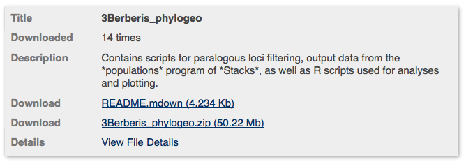
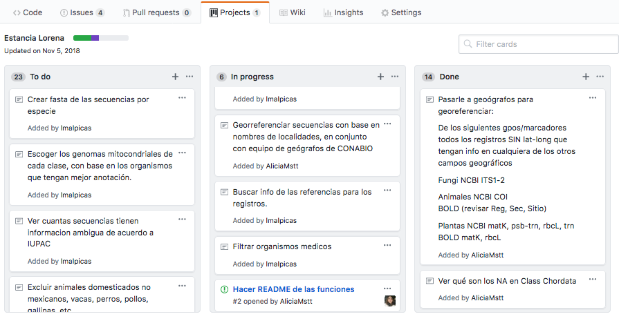
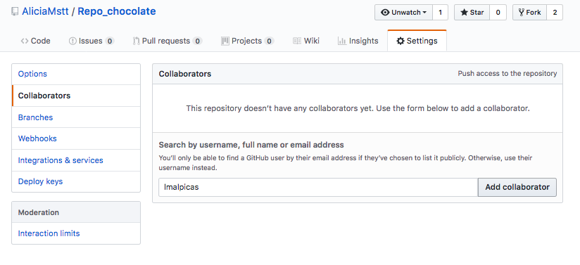
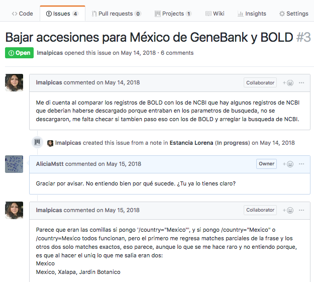
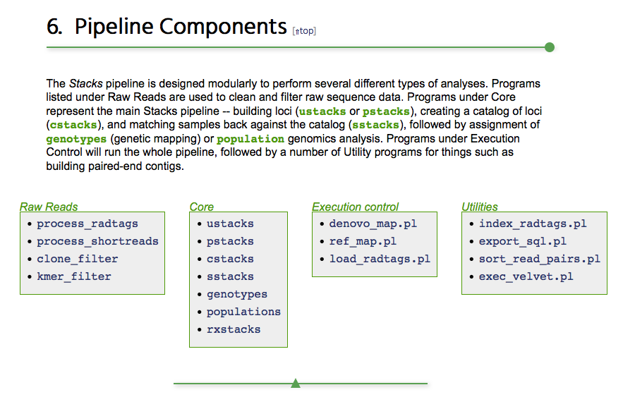

# Unidad 2: Organización de un proyecto bioinformático

Un proyecto bioinformático consiste en los datos crudos, datos procesados, scripts y documentación  necesarios para reproducir los análisis realizados. Es decir en todo lo que al final debes subir a un repositorio como [Dryad](https://www.datadryad.org/pages/organization) (aunque los datos pueden conectarse desde otros repos, como [SRA](https://www.ncbi.nlm.nih.gov/sra), claro). 

#### Organización de directorios 

Un proyecto bioinformático debe tener su propio **directorio** (carpeta) y contener en subdirectorios todo lo necesario para realizarlo.

El directorio del proyecto debe dividirse a su vez, lo recomendable es que sea en **subdirectorios** parecidos a los siguientes:

* **data**, contiene los datos, también puede tener otros nombres como *genetic* para datos genéticos y *spatial* para datos espaciales. Los datos genéticos pueden dividierse a su vez en subdirectorios como *raw*, *filtered*, *genotypes*, *data_in*, *data_out* de modo que los datos crudos estén en un directorio y los modificados por análisis subsecuentes en otros directorios. El punto es tener uno o más directorios donde estén todos los datos.  

* **meta**, **info** o **docs** donde puedes guardar todos los metadatos, como un archivo cvs detallando información de cada una de las muestras. Si lo prefieres este archivo puede ir dentro del directorio de datos sin necesidad de hacer la carpeta *meta*. También es posible guardar aquí cualquier otro documento necesario para procesar los datos.
  		
* **bin** o **scripts**, donde guardas todos los scripts necesarios para correr el análisis de principio a fin. Este es un directorio obligatorio. Esta es la carpeta más difícil de documentar.

* **figures**, opcionalmente, puedes poner aquí el código que se utilice sólo para hacer las figuras de una publicación dada. Es como un extracto de *bin* dedicado solo a esto.

* **archive** este directorio NO se sube al repositorio, pero es bueno tenerlo para ir poniendo ahí scripts y resultados que crees no necesitar más pero que es bueno no borrar por completo.

También es posible tener un directorio para cada subanálisis concreto, por ejemplo uno para *stacks* y otro para *admixture*, pero dentro de cada uno de ellos subdirectorios como los anteriores. 

Independientemente del nombre que escojamos para los directorios y archivos, qué es qué y dónde está cada cosa debe ir explicado en un **README**.

Para ver un ejemplo de un repositorio organizado así, baja la sección **Data and scripts for population genomics and SDM** de [este repo de Dryad](https://www.datadryad.org/resource/doi:10.5061/dryad.f7248) (El archivo que se llama ++PopGenomicsIBR.zip++).


## Documentación de scripts y del proyecto

**Documentar** permite que otrxs entiendan qué hace cada parte de nuestro código y cómo. Un proyecto bien documentado incluye:

* **Código comentado y organizado en scripts** 

* **README** 


#### README
	* "Leeme".
	* Un archivo de texto (no Word, pero puede ser MarkDown) que detalla:
   * **Qué hay** dentro del repositorio (y cada uno de sus directorios).
   * **Qué hacen** cada una de las funciones/scripts del repositorio
   * **Cómo y en qué órden** deben ocuparse los scripts para realizar los análisis
* Ejemplo:
    * [Este](http://datadryad.org/resource/doi:10.5061/dryad.n3jk5) repositorio de datos está dividido en varias secciones. La 3ra se ve así:



Y si abres el README.mdown verás algo así (los colores y el fondo negro son porque lo abrí con el editor MacDown, pero es un vil archivo de texto):

 


### ¿Por qué documentar y compartir nuestro código?

* Reproducibilidad de la cienica
* Construir sobre lo construído y hacer mejor el código antes. Más en el artículo: 
 [Openness makes software better sooner](http://www.nature.com/news/2003/030623/full/news030623-6.html)

#### ¿Reproducible para quién?

**1. Quién hizo la investigación, 6 meses (ó 6 días) después**

Evitar:

* ¿Cómo chingaos era esto?
* El archivo bueno es final.xlsx. No, espera, tal vez sea final_elbueo.xlsx. Deja reviso la última fecha de modificación. Hum....
* Ahorita me acuerdo.

Ganar:

* Volver a correr fácilmente los mismos datos con pequeñas modificaciones a los parámetros o datos input.
* Reutilizar código o datos para nuevos análisis
* Confianza en tus resultados

**2. Luchar vs la _crisis de la reprodubilidad_**
 
Vamos a ver [qué se ha publicado al respecto](https://scholar.google.com/scholar?q=reproducibility%20crisis&btnG=Search&as_sdt=800000000001&as_sdtp=on).

[The science ‘reproducibility crisis’ – and what can be done about it, The Conversation 2017](https://theconversation.com/the-science-reproducibility-crisis-and-what-can-be-done-about-it-74198) es un buena síntesis comentada de la situación. En resumen, en cuanto la comunidad científica de diferentes áreas nos sentamos a intentar repetir experimentos y análisis publicados, descrubrimos que los resultados no son reproducibles. Una [encuesta en Nature](https://www.nature.com/polopoly_fs/1.19970.1469695948!/menu/main/topColumns/topLeftColumn/pdf/533452a.pdf?origin=ppub) encontró que 52% de lxs investigadorxs creen que hay una crisis significativa de reproducibilidad, y 32% que hay una crisis menor.  


Esto no sólo es una pérdida de esfuerzo de investigación y dinero, sino que puede llevar a "perseguir" explicaaciones erroneas e incluso desarrolar tratamientos médicos que no funcionan. Por ejemplo el [Reproducibility Project: Cancer Biology](https://elifesciences.org/collections/9b1e83d1/reproducibility-project-cancer-biology) ha encontrado que artículos claves para el desarrollo de nuevos tratamientos vs cáncer no son reproducibles.
 

### Excusas comunes para no compartir nuestro código
* Me da pena que vean mi código
* No quiero que otros saquen provecho de mi código, me pertenece o a mi institución
* Otros no publican su código ¿por qué yo sí?
* Me da flojera pulir mi código para publicarlo
* Si publico mi código le van a encontrar errores y demandar correcciones o ayuda

Si respondiste sí (o tus colaboradores) a cualquiera de los anteriores checa esta lectura recomendada: [Publish your computer code: it is good enough](http://www.nature.com/news/2010/101013/full/467753a.html) de Nick Barnes.

### ¿Cómo documentar y compartir código?

* Scripts **comentados** y con un **README**
* Repositorio de código
   * Dryad (como parte del repositorio de datos)
   * [GitHub](https://github.com/) (mejor para funciones y projectos que continuarán actualizándose).


## Markdown

Markdown es el formato en el que está escrito este repositorio y el que ocupan sitios como Github, Stacksoverflow y muchos tutoriales.

Básicamente es una manera de escribir texto de manera que sea interpretado por un programa y convertido en un bonito archivo html. Tiene la ventaja de que está especialmente hecho para poder `formatear código en un texto como este`.

[Aquí una guía de MarkDown](https://github.com/adam-p/markdown-here/wiki/Markdown-Cheatsheet)

**Ejercicio:** abre el el editor de Markdown de tu preferencia y escribe un texto en formato Markdown de manera que quede igual que los tres primeros puntos de [Preparing the environment, cleaning the data for Stacks](http://catchenlab.life.illinois.edu/stacks/tut.php#prep) (incluyendo ese subtítulo). No es necesario poner los colores, pero si quieres, cool.

Es útil aprender la sintaxis de Markdown para poder documentar mejor tus proyectos, sobretodo si los subes a GitHub.

## git

[`git`](https://git-scm.com/) es un programa que sirve para llevar el control de versiones de un proyecto informático.

Como introducción a `git` primero vamos a entender los principales conceptos y el [flujo de trabajo de Github leyendo esta documentación](https://guides.github.com/introduction/flow/). 

Y es muy buena idea leer [An Intro to Git and GitHub for Beginners (Tutorial) de Meghan Nelson](https://product.hubspot.com/blog/git-and-github-tutorial-for-beginners).

Además de la versión de línea de comando que veremos aquí, hay una versión de escritorio vinculada a Github que puedes probar. Pero si ya vas a aprender algo nuevo mejor lánzate a la terminal ;).

**Documentación extra para aprender más:**


* [Learn Git Branching](https://learngitbranching.js.org/) para volverse chidos manejando el ramerío.


* [A successful Git branching model de VincentDriessen](http://nvie.com/posts/a-successful-git-branching-model/). Excelente.

Es muy buena idea llevar un control de versiones de tus scrips en tu carpeta `bin`.

Sin embargo, cuando subas tu proyecto con todo y datos como un repositorio (e.g. a Dryad) recuerda **NO** compartir la carpeta `.git`. 

## Github
Es un repositorio de código que:

* Utiliza `git` para llevar un sistema de **control de versiones**,
* Tiene una interfase Web pública
* Permite escribir/revisar código en equipo
* Su símbolo es un gatopulpo. 


Lo primero que hay que hacer es este tutorial: [Hello-world Github Guide](https://guides.github.com/activities/hello-world/) para aprender a crear un repo en Github y utilizar su versión web.

**Ejercicio** siguiendo los pasos del tutorial anterior, genera un repositorio entro de **tu cuenta de Github** que se llame "Tareas_BioinfRepro2019_TusIniciales". 


### Los términos más importantes

+ **Repositorio**: Se usa para organizar un proyecto. Puede contener imágenes, código, etc. Es recomendable incluir un README.

+ **Fork**: Se crea un fork cuando el repositorio es copiado de la cuenta de un miembro de Github a la de otro.

+ **Branch**: El repositorio tiene una rama o branch principal llamada `master`, que es la "original". Se pueden crear otras ramas dentro del mismo repositorio en las cuales se pueden hacer modificaciones sin afectar el código original. Es el equivalente tener un archivo original `Tesis` y ponerle `Tesis_comentariosAsesora1` y `Tesis_comentariosAsesor2` a los archivos con los comentarios de tus asesores, mismos que eventualmente volverás a integrar en un archivo final (pero `git` lo hace todo más hermoso y organizado).

+ **Commit**: Equivale a guardar los cambios **en git** que no es lo mismo que en el archivo. ¡Ojo! Los cambios se guardan en la branch donde trabajas. Puedes acompañar el commit de un mensaje corto para especificar qué cambios hiciste. Esto es mucho mejor que tener nombres de archivos larguísimos tratando de explicar qué versión son (e.g. `Tesis_final_comentariosAMY_DP_rev22oct2017_comentariosFran_revEnero2018_FINAL_BUENO_corrected_2.doc`).

+ **push:** para enviar los commits locales al repo online.

Piensa en `push` para enviar y `pull` para recibir.

+ **Pull request**: Si se quieren agregar las modificaciones en la branch `master`, se envía una solicitud al propietario original. Es decir tú no haces `push`, le pides al propietario que haga `pull`.

+ **Merge**: Una vez que el propietario del repositorio ha revisado y aceptado los cambios, fusiona las ramas. 


### Configurando nuestro git local con Github

Para poder vincular tu `git` con tu cuenta de Github necesitas cambiar **asociar tu dirección de correo electrónico principal de Github con tu git local**. Además puedes cambiar tu nombre de usuario, pero lo que realmente te vincula con Github es tu correo. 

Para cambiar tu correo necesitas seguir cualquiera de estos dos métodos:

1) Correr `$ git config --global --edit` 

Lo cual abrirá una pantalla de `vim`. Edita tu nombre de usuario y cuenta de correo. Para poder "escribir en vim" presiona `I` (de insertar) donde quieras comenzar a escribir. Recuerda, para guardar y salir, tecla Esc y luego `:wq`.

2) Correr:

`$ git config --global user.email "email@example.com"`

`$ git config user.name "Mi_nombre"`

Donde el texto entre comillas son tus datos.

Comrpueba tu dirección es la correcta con:

`$ git config user.email`

Debe mostrarse tu dirección correcta.


[Referencia de lo anterior](https://help.github.com/articles/setting-your-commit-email-address-in-git/)


### Ejemplo: vamos a clonar un repo.

#### `git clone`
Te permite copiar un repositorio que ya existe. Cada versión de cada archivo de la historia del proyecto es descargado cuando lo ejecutas. La dirección del repo que quieres clonar puedes conseguirla en el botón verde que dice "Clone or Download" en la página principal del repo en Github.

**Ojo con dónde corres `git clone`, pues tu working directory será el lugar a donde "se baje" el repo que estás clonando.**

```
$ git clone https://github.com/AliciaMstt/Repo_chocolate.git
Cloning into 'Repo_chocolate'...
remote: Counting objects: 3, done.
remote: Compressing objects: 100% (2/2), done.
Unpacking objects: 100% (3/3), done.
remote: Total 3 (delta 0), reused 0 (delta 0), pack-reused 0

```

Para poder hacer los siguientes comandos debemos estar en el directorio del repo. Es decir lo que acabamos de bajar. Así que `cd Repo_chocolate`.

#### `git status`
Es para saber en qué branch estas trabajando y si tienes archivos que te falte "guardar" (commit). Por ejemplo, si lo haces cuando acabas de clonar un repositorio, debe verse algo así:

```
$ git status                           []
On branch master
Your branch is up-to-date with 'origin/master'.
nothing to commit, working tree clean
```

#### `git add`
Te permite agregar un archivo que no existía en el repositorio o prepara las modificaciones a archivos existentes. Esto no lo "guarda" (commit), solo hace que "lo sigas". Si modificas un archivo es necesario que vuelvas a dar `add`.

```
$ touch ejemplo.txt
$ git status
On branch master
Your branch is up-to-date with 'origin/master'.
Untracked files:
  (use "git add <file>..." to include in what will be committed)

	ejemplo.txt

nothing added to commit but untracked files present (use "git add" to track)
$ git add ejemplo.txt
```


#### `git commit`
Confirma y agrega los cambios a la branch en la que estas trabajando. Utiliza la flag `-m` para escribirun mensaje breve. Si no lo haces se abrirá un editor de texto donde puedes describir brevemente el cambio que hiciste. Si tu editor es Vim, puedes guardar y salir con `:wq`.

```
$ git commit -m "agregar archivo ejemplo"
[master 79fce15] agregar archivo ejemplo
 1 file changed, 0 insertions(+), 0 deletions(-)
 create mode 100644 ejemplo.txt
```

#### `git diff`
Para ver los cambios que se hicieron a un archivo.

```
$ echo "el mundo es bello" > ejemplo.txt
$ cat ejemplo.txt 
el mundo es bello
$ git status
On branch master
Your branch is up-to-date with 'origin/master'.
Changes not staged for commit:
  (use "git add <file>..." to update what will be committed)
  (use "git checkout -- <file>..." to discard changes in working directory)

	modified:   ejemplo.txt

no changes added to commit (use "git add" and/or "git commit -a")
$ git diff ejemplo.txt
diff --git a/ejemplo.txt b/ejemplo.txt
index 8d269c1..0dc4fee 100644
--- a/ejemplo.txt
+++ b/ejemplo.txt
@@ -1 +1 @@
-bla bla bla
+el mundo es bello
```


#### `git rm`
Si quieres borrar un archivo **que ya había formado parte de un commit** no sólo de tu compu sino del sistema de versiones de git, lo mejor es NO utilizar `rm`, sino `git rm`. Ejemplo:

```
$ touch ejemplo2.txt
$ git add ejemplo2.txt
$ git status
On branch master
Your branch is ahead of 'origin/master' by 1 commit.
  (use "git push" to publish your local commits)
Changes to be committed:
  (use "git reset HEAD <file>..." to unstage)

	new file:   ejemplo2.txt
$ git add ejemplo2.txt
$ git commit -m added ejemplo2
$ git rm ejemplo2.txt
$ git status
On branch master
Your branch is ahead of 'origin/master' by 2 commits.
  (use "git push" to publish your local commits)
Changes to be committed:
  (use "git reset HEAD <file>..." to unstage)

	deleted:    ejemplo2.txt

```

#### `git push`

Una vez que quieres integrar tus cambios a una rama, este comando te permite fusionar ramas. Debes decirle el origen (rama donde hiciste los commits) y el destino (por ejemplo master u otra rama).

**Ojo** uds no podrán hacer `push` porque no son propietarios de este repo. Para ello deberían hacer primero un `pull request`. Más adelante haremos ejercicios de esto.


```
$ git push origin master
Counting objects: 3, done.
Delta compression using up to 4 threads.
Compressing objects: 100% (2/2), done.
Writing objects: 100% (3/3), 285 bytes | 0 bytes/s, done.
Total 3 (delta 0), reused 0 (delta 0)
To https://github.com/AliciaMstt/Repo_chocolate.git
   72129b3..79fce15  master -> master
```

Nota: puedes agregar la flag `-u` para establecer `origin master` (o lo que sea) como el default y solo tener que hacer `git push` en un futuro.


#### `git pull`
Actualiza la copia del repositorio local con respecto a la rama remota. Es decir


```
$ git pull                             []
Already up-to-date.
```

Pero ojo, antes de andar con `pull` por la vida [checa las bondades de `git fetch`:

#### `git fetch`

Si vas a trabajar con repos de otras personas problablemente no quieras hacer un `merge` en automático (que es lo que hace `pull` tras bambalinas) con tu repo local, sino que solo quieras jalar los cambios que hayan hecho otros. Por ejemplo los archivos que agregue a este repo sin que borre lo que tu hayas hecho en tu versión. [Para evitar posibles problemas asociados a esto se recomienda usar `fetch`]((https://help.github.com/articles/fetching-a-remote/)).

[Otra referencia de fetch vs pull](https://longair.net/blog/2009/04/16/git-fetch-and-merge/)

Voy a hacer unos cambios en el archivo `ejemplo.txt` desde el editor de texto de Github y comitearlo (sí, espanglish del chido) online. Ahora veamos los cambios:

```
$ git fetch
remote: Counting objects: 3, done.
remote: Compressing objects: 100% (2/2), done.
remote: Total 3 (delta 0), reused 0 (delta 0), pack-reused 0
Unpacking objects: 100% (3/3), done.
From https://github.com/AliciaMstt/Repo_chocolate
   79fce15..ad845a6  master     -> origin/master
$ head ejemplo.txt

$ git status
On branch master
Your branch is behind 'origin/master' by 1 commit, and can be fast-forwarded.
  (use "git pull" to update your local branch)
nothing to commit, working tree clean

$git pull
Updating 79fce15..ad845a6
Fast-forward
 ejemplo.txt | 1 +
 1 file changed, 1 insertion(+)

$ head ejemplo.txt 
bla bla 

```


#### `git log`

Para ver el historial de commits que se han hecho en el repo. Por default te mostrará los commits en orden cronológico invertido, pero hay muchas opciones que puedes darle para buscar algo más específico. [Instrucciones aquí](https://git-scm.com/book/en/v2/Git-Basics-Viewing-the-Commit-History).


**Ejercicio:** clona el repositorio de la clase y actualízalo que vez que sea necesario. **NOTAS IMPORTANTES PARA ESTE EJERCICIO:** 

1) Clonalo en un lugar distinto de dónde habías bajado la carpeta del repo las clases anteriores, o cámbiale el nombre a esa carpeta vieja, o símil.

2) Como mi repo tiene más de una rama, necesitarás agregar a tu `git clone` lo siguiente: `--branch master --single-branch`.

#### `git` para la vida diaria en resumen:

1) `git status` dentro del directorio de tu repo para ver si hay cambios.

2) `git diff nombrearchivo` para ver las modificaciones que se hicieron a un archivo desde el último commit.

3) `git add nombrearchivo` (para un archivo) o `git add *` (para todos los archivos) para agregar los archivos **que queremos incluir en un commit**. Como el equivalente a "adjuntarlos" en un correo que te enviarías por correo. 

4) `git commit -m "mensaje corto explicando qué contiene el commit"`. Como el contenido de un correo donde te explicarías a tí mismx qué cambios hiciste que ameritan guardar la versión ("commit").


#### ¿Cómo volver al pasado?

Hay muchas formas. [Esta respuesta de Stacksoverflow es una buena guía](https://stackoverflow.com/questions/4114095/how-to-revert-a-git-repository-to-a-previous-commit).


### Recomendación: ignorar archivos que no queremos que git siga**

Algunso archivos no queremos que sean considerados por `git`, por ejemplo archivos que la compu hace en automático como los "fantasmitas de Mac" o archivos de datos muy pesados si queremos solo publicar el código. Podemos entonces decirle a git cuáles archivos ignorar. Pasos:

1) Crear un archiovo `.gitignore` en el wd de tu repositorio (donde vive tu `.git` que se creó con `git init` o con `git clone`).

`touch .gitignore` (nota el punto `.`)

2) En ese archivo poner el nombre (o las extensiones) de los archivos que quieres ignorar. [Aquí puedes ver una lista de casos comunes proporcionada por Github](https://gist.github.com/octocat/9257657).

Por ejemplo yo voy ignorar los fantasmitas Mac:


`$ vim .gitignore`

Y en el editor de vim pegué lo siguiente:

```
# OS generated files #
######################
.DS_Store
.DS_Store?
._*
.Spotlight-V100
.Trashes
ehthumbs.db
Thumbs.db

```

3) Si haces un `git status` notarmás que aparece `.gitignore` como untracked. Entonces debes:

```
$ git add .gitignore
$ git commit -m "Added .gitignore file to repo"
$ git push 
```

También puedes crear un `.gitignore` global que aplique en todos los repos de tu compu. Instrucciones [aquí](https://help.github.com/articles/ignoring-files/)


### Cómo actualizar el repo del curso en tu compu con `git`.

1) Clona el repo (esto **solo hay que hacerlo una vez**)

```
git clone https://github.com/AliciaMstt/BioinfinvRepro.git --branch master --single-branch
```


2) Entra al repo

```
cd BioinfinvRepro/
```

3) Cuando les diga "actualicen el repo" (por ejemplo para poder utilizar los archivos que creé para un ejercicio), corre:

```
git pull
```

O, un poco más complicado, pero para evitar posibles errores:


```
git fetch

```

**y luego**

```
git merge
```

## Manejo de proyectos e issues en Github

Como hemos visto GitHub te permite llevar un control de versiones, es decir, llevar un registro de los cambios que se realizan sobre un proyecto informático, particularmente sobre las modificaciones a los scripts.

Github además permite organizar proyectos con un sistema de asignación "tareas por hacer" que se pueden asignar a un usuario de forma colaborativa, o a una misma para mantener un proyecto propio sin perderse.

Puedes generar tareas ("cards") y páneles de estado (Pendientes, En Proceso, Terminadas, por ejmemplo). Lueg puedes arrastraslas de un panel a otro según vayas progresando.




Los proyectos solo los podemos ver si es nuestro repositorio o si estamos agregados como colaboradorxs en ellos. Para agregar a un colaborador ve la pestaña "Settings" (arriba derecha) y luego a "Collaborators" en el menú de la izquierda. Debes buscar a quien quieras agregar por su nombre de usuario en Github. El usuario debe aceptar la invitación para unirse formalmente al proyecto.



Las tareas ("cards") de un proyecto pueden quedarse como tareas simplemente, o volverse un **issue**. Los issues permiten delimitar una tarea que debe atenderse (por ejemplo un bug, una modalidad nueva deseada, etc) pero cuya solución además requiere discusión. Cada issue tiene asociado entonces una conversación. Tanto los issues como sus conversaciones asociadas son públicos, pues permiten al público saber, por ejemplo, que el problema existe y en qué va su solución.




**Ejercicio** Genera un repositorio dentro de tu cuenta de Github que se llame "Tareas\_BioinfRepro2019\_TusIniciales".  

**Ejercicio** Agréganos a Lorena y a mi como colaboradoras en el repositorio de tareas del curso que creaste en tu cuenta de Github.

Parte de los proyectos del curso involucrarán crear proyectos de github e irlos actualizando con sus avances a lo largo del semestre.


## Creación de pipelines

La *programación modular* se refiere a subdividir un programa de cómputo en varios sub-programas separados.

Ventajas: 

* Es más fácil leer (y escribir) el código.
* Permite revisar el output de pasos complejos antes de enviarlos al siguiente paso.
* Si algo falla es más fácil identificar qué fue.
* Permite tener más de una opción de programas para realizar el análisis completo (e.g. demultiplexeo en un programa, alineación en otro).
* Permite volver a correr las partes del proceso que queremos, y no toooodo desde el inicio otra vez.

A la secuencia completa de módulos necesarios para completar un análisis se le conoce como **pipeline** (de ahí el nombre del símbolo **|**).

Veamos por ejemplo los [componentes del programa Stacks](http://catchenlab.life.illinois.edu/stacks/manual/#comps), que es uno de los softwares más populares para analizar datos RADseq:



No solamente los programas bioinformáticos pueden pensarse modularmente, sino también **cualquier análisis** que involucre varios pasos complejos. De modo que en vez de tener un único script que lo haga todo, podemos tener uno por cada paso importante, y correrlos de forma independiente (para probarlos o repetir sólo un paso) o correrlos todos en una sola sentada con un script que ejecute todo el *pipeline* paso por paso. 

**Ejercicio:** Mira el siguiente script ([tomado del manual de Stacks](http://catchenlab.life.illinois.edu/stacks/manual/#phand)) y contesta lo siguiente:

1. ¿Cuántos pasos tiene este script?
2. ¿Si quisieras correr este script y que funcionara en tu propio equipo, qué línea deberías cambiar y a qué? 
2. ¿A qué equivale `$HOME`?
3. ¿Qué paso del análisis hace el programa `gsnap`?
4. ¿Qué hace en términos generales cada uno de los loops?


```
#!/bin/bash 

src=$HOME/research/project 

files=”sample_01 
sample_02 
sample_03” 

#
# Align with GSnap and convert to BAM
# 
for file in $files
do
	gsnap -t 36 -n 1 -m 5 -i 2 --min-coverage=0.90 \
			-A sam -d gac_gen_broads1_e64 \
			-D ~/research/gsnap/gac_gen_broads1_e64 \
			$src/samples/${file}.fq > $src/aligned/${file}.sam
	samtools view -b -S -o $src/aligned/${file}.bam $src/aligned/${file}.sam 
	rm $src/aligned/${file}.sam 
done

#
# Run Stacks on the gsnap data; the i variable will be our ID for each sample we process.
# 
i=1 
for file in $files 
do 
	pstacks -p 36 -t bam -m 3 -i $i \
	 		 -f $src/aligned/${file}.bam \
	 		 -o $src/stacks/ 
	let "i+=1"; 
done 

# 
# Use a loop to create a list of files to supply to cstacks.
# 
samp="" 
for file in $files 
do 
	samp+="-s $src/stacks/$file "; 
done 

# 
# Build the catalog; the "&>>" will capture all output and append it to the Log file.
# 
cstacks -g -p 36 -b 1 -n 1 -o $src/stacks $samp &>> $src/stacks/Log 

for file in $files 
do 
	sstacks -g -p 36 -b 1 -c $src/stacks/batch_1 \
			 -s $src/stacks/${file} \ 
			 -o $src/stacks/ &>> $src/stacks/Log 
done 

#
# Calculate population statistics and export several output files.
# 
populations -t 36 -b 1 -P $src/stacks/ -M $src/popmap \
			  -p 9 -f p_value -k -r 0.75 -s --structure --phylip --genepop
```

En el ejemplo anterior, un solo script hace muchos pasos distintos. Alternativamente, podemos tener cada paso en un script independiente (y así poderlos correr por separado) y una vez que tenemos listos los scripts de todos los pasos de un análisis es posible "enlazarlos" todos en un script "maestro" (**pipeline**) que los corra todos uno detrás de otro en el orden adecuado.


**Ejercicio**: retoma el ejercicio anterior y divídelo en un subscript para cada paso y un script maestro que corra toda la pipeline.


### Correr R en batch mode

Es decir correr scripts de R desde la terminal sin abrir R. Esto es útil porque correr un script de R puede volverse parte de un script de bash.

Existen tres formas de hacerlo:

#### `Rscript` 

Por ejemplo el script `Unidad2/Prac_Uni2/egR/holascript_simple.R` contiene:

`cat holascript.R`
```{R}
x<-10
y<-6
cat("¡Hola mundo!", x, "+", y, "es igual a", x+y)
write(x, file="aquiestax.txt")
```

Y puede correrse así:

```
$ Rscript holascript.R
¡Hola mundo! 10 + 6 es igual a 16
```

#### `#!` a `Rscript`

El contenido de un script debe incluir en la primera línea `#!/usr/bin/Rscript` o `/usr/local/bin/Rscript` o lo que sea que diga el output de correr `which Rscript`. Por ejemplo el script `/Unidad2/PracUni2/egR/holascript_ejecutable.R` contiene:

```{R}
#!/usr/local/bin/Rscript

x<-10
y<-6
cat("¡Hola mundo!", x, "+", y, "es igual a", x+y)
```

Y puede correrse así (recuerda hacerlo ejecutable antes con `chmod`:

```
$ ./holascript_ejecutable.R 
[1] "¡Hola mundo! 10 + 6 es igual a 16"
```

Nota: si lo anterior no funciona tal vez debas cambiar la ruta a Rscript, puedes averiguar esto con `which Rscript` en la Terminal. Ojo, esto NO es lo mismo que `which R`.

#### `R CMD BATCH`:

Una alternativa a RScript es `R CMD BATCH`. La diferencia es que el resultado de correr el script se escribe a un archivo `.Rout` (incluso si el script involucra imprimir resultados a pantalla con `cat` o `print`) que contiene el código, el resultado y datos de cuánto tardó el procesamiento. 

```
$ R CMD BATCH holascript.R 
$ cat holascript_simple.Rout

R version 3.2.2 (2015-08-14) -- "Fire Safety"
Copyright (C) 2015 The R Foundation for Statistical Computing
Platform: x86_64-apple-darwin13.4.0 (64-bit)

R is free software and comes with ABSOLUTELY NO WARRANTY.
You are welcome to redistribute it under certain conditions.
Type 'license()' or 'licence()' for distribution details.

  Natural language support but running in an English locale

R is a collaborative project with many contributors.
Type 'contributors()' for more information and
'citation()' on how to cite R or R packages in publications.

Type 'demo()' for some demos, 'help()' for on-line help, or
'help.start()' for an HTML browser interface to help.
Type 'q()' to quit R.

> x<-10
> y<-6
> cat("¡Hola mundo!", x, "+", y, "es igual a", x+y)
¡Hola mundo! 10 + 6 es igual a 16> write(x, file="aquiestax.txt")
> proc.time()
   user  system elapsed 
  0.297   0.080   1.278 

```

Notas recomendadas: [Running R in batch mode on Linux](http://www.cureffi.org/2014/01/15/running-r-batch-mode-linux/)

**Utilidad:** Una aplicación de lo anterior es poder correr scripts de R y otro lenguaje directamente en un script de bash, de manera que nuestro script maestro pueda incluir todos los pasos.

