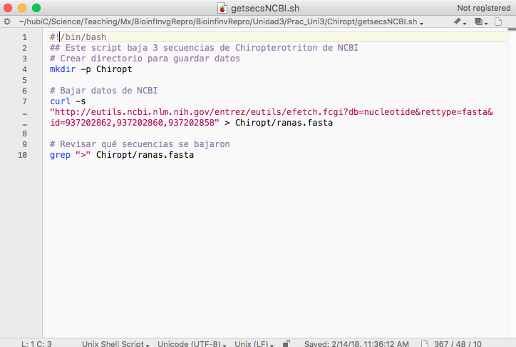

# Unidad 3 Algoritmos y programación

En esta unidad veremos cómo escribir *scripts* para resolver algoritmos a través de código de cómputo.

Comencemos por:

## 3.1. Lógica de la ejecución de un algoritmo

### Algoritmos

En programación, un algoritmo es:

* Un procedimiento bien definido, con un inicio y un final claros, que le permite a una computadora resolver un problema.
* Una secuencia inequívoca (sin lugar a interpretaciones subjetivas) de instrucciones.

Los algoritmos **no** son código de cómputo, sino una división por pasos para solucionar un problema.  

Ejemplo:


*Algoritmo para sumar dos variables*

```
Paso 1: Inicio
Paso 2: Declarar las variables num1, num2 y suma. 
Paso 3: Leer las variables num1 y num2. 
Paso 4: Agregar num1 y num2 y asignar el resultado a suma.

        suma←num1+num2 

Paso 5: Mostrar suma
Paso 6: Fin
```

Un ejemplo bioinformático:

*Algoritmo para obtener datos RADseq:*

```
Paso 1: Inicio
Paso 2: Obtener secuencias raw en formato FASTQ 
Paso 3: Descartar secuencias de baja calidad
Paso 4: Demultiplexear secuencias por individuo
Paso 5: Realizar ensamblado de novo
Paso 6: Genotipificar individuos
Paso 7: Mostrar matriz de genotypos por individuos
Paso 7: Fin
```

**Utilidad**

Tener claro el algoritmo con el que solucionaremos un problema nos ayuda a después escrbir el código para realizar cada paso.

### Algoritmos y scripts

Como vimos en la Unidad 1, un **script** es:

* un archivo de texto plano (**¡¡NO WORD!!**)
* permanente,
* repetible,
* anotado y
* compartible

El script consta de dos tipos de texto: 

1. El **código** (comandos) que queremos que se ejecute, en el órden que queremos que lo ejecute. O sea que un script es una **serie de comandos que siguen la lógica de un algoritmo**.

2. Comentarios escritos **para un ser humano** en un **lenguaje de humanos**.

Una buena forma de escribir un script es:

1. Escribir el algoritmo, es decir los pasos que queremos hacer.
2. Marcar dichos pasos como comentarios (recuerda el uso de `#` para indicar que el texto a su derecha es un comentario, no un comando).
3. Escribir el código para hacer cada paso debajo del comentario correspondiente. 

Ejemplo:

* Algoritmo para guardar secuencias de *Chiropterotriton*
 
```
Definir secuencias a bajar desde NCBI
Crear directorio para guardar datos
Bajar datos al directorio deseado
Revisar secuencias
Fin
```

* Algoritmo + código para bajar secuencias de *Chiropterotriton*:

```
## Este script baja 3 secuencias de Chiropterotriton de NCBI
# Crear directorio para guardar datos
mkdir Chiropt

# Bajar datos de NCBI 
curl -s "https://eutils.ncbi.nlm.nih.gov/entrez/eutils/efetch.fcgi?db=nucleotide&rettype=fasta&id=937202862,937202860,937202858" > Chiropt/ranas.fasta

# Revisar qué secuencias se bajaron
grep ">" Chiropt/ranas.fasta
```

**Observación**: una ventaja de los scripts es que nos permiten tener en un solo documento *varios* comandos que se utilizaron para hacer algo, es decir, conforme se complican los análisis necesitamos más de una línea de comando para realizarlos.

Si haces los análisis de tu trabajo en la terminal sin tenerlos en un script es como platicar la introducción de tu tesis sin haberla escrito nunca. Considera el correr comandos en la terminal como una **prueba** y ya que todo funcione, pon todos los comandos juntos en **uno más scripts docuemntados** y deja que corra el análisis de principio a fin solito (veremos adelante cómo).


## 3.2. Modularidad

La *programación modular* se refiere a subdividir un programa de cómputo en varios sub-programas separados.

Ventajas: 

* Es más fácil leer (y escribir) el código.
* Permite revisar el output de pasos complejos antes de enviarlos al siguiente paso.
* Si algo falla es más fácil identificar qué fue.
* Permite tener más de una opción de programas para realizar el análisis completo (e.g. demultiplexeo en un programa, alineación en otro).
* Permite volver a correr las partes del proceso que queremos, y no toooodo desde el inicio otra vez.

A la secuencia completa de módulos necesarios para completar un análisis se le conoce como **pipeline** (de ahí el nombre del símbolo **|**).

Veamos por ejemplo los [componentes del programa Stacks](http://catchenlab.life.illinois.edu/stacks/manual/#comps), que es uno de los softwares más populares para analizar datos RADseq:


No solamente los programas bioinformáticos pueden pensarse modularmente, sino también **cualquier análisis** que involucre varios pasos complejos. De modo que en vez de tener un único script que lo haga todo, podemos tener uno por cada paso importante, y correrlos de forma independiente (para probarlos o repetir sólo un paso) o correrlos todos en una sola sentada con un script que ejecute todo el *pipeline* paso por paso. 

**Ejercicio:** Mira el siguiente script ([tomado del manual de Stacks](http://catchenlab.life.illinois.edu/stacks/manual/#phand)) y contesta lo siguiente:

(Si requieren googlear, para evitar colapsar la red hagamos esto por equipos de 3 utilizando una sóla computadora).

1. ¿Cuántos pasos tiene este script?
2. ¿Si quisieras correr este script y que funcionara en tu propio equipo, qué línea deberías cambiar y a qué? 
2. ¿A qué equivale `$HOME`?
3. ¿Qué paso del análisis hace el programa `gsnap`?
4. ¿Qué hace en términos generales cada uno de los loops?


```
#!/bin/bash 

src=$HOME/research/project 

files=”sample_01 
sample_02 
sample_03” 

#
# Align with GSnap and convert to BAM
# 
for file in $files
do
	gsnap -t 36 -n 1 -m 5 -i 2 --min-coverage=0.90 \
			-A sam -d gac_gen_broads1_e64 \
			-D ~/research/gsnap/gac_gen_broads1_e64 \
			$src/samples/${file}.fq > $src/aligned/${file}.sam
	samtools view -b -S -o $src/aligned/${file}.bam $src/aligned/${file}.sam 
	rm $src/aligned/${file}.sam 
done

#
# Run Stacks on the gsnap data; the i variable will be our ID for each sample we process.
# 
i=1 
for file in $files 
do 
	pstacks -p 36 -t bam -m 3 -i $i \
	 		 -f $src/aligned/${file}.bam \
	 		 -o $src/stacks/ 
	let "i+=1"; 
done 

# 
# Use a loop to create a list of files to supply to cstacks.
# 
samp="" 
for file in $files 
do 
	samp+="-s $src/stacks/$file "; 
done 

# 
# Build the catalog; the "&>>" will capture all output and append it to the Log file.
# 
cstacks -g -p 36 -b 1 -n 1 -o $src/stacks $samp &>> $src/stacks/Log 

for file in $files 
do 
	sstacks -g -p 36 -b 1 -c $src/stacks/batch_1 \
			 -s $src/stacks/${file} \ 
			 -o $src/stacks/ &>> $src/stacks/Log 
done 

#
# Calculate population statistics and export several output files.
# 
populations -t 36 -b 1 -P $src/stacks/ -M $src/popmap \
			  -p 9 -f p_value -k -r 0.75 -s --structure --phylip --genepop
```


## 3.3. Cómo organizar un script

Ya hemos visto que un script es un archivo de texto con código y comentarios. Esta es una generalidad cierta para cualquier lenguaje de programación (aunque los comentarios no son obligatorios se recomienda mucho).

Sin embargo los scripts que corremos desde la Terminal Unix, es decir scripts de *Bash* o *Shell* requiren de 3 pasos para **convertirse en software**:

1. Escribir los comandos a un archivo de texto (escribir el script).
2. Indicarle al sistema operativo (computadora) que programa (lenguaje) debe utilizar para *interpretar* los comandos
3. Darle al *archivo* los *permisos* que necesita para poder ser *ejecutado por Shell*.

### Escribir el script

Escribir un script es escribir en un **editor de texto** los comandos para resolver un problema, de preferencia comentando cada paso.

Editores de texto recomendados:

* Windows: [Notepad++](https://notepad-plus-plus.org/)
* Mac: [TextWrangler](http://download.cnet.com/TextWrangler/3000-2351_4-10220012.html) o [Fraise](http://www.macupdate.com/app/mac/33751/fraise)
* Linux: [Gedit](http://sourceforge.net/projects/gedit/)


**NOTA IMPORTANTE**: el workingdirectory de un script siempre es el directorio donde está guardado dicho script. Entonces, es importante que si tu script va a manejar directorios (`cd` a algún lugar) lo planees todo con **rutas relativas** empezando en el directorio donde guardarás el script. ¿Dónde es un buen lugar para guardar el script? Lo veremos con detalle en otra unidad, pero en resumen el mejor lugar es en el mismo directorio que los datos, o en uno muy cercano.

El ejemplo que vimos antes, abierto en TextWrangler se ve así:


La terminación `.sh` indica que es un archivo Shell (es decir el interpretador de la Terminal, equivalente a decir Bash, recordemos la Unidad 1). Y al darle esta terminación de archivo, o señalar el tipo de lenguaje en el menú de opciones, el editor de texto nos ayuda a leer el código coloreando los comandos, los flags, las variables y los comentarios.

En este momento ya podemos correr nuestro script. Sólo hay que ir a la Terminal, `cd` al directorio donde esté nuestro script y utilizar el comando `bash`:

```
$ bash getsecsNCBI.sh 
>gi|937202862|gb|KT820711.1| Chiropterotriton sp. SMR-2015b voucher MVZ:Herp:269665 cytochrome b (cytb) gene, partial cds; mitochondrial
>gi|937202860|gb|KT820710.1| Chiropterotriton sp. SMR-2015a voucher IBH:28182 cytochrome b (cytb) gene, partial cds; mitochondrial
>gi|937202858|gb|KT820709.1| Chiropterotriton sp. SMR-2015a voucher IBH:28178 cytochrome b (cytb) gene, partial cds; mitochondrial

```

`bash` es un comando que a su vez ejecuta comandos de un stdinput o de un archivo, en este caso nuestro script.

Sin embargo este script **aún no está listo para ser un ejecutable**. La terminación `.sh` podría o podría no existir y a `bash` le daría lo mismo para correr el ejemplo anterior. Para hacer de nuestro script un ejecutable es necesario:

### Indicar con qué programa *interpretar* el script: `#!`

**`#!`** Se lee cómo "Shebang".

Se pone en la **primera línea** de un script seguido del nombre (path) del programa (lenguaje, para bash `/bin/bash`) con el que está escrito el script, para indicarle a la computadora que debe interpretar el script en dicho lenguaje.

Memotecnica: *She bangs* de Ricky Martin.

**Ojo**: el shebang **no** es un comentario aunque empiece con `#`, pues en realidad el símbolo `#!` considera a los caracteres `#` y `!` juntos.


Por ejemplo, para decir que estamos escribiendo un script de Bash que queremos correr en la Terminal la primera línea tendría que decir:

```
#!/bin/bash
```
Ejemplos en otros lenguajes:

```
#!/usr/bin/env python
```

Nuestro script entonces se verá así:



Podemos correr este script con `bash` como antes. Sin embargo, si **hacemos el archivo ejecutable** ya no será necesario ejecutarlo a través de bash, ya que será un *programa* por sí mismo.


### Hacer ejecutable el archivo

`ls -l` nos da información extendida de los archivos, incluyendo los *permisos*.

Por ejemplo: 

```
$ ls -l 
total 8
drwxr-xr-x  3 ticatla  staff  102 13 Feb 23:09 Chiropt
-rw-r--r--@ 1 ticatla  staff  350 13 Feb 23:05 getsecsNCBI.sh

``` 

Veamos cómo leerse (imagen cortesía de [aquí](https://www.samba.org/samba/docs/man/Samba-HOWTO-Collection/AccessControls.html)):

.

`chmod` es el comando para cambiar estos permisos, lo cual nos permite volver un archivo ejecutable:

```
$ chmod u+x getsecsNCBI.sh
$ ls -l
total 8
drwxr-xr-x  3 ticatla  staff  102 13 Feb 23:09 Chiropt
-rwxr--r--@ 1 ticatla  staff  350 13 Feb 23:05 getsecsNCBI.sh
```

¿Notas que ahora dice -rwxr? La nueva x quiere decir que ahora el archivo es un ejecutable, para correrlo:

```
$ ./getsecsNCBI.sh
>gi|937202862|gb|KT820711.1| Chiropterotriton sp. SMR-2015b voucher MVZ:Herp:269665 cytochrome b (cytb) gene, partial cds; mitochondrial
>gi|937202860|gb|KT820710.1| Chiropterotriton sp. SMR-2015a voucher IBH:28182 cytochrome b (cytb) gene, partial cds; mitochondrial
>gi|937202858|gb|KT820709.1| Chiropterotriton sp. SMR-2015a voucher IBH:28178 cytochrome b (cytb) gene, partial cds; mitochondrial
```

**Ojo:** hay un `./` antes del nombre del script, esto sirve para decirle dónde está dicho script, ya que por default la Terminal busca los comandos en los directorios enlistados en tu PATH (`echo $PATH`) para saber cuales son. 

**Comentario:** si tienes una serie de scripts que usas mucho, vale la pena ponerlos todos juntos en una carpeta y volver a esta carpeta parte de tu PATH. Checa el Capítulo 6 de Haddock & Dunn (2011) para cómo.


## Ejercicios


1. Escribe **una** línea de código que cree un archivo con los nombres de las muestras de maiz enlistadas en `/Unidad2/Prac_Uni2/Maiz/nuevos_final.fam`. 

2. Escribe un script que cree 4 directorios llamados PobA, PobB, PobC, PobD y dentro de cada uno de ellos un archivo de texto que diga "Este es un individuo de la población x" donde x debe corresponder al nombre del directorio. 

3. Escribe un script que baje 5 secuencias (algún loci corto, no un genoma) de una especie que te interese y señala cuántas veces existe la secuencia "TGCA" en cada una de ellas. ¿Sabes qué hace esta secuencia?

4. Imagina que tienes datos de RADseq de una serie de poblaciones de una especie a lo largo de la Sierra Madre Occidental colectados a altas y bajas altitudes. Ya has filtrado las secuencias sucias, demultiplexeado y corrido un ensamblaje *de novo* utilizando el programa [Stacks](http://catchenlab.life.illinois.edu/stacks/). 

En [/Unidad3/Prac_Uni3/Ejstacks](../Unidad3/Prac_Uni3/Ejstacks) encontrarás varios directorios como los que hubieras generado hasta este momento si dichos datos fueran reales. Por ejemplo, en el directorio `/raw` estarían tus secuencias crudas y en el directorio `/stacks` el output del ensamblado de Stacks y tu Population Map [busca qué es aquí](http://catchenlab.life.illinois.edu/stacks/comp/populations.php). 

**a) Desde la Terminal explora el archivo `Ejstacks/stacks/PopMapAll.txt`.**  

Notarás un patrón muy simple en cómo están llamadas tus muestras:

* Los primeros tres caracteres corresponden a un estado de la república
* Los segundos tres caracteres corresponen a la categoría altitudinal de la muestra
* Los números del final se refieren al número de muestra para ese estado y altitud. 

Tras un análisis del resultado que obtuviste de estos datos tu y una colaboradora deciden correr un programa que requiere los datos en formato [plink](http://pngu.mgh.harvard.edu/~purcell/plink/), por lo que tuviste que utilizar el módulo [*populations* de Stacks](http://catchenlab.life.illinois.edu/stacks/comp/populations.php) para exportar tus datos al formato adecuado. 

Esto lo lograste incluyendo en un script una líndea de comando como la de abajo (pero sustituyendo lo que está entre `[]` por el path adecuado:

`populations -P [pathdirectorioDatosStacks] -M ../stacks/PopMapAll.txt -b 1 -f p_value --plink --write_single_snp`

Después de analizar estos datos tu colaboradora observa que tienes muchos datos faltantes (missing data), lo cual interfiere con el análisis, por lo que te escribe lo siguiente:

"*Seems like in order to get all the populations (State+Altitude) included, 7 individuals is the highest we can go. I'd recommend filtering out all SNPs that are in less than 7 individuals per population, and then selecting SNPs again to export to plink format as you did before. It might be worth going back in the future and doing this again at different levels of individuals; so could you please send me the data ran independently for each population for everything from min 7 to 10 individuals?*"

Tras consultar el manual de [*populations* de Stacks](http://catchenlab.life.illinois.edu/stacks/comp/populations.php) notas que hay una opción (`-r`) para filtrar los loci acorde a que existan en un mínimo de individuos de una población, pero que está en términos de porcentaje y no de número de individuos. 

`
r — minimum percentage of individuals in a population required to process a locus for that population.
`

**b) Haz un script que te permitiría correr el programa _populations_ de Stacks independientemente para cada población y para cada mínimo de individuos que te pidió tu colaboradora, considerando lo siguiente**:

 
*  Tu script debe determinar automáticamente el valor que darle a `-r` con base en el número total de individuos por cada población (ej: 5 individuos de 10 que hay en la población= 5/10). 

* Como no tienes instalado el programa Stacks (ni datos) la línea de tu script donde correrías *populations* debe hacer un `echo` de cómo debiera verse la línea para correr *populations*. Otros comando, por ejemplo crear directorios, sí deben funcionar. 

* El output de *populations* serían dos archivos llamados plink.ped y plink.map. Como no lo estamos corriendo de verdad, el ejercico es que el `echo` del punto anterior sea escrito a un archivo de texto llamado `falsoplink.out` y que dicho archivo quede dentro un directorio por población y filtro mínimo de individuos. 

5.- Revisa la sección de Métodos del artículo [Zhang X, Niu J, Liang Y, Liu X, Yin H (2016) Metagenome-scale analysis yields insights into the structure and function of microbial communities in a copper bioleaching heap. BMC Genetics, 17, 21.](http://bmcgenet.biomedcentral.com/articles/10.1186/s12863-016-0330-4) y describe su pipeline bioinformática a manera de algoritmo.

6.- Describe a manera de algoritmo cuáles son los pasos que ocupó la pipeline bioinformática de un artículo que haya utilizado el tipo de datos y preguntas biológicas de tu proyecto.


  
