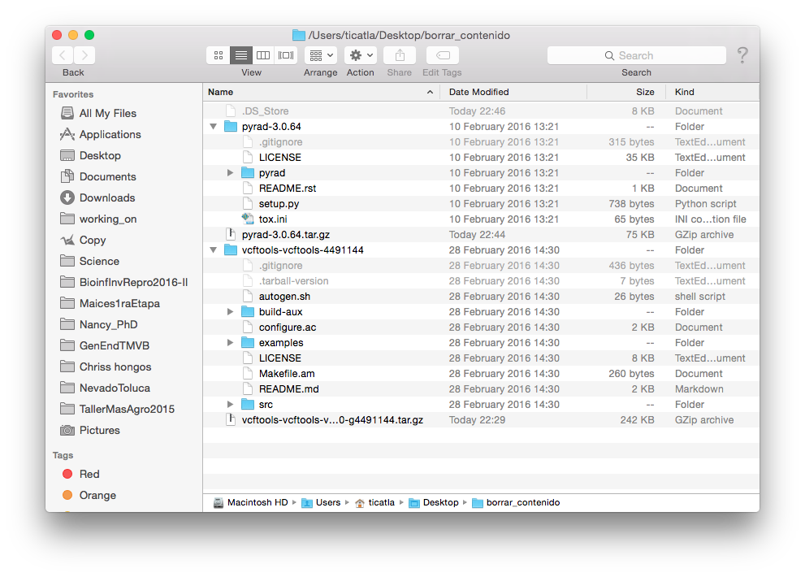
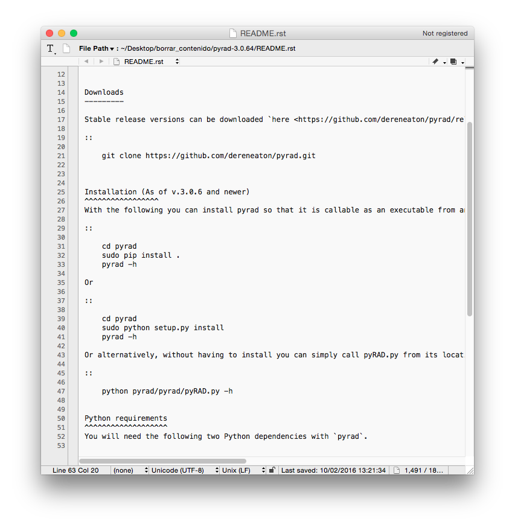

# Unidad 5 Uso general de software especializado

Lecturas recomendadas:

* [Beaulieu-Jones, B. K., & Greene, C. S. (2017). Reproducibility of computational workflows is automated using continuous analysis. Nature Biotechnology, advance online publication. doi:10.1038/nbt.3780](https://www.nature.com/articles/nbt.3780)

* [da Veiga Leprevost, F., Grüning, B. A., Alves Aflitos, S., Röst, H. L., Uszkoreit, J., Barsnes, H., … Perez-Riverol, Y. (2017). BioContainers: an open-source and community-driven framework for software standardization. Bioinformatics, 33(16), 2580–2582.doi:10.1093/bioinformatics/btx192](https://academic.oup.com/bioinformatics/article/33/16/2580/3096437)


## 5.1. Utilidad del Software especializado

El software especializado permite realizar operaciones complejas con datos genéticos y preguntas biológicas de un tipo particular. 

Por ejemplo el ensamblado *de novo* de datos de GBS/RAD, puede hacerse con diferente software dependiendo de si las preguntas biológicas están enfocadas en genética de poblaciones (e.g. Stacks), filogenética (e.g. pyRAD) o diversidad de cultivos (e.g. UNEAK-TASSEL).

En la siguiente unidad veremos diferentes sofwares para cada tipo de datos, pero no profundizaremos en cada uno. Recuerda que ese no es el objetivo del curso y para esto hay cursos especializados. La idea es que puedas entender los artículos y el manual de cualquier software para tomar tus propias decisiones y realizar tus análisis con cualquier software.

## 5.2. Documentación de software especializado

La **documentación** de un programa bioinformático (y de cualquier software) se refiere al **manual** y tutoriales asociados al programa. 

Dos maneras de encontrar el manual:

* Dentro del programa (e.g. `man vcftools` o `vcftools -help`)
* En internet (en la página del software).

La complejidad del manual depende de la complejidad de la herramienta en sí. Si es algo que involucre varios pasos y analizar (en vez de solo e.g. reformatear) datos lo más recomendable es dedicarle una tarde (o semana) entera a correr y entender paso por paso un tutorial. Otras cosas sencillas pueden entenderse dándole un vistazo al manual. 

Vamos a ver algunos ejemplos de manuales online:

* [VCFtools](https://vcftools.github.io/man_latest.html)
* [Stacks](http://catchenlab.life.illinois.edu/stacks/manual/)
* [Mothur](http://www.mothur.org/wiki/Mothur_manual) 
* [Trinity](https://github.com/trinityrnaseq/trinityrnaseq/wiki/Running%20Trinity)


## 5.3. Instalación de software especializado

### Instalación manual
El software especializado en bioinformática en su mayoría corre directamente desde la línea de comando Unix y está escrito en lenguajes como C, python y Perl, entre otros. Por ende, su instalación no es dar dos clicks, sino realizar una serie de pasos, en su mayoría involucrando los siguientes pasos:

1) Busca la versión más reciente del software especializado de tu interés. Por lo general tienen su propia página en algún rincón del internet.

Veamos dos ejemplos:

[VCFtools](http://vcftools.github.io/index.html)
[pyRAD](http://dereneaton.com/software/pyrad/)

2) Busca la sección de **Download**, o **Install**. Normalmente te llevarán a bajar un tar o a un comando para bajar el tar desde Github. 

**Ojo**: si hay una sección que diga "Computing Requirements" o "Specs" checa eso primero. E.g: para [Trinity](https://github.com/trinityrnaseq/trinityrnaseq/wiki/Trinity-Computing-Requirements).

3). Baja el **source code** del programa.

Si vemos el contenido de los tar que bajamos veremos algo así:



4. Por lo general el tar con el source code incluye un archivo de texto (o Markdown) llamado **README**, pero también puede llamarse **INSTALL**. Este es el primer archivo que siempre debemos consultar (y si tanto README como INSTALL existen, primero README).

Así se ve el de pyRAD:



Y así el de VCFtools:


5. La instalación consiste en seguir los pasos que nos dice el README (o el link que contenga el README, a veces pasa).

**Puntos a observar**: 

* La instalación varía de programa a programa
* La instalación puede requerir los comandos:
  - `sudo`
  - `./configure`
  - `make`
  - `make install`
* Nuestro software de interés puede requerir **dependencias**, es decir otros programas o librerías (de python, Perl, etc) para poder correr. 
* Algunas de esos otros programas pueden instalarse a través de programas para instalar cosas, como `pip`, `brew`, etc. 


#### ¿Qué hacen `sudo`, `./configure`, `make` y `make install`?

Bonita referencia [aquí](https://robots.thoughtbot.com/the-magic-behind-configure-make-make-install).

##### `sudo`: 

Te vuelve el *super usuario*, es decir eres un todo poderoso administrador que puede hacer lo que sea con la línea de comando sin que la computadora te diga que no.

xkcd lo explica así: 


Debemos usar `sudo` ya que al correr como usuarios normales no tenemos privilegios de administrador, lo cual es una medida de seguridad para que no corran programas que se metan con nuestro sistema sin nuestra autorización, y también para revisar que sabes lo que haces antes de modificar algo importante en el sistema. 


##### `./configure`:

Para correr esto primero **debes** estar en el tar (descomprimido) del programa que acabas de bajar. La razón es que esta línea de comando corre un script llamado `configure` (que es un ejecutable) que **viene con tu programa**. 

Un script `configure` básicamente revisa que la computadora donde vas a instalar el programa tenga las dependencias que el programa necesita. En ocasiones puede decirte que no las tiene, pero que amablemente las baja por ti. En tal caso te lo preguntará, con al final de la pregunta un paréntesis así `(Y/n)`, tienes que decirle si Yes or Not. 

Si algunos de los requisitos importantes no se puede conseguir `configure` marcará error y no podrás continuar con la instalación hasta que tengas esas dependencias en orden (o sea que las instales por ti misma). Este suele ser el paso más doloroso de instalaciones difíciles.

Si todo sale bien configure habrá **creado** un nuevo archivo en nuestro WD (que sigue siendo el descomprimido del tar del programa en cuestión) llamado **MakeFile**, puedes pasar al siguiente paso:

##### `make`:

`make` es un programa de Unix que corre un archivo `MakeFile` que se encuentre en el WD. Este archivo (que creamos con `configure` en el paso anterior) es ligeramente diferente dependiendo de cada computadora, es decir, está personalizado para tu computadora, por eso no viene en el tar que bajamos. 

El `MakeFile` indica la secuencia de comandos que se necesitan seguir para construir (*build*) los componentes o sub-programas del software y crea los ejecutables necesarios. A esto también se le conoce como *compilación*.

Si todo sale bien, puedes seguir al último paso:

##### `make install`: 

`make install` también corre el archivo `MakeFile`, pero sólo una sección dentro de dicho archivo llamada **Install**. Esta sección contiene instrucciones para que los archivos creados por el paso anterior (`make`) se copien a sus directorios destino dentro de tu computadora, por ejemplo `/usr/local/bin` para que cualquier usuario los pueda correr. Si fue necesario instalar dependencias, estas también se copiarán al lugar que les corresponda (se crearon en el paso anterior, pero vivían en un directorio temporal). 

Muy probablemente en este paso tu terminal te dirá que no tienes autorización (`Permission denied`) si intentas correr `make install`. Aquí es cuando entra `sudo`, así:

`sudo make install`

(Te pedirá tu pasword, dáselo). 

### Instalación via Docker

Pero primero necesitamos una larga y bonita introducción al mágico mundo de la ballena feliz: docker 


**Ejercicio**: encuentra la documentación de un programa que se utilice con tu tipo de datos.
¿Explica la instalación, si sí, cuáles son los pasos?
¿Puedes encontrar de un vistazo lo que te interesa saber cómo hacer?
¿Cuenta con un tutorial?
¿Cuánto tiempo crees te tomará correr el tutorial?


## 5.4. Docker

A veces no basta con tener los scripts, tener una versión distinta de un software puede llevar a resultados diferentes.


**Figura tomada de Beaulieu-Jones et al Greene (2017)**

Las pipelines bioinformáticas ocupan muchos programas distintos que constantemente están renovándose. La probabilidad de que tengamos una versión de algo distinta a la que corrieron los autores originales es muy alta.

Como vimos arriba, instalar un software especializado puede no ser trivial, y además al instalar un programa bioinformático es común "romper" las dependencias de otro programa o incluso tu sistema operativo. Por eso a la hora de **tener** que hacer una actualización nos dan mido los tiburones:


Una solución a ambos problemas es utilizar un sistema de **contenedores de sofware, como Docker**. 

_logo.png)

Docker permite poner dentro de un contenedor un software (o varios) junto con todo lo que necesitan para correr: su sistema de archivos, código, herramientas del sistema, librerías, etc, cualquier cosa que normalmente podamos instalarle a un sistema operativo.

Terminología básica:

* Un **contenedor** es una versión de Linux reducida a sus componentes más básicos. 

* Una **imagen** es el software que cargamos en un contenedor. 

* Un **dockerfile** es un script que describe (e instala) el software que pondremos en una imagen, pero esto no incluye sólo el programa en sí, sino también cualquier detalle de la configuración del ambiente y hasta los comandos que queremos corra.


Esto nos permite que un programa corra de manera idéntica sin importar el sistema operativo original del equipo, y hace que la instalación sea independiente de la instalación de otro software.

Los contenedores son **la nueva forma de hacer aplicaciones**.


**Figura tomada de la documentación de [Kubernetes](https://kubernetes.io/)**, que es otra forma de hacer contenedores. Su documentación tiene una [muy buena intro a por qué utilizar contendores](https://kubernetes.io/docs/concepts/overview/what-is-kubernetes/#why-containers).

En el siguiente link puedes encontrar las instrucciones y primeros pasos para utilizar Docker.

[Instalación en Ubuntu](https://docs.docker.com/install/linux/docker-ce/ubuntu/#install-docker-ce)

[Instalación en Mac](https://docs.docker.com/docker-for-mac/install/)

[Primeros pasos de Docker](https://docs.docker.com/get-started/).

Para probar que Docker está funcionando correctamente deberás correr `docker run hello-world` y obtener:

```
$ docker run hello-world
Unable to find image 'hello-world:latest' locally
latest: Pulling from library/hello-world
78445dd45222: Pull complete
Digest: sha256:c5515758d4c5e1e838e9cd307f6c6a0d620b5e07e6f927b07d05f6d12a1ac8d7
Status: Downloaded newer image for hello-world:latest

Hello from Docker!
This message shows that your installation appears to be working correctly.

To generate this message, Docker took the following steps:
 1. The Docker client contacted the Docker daemon.
 2. The Docker daemon pulled the "hello-world" image from the Docker Hub.
 3. The Docker daemon created a new container from that image which runs the
    executable that produces the output you are currently reading.
 4. The Docker daemon streamed that output to the Docker client, which sent it
    to your terminal.

To try something more ambitious, you can run an Ubuntu container with:
 $ docker run -it ubuntu bash

Share images, automate workflows, and more with a free Docker ID:
 https://cloud.docker.com/

For more examples and ideas, visit:
 https://docs.docker.com/engine/userguide/

```


#### Cómo iniciar Docker:

Para inciar Docker  primero prendemos la máquina (para poder correr los comandos de docker, esto es similar a prender una máquina virtual en VirtualBox).

Puede ser que la máquina ya esté prendida, para averiguarlo puedes correr un comando como:

`docker ps` o (en Linux sobretodo) `sudo docker ps` (te pedirá tu  contraseña).

Si obtienes algo parecido a esto todo está en orden.

```
CONTAINER ID        IMAGE               COMMAND             CREATED             STATUS              PORTS               NAMES
```

Si obtienes un error  como "Cannot connect to the Docker daemon. Is the docker daemon running on this host?" Entonces deberás iniciar la máquina:

* En Mac:
Click el ícono de Docker. Dependiendo de tu sistema esto abrirá una terminal con docker corriendo o prenderá docker (probablemente lo verás en el menú cerca de donde está el wireless de tu compu) de manera que ya podrás utilizar `docker OPTIONS` desde tu terminal.


* En Linux: 
`sudo service docker start`

Para no tener que utilizar `sudo` cada vez que corres un comando de `docker` para no tener que prenderlo cada vez que reuinicias tu compu, no olvides revisar [este link](https://docs.docker.com/install/linux/linux-postinstall/#manage-docker-as-a-non-root-user)


#### Funcionamiento básico de Docker

La sintaxis de docker es: `docker OPTIONS`. En Linux probablemente tendrás que correrlo con `sudo` (veremos qué es más adelante) antes, al menos que hagas lo que dice . Así: `sudo docker OPTIONS`. Te pedirá tu password (el que usas para entrar a tu computadora).

Las opciones más importanes de Docker son:

* `pull` una imagen (solo la primera vez)
* `run` la imagen dentro de un contenedor (para crearlo, solo la primera vez)
*  `exit` para salir del contendor
*  `stop` para detener un contenedor 
*  `restart` para reactivar un contenedor
*  `exec` para entrar a un contenedor activo
*  `rm` borrar un contenedor (debes `stop` primero).
*   `rmi` borrar una imagen. 

Veámoslo con un ejemplo:


1) Bajar (*pullear*) una imagen con `pull`. Por ejemplo la última versión de ubuntu: 

```
$ docker pull ubuntu #Baja la última versión de ubuntu 
Using default tag: latest
latest: Pulling from library/ubuntu

5a132a7e7af1: Pull complete 
fd2731e4c50c: Pull complete 
28a2f68d1120: Pull complete 
a3ed95caeb02: Pull complete 
Digest: sha256:4e85ebe01d056b43955250bbac22bdb8734271122e3c78d21e55ee235fc6802d
Status: Downloaded newer image for ubuntu:latest
```
 
Aquí por default bajó la última, pero también hubieramos podido especificar qué versión de ubuntu queríamos, así:  `docker pull ubuntu:14.04`
 
Para revisar hayamos bajado la imagen deseada:

```
$ docker images #Enlista imagenes ya bajadas
REPOSITORY          TAG                 IMAGE ID            CREATED             SIZE
ubuntu              latest              07c86167cdc4        11 days ago         188 MB
hello-world         latest              690ed74de00f        5 months ago        960 B
docker/whalesay     latest              6b362a9f73eb        9 months ago        247 MB
```    

2) Cargamos la imagen dentro de un contenedor con `run`. Voilá, estamos dentro de un Ubuntu, específicamente dentro de un **contenedor** corriendo Ubuntu.
      
```
$ docker run -it ubuntu bash
root@740df4e6d81e:/# 
root@740df4e6d81e:/# ls
bin   dev  home  lib64  mnt  proc  run   srv  tmp  var
boot  etc  lib   media  opt  root  sbin  sys  usr
```

**Pregunta**: ¿Qué significa el `#` en vez del `$`?


3) Es una versión tan básica de Ubuntu que prácticamente nada viene pre-instalado, y si sí, no en su última versión. Por eso es buena idea correr `apt-get update`:

```
# apt-get update
Ign http://archive.ubuntu.com trusty InRelease
Get:1 http://archive.ubuntu.com trusty-updates InRelease [65.9 kB]
Get:2 http://archive.ubuntu.com trusty-security InRelease [65.9 kB]
Hit http://archive.ubuntu.com trusty Release.gpg     
Hit http://archive.ubuntu.com trusty Release         
Get:3 http://archive.ubuntu.com trusty-updates/main Sources [328 kB]
Get:4 http://archive.ubuntu.com trusty-updates/restricted Sources [5217 B]
Get:5 http://archive.ubuntu.com trusty-updates/universe Sources [190 kB]
Get:6 http://archive.ubuntu.com trusty-updates/main amd64 Packages [910 kB]    
Get:7 http://archive.ubuntu.com trusty-updates/restricted amd64 Packages [23.5 kB]
Get:8 http://archive.ubuntu.com trusty-updates/universe amd64 Packages [440 kB]
Get:9 http://archive.ubuntu.com trusty-security/main Sources [134 kB]          
Get:10 http://archive.ubuntu.com trusty-security/restricted Sources [3920 B]   
Get:11 http://archive.ubuntu.com trusty-security/universe Sources [39.1 kB]    
Get:12 http://archive.ubuntu.com trusty-security/main amd64 Packages [542 kB]  
Get:13 http://archive.ubuntu.com trusty-security/restricted amd64 Packages [20.2 kB]
Get:14 http://archive.ubuntu.com trusty-security/universe amd64 Packages [162 kB]
Get:15 http://archive.ubuntu.com trusty/main Sources [1335 kB]                 
Get:16 http://archive.ubuntu.com trusty/restricted Sources [5335 B]            
Get:17 http://archive.ubuntu.com trusty/universe Sources [7926 kB]             
Get:18 http://archive.ubuntu.com trusty/main amd64 Packages [1743 kB]          
Get:19 http://archive.ubuntu.com trusty/restricted amd64 Packages [16.0 kB]    
Get:20 http://archive.ubuntu.com trusty/universe amd64 Packages [7589 kB]      
Fetched 21.5 MB in 27s (778 kB/s)                                              
Reading package lists... Done
```

5) Y ahora sí, podemos instalar herramientas, por ejemplo `curl`:

```
# apt-get install curl
```

5) Cuando termines puedes salir (`exit`) de este contenedor. Los cambios que hayas hecho **no se guardarán en la imagen**, pero **sí en el contenedor que se creó al correrla**. 

Vamos a ver qué contenedores tenemos:

```
$ docker ps  
CONTAINER ID        IMAGE               COMMAND             CREATED             STATUS                    PORTS               NAMES
a5864268eadd        ubuntu              "bash"              46 hours ago        Up 7 minutes                            sleepy_pasteur
```

Ese es nuestro contenedor. Se encuentra corriendo (aunque no haga nada). Para volver a entrar a él utilizamos `exec` y su ID:

```
$ docker exec -it a5864268eadd bash
root@a5864268eadd:/#
root@a5864268eadd:/# mkdir Prueba # hacer un directorio prueba
root@a5864268eadd:/# ls
Prueba  bin  boot  dev  etc  home  lib  lib64  media  mnt  opt  proc  root  run  sbin  srv  sys  tmp  usr  var
```
(nota que el texto alfanumérico después de `exec` es el ID del container. 

Si nos salimos (`exit`) y luego queremos detenerlo por completo:

```
$ docker stop a5864268eadd 
```

Si enlistamos con `docker ps` los contenedores corriendo ya no tendremos ningún resultado. Sin embargo, aún podemos ver ver otros contenedores no activos (abajo son los ejemplos en mi sistema, será diferente en el tuyo dependiendo qué contenedores tengas).

```
$ docker ps -a 
CONTAINER ID        IMAGE               COMMAND             CREATED             STATUS                    PORTS               NAMES
a5864268eadd        ubuntu              "bash"              46 hours ago        Exited (0) 32 hours ago                       sleepy_pasteur
28500c7d3069        ubuntu              "bash"              46 hours ago        Exited (0) 46 hours ago                       elegant_yalow
ee966523a24f        hello-world         "/hello"            46 hours ago        Exited (0) 46 hours ago                       tiny_feynman
f09c940dfdc9        docker/whalesay     "cowsay boo"        46 hours ago        Exited (0) 46 hours ago                       big_einstein
d44c3d46c6f9        hello-world         "/hello"            46 hours ago        Exited (0) 46 hours ago                       mad_euclid
e5af547543fa        ubuntu              "/bin/bash"         46 hours ago        Exited (0) 46 hours ago                       determined_mccarthy
a638c4048191        ubuntu              "/bin/bash"         46 hours ago        Exited (0) 46 hours ago                       big_ritchie
5b4ad6c46797        hello-world         "/hello"            46 hours ago        Exited (0) 46 hours ago                       adoring_babbage
```

Si queremos volver a ejecutar un proceso en nuestro contenedor (con `exec` como hicimos arriba) primero necesitamos reiniciarlo (o sea deshacer el stop):

`docker restart a5864268eadd`

Y ya luego podemos volver a entrar a el:

```
docker exec -it a5864268eadd bash
root@a5864268eadd:/# ls
Prueba  bin  boot  dev  etc  home  lib  lib64  media  mnt  opt  proc  root  run  sbin  srv  sys  tmp  usr  var
```

Nota que los cambios que hayas realizado dentro del contenedor continúan existiendo.

Si quieres borrar contenedores o imágenes (son espacio en disco):

* Borrar un contenedor: Primero deterlo con `docker stop CONTAINER_ID` y luego borrarlo con `docker rm CONTAINER_ID`

* Borrar una imagen: `docker rmi -f IMAGE_ID`


#### "Conectar" un contenedor con un directorio dentro del OS nativo, aka "montar un volumen":

Ejemplo con una imagen de Ubuntu.

1) Enlista las imagenes para asegurarte tener una de Ubuntu:

```
$ docker images
REPOSITORY             TAG                 IMAGE ID            CREATED             SIZE
miproyecto/analisis1   v1                  b951cd1b24b5        12 hours ago        188 MB
ubuntu                 latest              07c86167cdc4        13 days ago         188 MB
hello-world            latest              690ed74de00f        5 months ago        960 B
```

Ya debes tener una imagen de ubuntu (si seguiste las notas anteriores), si no `docker  pull ubuntu`.

3) Corre la imagen de ubuntu dentro de un contenedor, pero **montando un volumen**, es decir un directorio en tu equipo que podrá ser accedido por el contenedor:

```
docker run -v /Users/ticatla/hubiC/Science/Teaching/Mx/BioinfInvgRepro/BioinfinvRepro/Unidad5/Prac_Uni5/DatosContenedor1:/DatosContenedorEjercicioClase -it ubuntu bash
```

Desglozando el comando anterior:

`-v` es la bandera para indicar que queremos que monte un volumen 

`/Users/ticatla/hubiC/Science/Teaching/Mx/BioinfInvgRepro/BioinfinvRepro/Unidad5/Prac_Uni5/DatosContenedor1` es la ruta **absoluta**. Sí, absoluta (así que cambiala por la ruta de tu equipo) ya que así es cuando se trata de montar volúmenes :(. 

`:/DatosContenedorEjercicioClase` es el nombre del directorio como quremos que aparezca dentro de nuestro contenedor. El `:/` es para indicar que lo que sigue es el nombre.

4) Explora el volumen que montaste, prueba hacer un archivo. Nota que puedes acceder a el desde tu explorador, es decir todo lo que suceda en ese directorio puedes verlo/modificarlo desde dentro y fuera del contenedor. 

```
root@dd4667e94adb:/# ls
DatosContenedorEjercicioClase  bin  boot  dev  etc  home  lib  lib64  media  mnt  opt  proc  root  run  sbin  srv  sys  tmp  usr  var
root@dd4667e94adb:/# cd DatosContenedorEjercicioClase/
root@dd4667e94adb:/DatosContenedorEjercicioClase# ls
eg_ddRAD_data.fastq
root@dd4667e94adb:/DatosContenedorEjercicioClase# touch Prueba
root@dd4667e94adb:/DatosContenedorEjercicioClase# ls
Prueba  eg_ddRAD_data.fastq
```


Vamos a ver un ejemplo en el contenedor de Ubuntu donde montamos el volumen en el ejemplo de funcionamiento de Docker. Esto nos permitirá trabajar todos sobre lo mismo (y no romper nada):

Recuerda primero buscar el ID del contenedor (el ID será diferente en tu computadora) con `docker ps -a`. Luego:


```
$ docker start 8509d265036f
$ docker exec -it 8509d265036f /bin/bash
root@8509d265036f:/# 
```

Empecemos por actualizar el software de ubuntu instalado de base y bajar algunos escenciales que no vienen en nuestra imagen de ubuntu down to basics. 

```
apt-get update
apt-get install build-essential
```


**Ejercicio:**

Ve a la página de [FastX-Tools](http://hannonlab.cshl.edu/fastx_toolkit/download.html) y baja el archivo `fastx_toolkit-0.0.14.tar.bz2` (ojo NO las librerías pre-compiladas). Guarda este archivo en `DatosContenedor1` para que podamos verlo en el volumen `DatosContenedorEjercicioClase`. 

7) Descomprime el archivo que acabas de bajar desde adentro de tu contenedor

`tar -xvf fastx_toolkit-0.0.14.tar.bz2`
(no pego el output de tar por brevedad) Pero aquí el resultado:

```
root@3c3c2e063371:/DatosContenedorEjercicioClase# ls
datos  fastx_toolkit-0.0.14  fastx_toolkit-0.0.14.tar.bz2
root@3c3c2e063371:/DatosContenedorEjercicioClase# cd fastx_toolkit-0.0.14
root@3c3c2e063371:/DatosContenedorEjercicioClase/fastx_toolkit-0.0.14# ls
AUTHORS  ChangeLog  Makefile.am  NEWS    THANKS      build_scripts  config.h.in  configure.ac  galaxy                   m4      scripts
COPYING  INSTALL    Makefile.in  README  aclocal.m4  config         configure    doc           install_galaxy_files.sh  reconf  src
```

8) **Ejercicio** Instala FastX-Tools dentro de un contenedor


## 5.5. Biocontainers

#### Dockerfiles

Recordemos que los contenedores de docker son creados a partir de una **imagen**. Dicha imagen puede ser básica, es decir el OS en su forma más simple, pero también puede incluir un software o conjunto de softwares ya instalados y listos para correr, y hasta los comandos que queremos que corra.

Lo anterior se hace a través de un **dockerfile**, es decir un script que describe (e instala) el software que pondremos en una imagen y además incluye cualquier detalle de la configuración del ambiente y hasta los comandos a correr.

Es decir un dockerfile nos permite construir y compartir una imagen especializada en correr el proceso que deseemos.

Veamos un dockerfile como [este](https://github.com/BioContainers/containers/blob/master/fastxtools/0.0.14/Dockerfile) que instala el programa FastXTools que instalamos desde cero en el ejercico anteior.


#### Biocontainers

El dockerfile del ejercicio anterior vive en el [github de Biocontainers](https://github.com/Biocontainers/). Y además en  [DockerHub de Biocontainers](https://hub.docker.com/u/biocontainers/), por lo que podemos hacer un `pull` desde ahí.

Como verás, **[Biocontainers](http://biocontainers.pro/)** es una comunidad que se dedica a crear imágenes para instalar ese software que tanto necesitas. Checa sus [contenedores](https://github.com/Biocontainers/containers).

La imagen base de Biocontainers se llama `biocontainers` y es un ubuntu más varias herramientas básicas de bioinformática. Checa su [dockerfile aquí](https://github.com/BioContainers/containers/blob/master/biocontainers/Dockerfile).

Vamos a bajar la imagen y correr un contenedor:

```
$ docker pull biocontainers/biocontainers
$ docker run -it biocontainers/biocontainers /bin/bash
biodocker@4c1831e1f7f7:/data$
$ curl   
curl: try 'curl --help' or 'curl --manual' for more information

```

**Observaciones y preguntas**:

* En vez de ser root (´#´ al inicio de la línea de comando) como es el default de docker, somos un usuario normal y estamos en un directorio llamado ´data´. ¿Con qué líneas del dockerfile se realizó esto?

* `curl` está instalado (el default no es este, según vimos la clase pasada). ¿Con qué líneas del dockerfile se especificó esto?

* Pude hacer un docker pull porque el dockerfile de arriba existe en un repositorio de contenedores llamado `biocontainers`. 

* La línea 100 del dockerfile dice `VOLUME ["/data", "/config"]` ¿Qué significa esto?

**Ejercicio** ¿Cómo puedo utilizar `docker run` para que el volumen `data` corresponda a un directorio en mi computadora? 

#### Imagenes de sofware bioinformáico

Pero además del contendor básico biocontainers tenemos contenedores con ese sofware que siempre deseamos instalar. Por ejemplo con FastX-Tools y otro con vcftools. Vamos a hacer un `pull`:

```
$ docker pull biocontainers/fastxtools
$ docker pull biocontainers/vcftools
```

Yo puedo entrar a estos contenedores con `-it /bin/bash` como lo hemos hecho antes, pero también puedo utilizarlo para **solo** correr el programa con un comando concreto. Por ejemplo, mostrar la ayuda:

```
$ docker run biocontainers/vcftools vcftools -help

VCFtools (0.1.14)
© Adam Auton and Anthony Marcketta 2009

Process Variant Call Format files

For a list of options, please go to:
	https://vcftools.github.io/man_latest.html

Alternatively, a man page is available, type:
	man vcftools

Questions, comments, and suggestions should be emailed to:
	vcftools-help@lists.sourceforge.net

```

o en FastX-tools:

```
$ docker run biocontainers/fastxtools fastq_to_fasta -h
usage: fastq_to_fasta [-h] [-r] [-n] [-v] [-z] [-i INFILE] [-o OUTFILE]
Part of FASTX Toolkit 0.0.14 by A. Gordon (assafgordon@gmail.com)

   [-h]         = This helpful help screen.
   [-r]         = Rename sequence identifiers to numbers.
   [-n]         = keep sequences with unknown (N) nucleotides.
                  Default is to discard such sequences.
   [-v]         = Verbose - report number of sequences.
                  If [-o] is specified,  report will be printed to STDOUT.
                  If [-o] is not specified (and output goes to STDOUT),
                  report will be printed to STDERR.
   [-z]         = Compress output with GZIP.
   [-i INFILE]  = FASTA/Q input file. default is STDIN.
   [-o OUTFILE] = FASTA output file. default is STDOUT.

```

**Ejercicio**: ve a la página [http://biocontainers.pro/docs/101/running-example/](http://biocontainers.pro/docs/101/running-example/) y lee el ejemplo de cómo usar `blast`. Escribe un script para adoptar el ejemplo de esta página a tu computadora. Guarda tu script en tu repositorio de Github para las tareas del curso y brinda el link a dicho script.


### Tip: borrar automáticamente un contenedor cuando acaba de correr

Cada vez que utilizamos `docker run` se **crea** un contendor nuevo. Por ejemplo si corriste los `docker run` de fastxtools y vcftools de arriba:

```
$ docker ps -a
CONTAINER ID        IMAGE                      COMMAND               CREATED             STATUS                      PORTS               NAMES
5750fafe938a        biocontainers/vcftools     "vcftools -help"      2 seconds ago       Exited (0) 3 seconds ago                        practical_yonath
4845c81d1dc6        biocontainers/fastxtools   "fastq_to_fasta -h"   17 seconds ago      Exited (1) 17 seconds ago                       elastic_villani

```

Esto ocupa espacio en disco y nos llena de contenedores a los que no volveremos a entrar. La solución: borrar un contenedor al salir. 

Esto se hace con el flag `--rm` para que se borre al salir. Más una de estas dos opciones: 

1) Indicandole al contenedor que se salga al terminar de correr, agregando `-c exit` al comandos que queremos que corra. Ejemplo:

```
$ docker run --rm biocontainers/fastxtools fastq_to_fasta -h -c exit
usage: fastq_to_fasta [-h] [-r] [-n] [-v] [-z] [-i INFILE] [-o OUTFILE]
Part of FASTX Toolkit 0.0.14 by A. Gordon (assafgordon@gmail.com)

   [-h]         = This helpful help screen.
   [-r]         = Rename sequence identifiers to numbers.
   [-n]         = keep sequences with unknown (N) nucleotides.
                  Default is to discard such sequences.
   [-v]         = Verbose - report number of sequences.
                  If [-o] is specified,  report will be printed to STDOUT.
                  If [-o] is not specified (and output goes to STDOUT),
                  report will be printed to STDERR.
   [-z]         = Compress output with GZIP.
   [-i INFILE]  = FASTA/Q input file. default is STDIN.
   [-o OUTFILE] = FASTA output file. default is STDOUT.
$ docker ps -a
CONTAINER ID        IMAGE               COMMAND             CREATED             STATUS              PORTS               NAMES
```

2) El flag `-c`  en realidad sirve para pedirle que corra más de un comando dentro del mismo contenedor (unidos por ejemplo con `|`, `;`, etc) Si corres el contenedor con `bash` y los comandos deseados entre "" automáticamente se saldrá (sin tenerle que decir `exit`) al terminar de correr todos los comandos. Ejemplo:

```
$ docker run --rm biocontainers/fastxtools bash -c "fastq_to_fasta -h ; echo hola mundo"
usage: fastq_to_fasta [-h] [-r] [-n] [-v] [-z] [-i INFILE] [-o OUTFILE]
Part of FASTX Toolkit 0.0.14 by A. Gordon (assafgordon@gmail.com)

   [-h]         = This helpful help screen.
   [-r]         = Rename sequence identifiers to numbers.
   [-n]         = keep sequences with unknown (N) nucleotides.
                  Default is to discard such sequences.
   [-v]         = Verbose - report number of sequences.
                  If [-o] is specified,  report will be printed to STDOUT.
                  If [-o] is not specified (and output goes to STDOUT),
                  report will be printed to STDERR.
   [-z]         = Compress output with GZIP.
   [-i INFILE]  = FASTA/Q input file. default is STDIN.
   [-o OUTFILE] = FASTA output file. default is STDOUT.

hola mundo
$ docker ps -a
CONTAINER ID        IMAGE               COMMAND             CREATED             STATUS              PORTS               NAMES
```

Si te quedan dudas sobre Docker y cómo aplicarlo a Bionformática revisa esta excelente [sección de ayuda de Biocontainers](http://biocontainers.pro/docs/101/intro/).


### Repaso y conceptos clave

* Utilidad de docker: 

1 ) Máxima reproducibilidad, al igualar OS y versiones de un software.

2) No romper tu equipo/otroprograma tratando de instalar algo


* Docker permite correr un programa en un *contenedor* a partir de una *imagen* que podemos `pull` desde un repositorio online, como Biocontainers o DockerHub.

* Dentro de un contenedor está el OS, las librerías y otros requisitos que requiera un programa y el programa mismo.

* Para "conectar" un contenedor de Docker con el mundo necesitas **montar un volumen**: `docker run -v [RutaABSOLUTAaldirectorioDeseado:/nombrevolumen] [imagen] [comandos a correr].` 

* Formas para correr un software bioinformático usando Docker:

1) **Entrando a un contenedor con todo lo que queremos**: suponiendo que en un contenedor vayas instalando todo el sofware que necesitas para un análisis dado. Los comandos base que necesitas para esto serían: 

`docker pull [IMAGEN]` para bajar la imagen base donde trabajaras

 `docker run -v [-v [RutaABSOLUTAaldirectorioDeseado:/nombrevolumen]] -it [IMAGEN] bash` para crear y correr el contenedor con la imagen de forma interactiva ("entrando") y con un volumen montado a un directorio de nuestra compu donde queramos escribir/leer datos. Ejemplo: `docker run -v /Users/ticatla/hubiC/Science/Teaching/Mx/BioinfInvgRepro/BioinfinvRepro/Unidad5/Prac_Uni5/DatosContenedor1:/DatosContenedorEjercicioClase -it ubuntu bash`
 
  OJO: cada vez que haces `docker run` se **crea** un contenedor **distinto** a partir de la misma imagen. 
 
 `docker restart IDCONTAINER` para prender de nuevo el contenedor, NO `docker pull` de nuevo.
 
 `docker exec -it IDCONTAINER bash` para volver a entrar al contenedor. 
 
 
 `docker rm` para borrar un contenedor que ya no quieras. Debes `docker stop` si está corriendo.
 
 
 
 
 2) **Utilizando un contenedor por proceso** (Recomendado) suponiendo que el sofware que utilizas ya vive en una imagen, por ejemplo de Biocontainers. Los comandos base que utilizarías para esto serían:
 
 `docker pull [biocontainers/IMAGEN]` para bajar la imagen de cada sofware que utilizarás, por ejemplo de Biocontainers.
 
 `docker run --rm -v [RutaABSOLUTAaldirectorioDeseado:/data]  [biocontainers/IMAGEN] [COMANDOS del sofware en cuestión] -c exit` para correr el contenedor de una imagen de biocontainers con los comandos específicos de un software dado, con volumen montado a un directorio de nuestra compu donde queramos escribir/leer datos y de tal forma que el contenedor se borre automáticamente al terminar el proceso. Ejemplo:
 
`docker run --rm -v /Users/ticatla/hubiC/Science/Teaching/Mx/BioinfInvgRepro/BioinfinvRepro/Unidad5/Prac_Uni5/DatosContenedor1/datos:/data biocontainers/fastxtools bash -c "fastx_trimmer -f 1 -l 70 -i human_Illumina_dataset.fastq -v | fastq_quality_filter -q 20 -p 90 -o clean_human_data.fastq -v ; exit"`


(Estos datos ejemplo vienen de [Galaxy Data Libraries](https://usegalaxy.org/library/list#folders/F5bee13e9f312df25/datasets/99fa250d93e003f7) y son de libre uso)

**RECOMENDACIONES**

* En lugar de poner líneas tan largas como las de arriba párte comando por comando utilizando `\`, que es como `;` pero puedes dar enter y continuar en la línea de abajo.

* Declara una variable con la ruta absoluta al inicio de tu script y luego utilizala dentro de tu línea de `docker run -v`. 

**Ejercicio**: corre el ejemplo anterior (el de limpiar `human_Illumina_dataset.fastq`) utilizando una variable declarada antes de `docker run...` para ajustando la ruta absoluta a tu equipo. 


