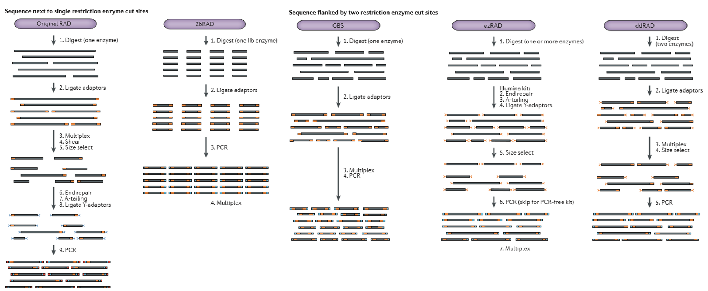

# RADseq para filogenias (laboratorio)

# **Introducción**

Los métodos de secuenciación de secuenciación de nueva generación (*NGS*, por sus siglas en inglés), permiten secuenciar múltiples partes de un genoma sin tener como requisito marcadores previos, lo que nos permite estudiar organismos no modelo al mismo tiempo que se inician estudios sofisticados en organismos silvestres o pobremente estudiados (Eguiarte *et al.* 2013) y aun más cuando no existe un genoma de referencia. 
En general, podemos hablar de cuatro pasos (Fig.1) (Davey *et al*., 2011; Eguiarte *et al.,* 2013;  Andrews *et al*, 2016)
   
 * La ruptura del ADN  en fragmentos pequeños  con  enzimas de restricción. 
 * El montaje de librerias con sitios de unión de oligonucleótidos  que inician la replicación de ADN.
 * La amplificación (obtención de copias) de los fragmentos anteriores.
 * Secuenciación (Illumina)
La secuenciación Illumina ofrece un método alternativo para muestrear la variación nucleotídica en forma de sitios de restricción asociados al ADN secuenciado (RAD) (Rubin *et al.,* 2012). En este trabajo nos proponemos contestar 4 preguntas dando un enfoque principal a filogenias utilizando RADseq, en los métodos de laboratorio.

## 1. ¿Cuáles son las principales variantes del método de laboratorio para generar mis datos y cuándo es más útil cada una?
Como se menciono al principio RADseq permite secuenciar una reducida pero consistente representación del genoma asociado a un sitio de restricción (RADseq) (Bleidorn, 2017). Las endonucleasas de restricción reconocen un patrón específico de bases en las secuencias de DNA y fragmentan la doble hélice en sitios específicos de cuatro a ocho nucleótidos: las dianas de restricción. Esta capacidad de las endonucleasas de restricción para reconocer secuencias específicas de RADseq es la base de la técnica RADseq. 
Los marcadores RAD se implementaron por primera vez en 2007 usando microarreglos (Miller *et al*., 2007) y posteriormente en 2008 fueron adaptados para Next Generation Sequencing ( Baird *et al*., 2008; Bleidorn, 2017; ). En la actualidad el término RADseq se usa para describir varios métodos similares (Andrews *et al*., 2016, Bleidorn, 2017):

* **Original RAD**

* **2bRAD**

* **GBS**

* **ezRAD**

* **ddRAD**

El ADN se extrae de tejido fresco, congelado y/o herbario, generalmente con kit (Qiagen, DNeasy, Valencia), se requiere una mayor cantidad de ADN a concentraciones homogeneas, a diferencia de utilizar microsatélites, AFLPs u otros marcadores.

*Los diferentes métodos de RADseq. Tomado de Andrews *et al*., 2016*

*Comparación entre diferentes métodos de RADseq. Tomado de  Puritz *et al*., 2014*

Todas las variantes parten de la digestión de una o dos  enzimas de restricción: 

#### Una sola enzima que amplifica fragmentos cortos: 
* Genotyping by sequencing (GBS, por sus siglas en inglés)
* Librerias reducidas representadas (RRLs, por sus siglas en inglés)
* Genotipado Multiplex (MSG, por sus siglas en inglés)
  
 Estas tecnicas se han utilizado en resoluciones filogenéticas de especies crípticas con el género *Pyramidula* (Razkin *et al.,* 2016). En especies con divergencia reciente, cuando existe poca señal filogenética, conflictos entre árboles de genes y árboles de especies, esta técnica tiene el potencial para obtener un gran número de sitios variables (SNPs) de genomas nucleares. Aunque GBS fue generado incialmente para maíz se ha utilizado en inferencia filogenética en especies de dificil resolución filogenética (Zimmer and Wen, 2015) . 
     
#### Dos enzimas

* Reducción compleja de secuencias polimorficas (CRoPS, por sus siglas en inglés)
* Doble digestión RAD (ddRAD, por sus siglas en inglés)
Estas técnicas han demostrado buena consistencia para ensamblados de novo con especies no modelo, Peterson *et al.,* (2012) evaluaron sus resultados con cruzas de laboratorio, con el género *Peromyscus*. 

El siguiente cuadro presenta tres estudios de caso para tres entidades y distintos objetivos (Emerson, K. J. *et al.* 2010; Andolfatto, P. *et al.* 2011; Ramos *et al.,* 2009)

 
*Fuente: Davey *et al*., 2011*

La secuenciación de genomas eucariontes completos para inferir filogenias sigue siendo costosa y lento. La secuenciación de genomas mitocondriales es más asequible, pero los árboles pueden ser engañosos debido a la introgresión y la heteroplasmia. Por lo tanto, los métodos RADseq parecen ser los más adecuados para generar reconstrucciones filogenéticas (Cariou *et al*., 2013, Cruaud *et al*., 2014). Por ejemplo en la siguiente figura podemos ver en la topología a partir de secuenciación Sanger posible introgresión (líneas punteadas) y algunos peines, además se observa que con el empleo de RADseq tan solo es aproximadamente tres veces más de tiempo y presupuesto a comparación con Sanger. 

 
*Filogenia obtenida de Cruaud *et al*., 2014*

## 2. ¿Qué limitantes y posibles fuentes de error puede presentar este método (en el laboratorio o la bioinformática)? ¿Qué puede hacerse para amortiguarlos?

* **DNA genómico de bajo peso molecular**

Cuando se trabaja en establecer relaciones filogenéticas en distintos grupos, en no pocas ocasiones se requiere extraer ADN de ejemplares de museo, herbario, y organismos que han estado almacenados por mucho tiempo a bajas temperaturas. Graham *et al.,* (2015) evaluaron el grado de degradación de ADN con tejido de *Coregonus clupeaformis*  y encontraron que entre más degrado este el DNA se requieren más ciclos de PCR durante la normalización (para permitir la multiplexación) para compensar la menor cantidad de fragmentos intactos presentes, además mayor cantidad de DNA inicial. El aumento de los ciclos de PCR da lugar a una mayor proporción de fragmentos redundantes retenidos por la secuenciación, reduciendo el contenido de información para cada individuo. El DNA moderadamente degradado si puede ser utilizado de manera óptima, sin embargo, el DNA altamente degradado generalmente no aprueba los filtrados de calidad. En este sentido trabajando con ejemplares de encinos Hipp *et al.* (2014)  no encontraron diferencias en la calidad de secuenciación  entre tejido fresco y congelado, auque se recomienda utilizar tejido fresco en la medida de lo posible.

 
*Fuente: Graham *et al*., 2015*

* **Inconsistencia en la selección del tamaño**

Para la mayoría de los protocolos, la digestión reduce el DNA genómico a un amplio rango de longitudes de fragmentos, y luego se usa un paso de selección de tamaño para aislar los fragmentos de longitudes ideales para la secuenciación. La consistencia en la selección de tamaño en las bibliotecas es crucial para producir datos de loci comparables en todas las muestras; la inconsistencia en la selección del tamaño  puede llevar a la aparición de diferentes conjuntos de loci en diferentes librerías, lo que da como resultado un esfuerzo de secuenciación desaprovechado y altos niveles de genotipos faltantes (Andrews *et al*., 2016).

* **Deserción de alelos y alelos nulos**

Resulta cuando se encuentran polimorfimos en el sitio de restricción, lo que causa errores en el genotipado, causando que el individuos heterocigotos con el alelo nulo aparezca como homocigotos. La frecuencia de deserción de alelos aumenta con el tamaño de los sitios de reconocimiento por la enzima de restricción, con los niveles de polimorfismo en el organismo sobre todo en ddRAD. Estos errores pueden conducir a una sobrestimación de la FST y un incremento de falsos positivos y falsos negativos en test de outliers, lo que puede amortiguarse con la remoción de alelos nulos, y tener una idea de las tasas de mutación en las regiones de estudio.

* **Duplicados de PCR y errores de genotipado**

Puritz *et al*. (2014) sugieren el uso de métodos “PCR-free” (ezRAD) para evitar duplicados de PCR. Estos métodos tienen un gran potencial, sin embargo son raramente factibles debido al alto costo por muestra y alta cantidad de DNA por muestra, excepto para las preguntas de investigación que se pueden responder utilizando muestras agrupadas (Puritz *et al*., 2014; Andrews *et al*., 2016)

* **Varianza en la profundidad de cobertura entre loci**

El promedio de cobertura de secuenciación por locus por individuo está dado por la siguiente fórmula: 

 
*Formula de la cobertura. Tomado de Cariou *et al*., 2013*

**R**: número total de reads, **N**: número de individuos incluidos en la librería, **Si**: número de sitios de restricción en el genoma del individuo **i**. 

Un incremento en el tamaño del pool ocasiona un un menor costo de secuenciación por muestra, pero ocasiona una menor cobertura por locus (Cariou *et al*., 2013).

* **Elección de la adecuada enzima de restricción**

Dependiendo de la pregunta de estudio se debe elegir la(s) enzimas(s). La elección de la enzima de restricción se basa en varios parámetros, como la frecuencia deseada de los sitios de RAD en todo el genoma, el contenido de GC, la profundidad de cobertura necesaria y el tamaño del genoma (Etter *et al*., 2011; Cariou *et al*., 2013). En la siguiente figura se puede observar que los diferentes grupos de organismos tienen distintos porcentajes de contenido de GC.

 
*Fuente: Davey *et al*., 2011*

Por ejemplo en un estudio filogenético de 12 especies de *Drosophila*, se determinó usar la enzima Sbf1, una enzima de corte raro debido a su sitio de restricción de 8 bp de longitud y rico en GC y por tanto cede en el menor número de sitios de restricción por genoma. Esta propiedad es valiosa para estudios donde una gran cantidad de especímenes son más importantes que una gran cantidad de loci por genoma (Cariou *et al*., 2013).

* **Tamaño de los reads**

En la siguiente figura se muestra la filogenia obtenida para doce especies de Drosophila realizada con reads de 100 pb, se observa una topología precisa. En contraste, también se realizaron pruebas filogenéticas con reads cortos (50 pb) y se encontraron errores (posición incorrecta de una especie) así como bajos soporte en los nodos más ancestrales. Este apoyo deficiente para los nodos profundos sugiere que los reads cortos deberían usarse para resolver filogenias de corta escala (Cariou *et al*. 2013).

 
*Filogenia de *Drosophila*. Tomado de Cariou *et al*., 2013*

* **Datos faltantes**

Una de las limitantes más recurrentes en la secuenciación son los datos faltantes, la caida de locus, esto puede tener varias causas (Schmidt-Luhn *et al.,*2017)

* Fallas en la amplificación de fragmentos.
* Falta de cobertura en algunas muestras.
* Procesos estocásticos.
* Mutaciones en los sitios de restricción RAD-seq, que esto depende del grupo de estudio. 

Una de las posibles soluciones es la utilización de algortimos como PyRAD  y  SVDquartets (Eaton,2014). Ver más abajo.

## 3. ¿El muestreo requiere algún diseño específico? Por ejemplo, si se quiere secuenciar un genoma de novo ¿qué individuo sería ideal? Si trabajo con trascriptomas, ¿cómo afecta el tejido, la edad, las condiciones, etc. mi muestreo?

* **Se requiere DNA limpio, intacto y de alta calidad**

Es importante que el DNA tenga estas características para el éxito general del protocolo, así como para la óptima  digestión de endonucleasas de restricción. Se puede usar ADN de menor calidad, pero es probable que la cantidad inicial de DNA deba aumentarse. Se recomienda el kit DNeasy Blood & Tissue (Qiagen) o un kit/protocolo similar que produzca DNA puro, de alto peso molecular y libre de RNA (Etter *et al*., 2011).

Cuando trabajar con muestras de ADN muy degradadas es la única opción, se ha encontrado que los parámetros del protocolo se pueden optimizar (cómo usar más DNA de entrada para comenzar y un cizallamiento menor) para crear bibliotecas utilizables. Estas bibliotecas a menudo no se amplifican tan bien como las hechas con DNA genómico intacto de alto peso molecular  (Etter *et al*., 2011).

En la siguiente figura se muestran geles de agarosa de DNA de . En A es DNA extraído inmediatamente después de la toma de sangre. En B es DNA extraído inmediatamente después de la toma del tejido muscular. En C es DNA extraído de músculo después de 12 horas de incubación a temperatura ambiente. En D después de 48 horas de incubación y E después de 96 horas. Se puede observar que conforme mayor tiempo de incubación a temperatura ambiente, se obtiene DNA más degradado (Graham *et al*., 2015).

 
*Geles de agarosa de DNA. Tomado de Graham *et al*., 2015*

* **Cuantificación precisa de DNA**

Se recomienda utilizar un método basado en fluorescencia para la cuantificación de DNA para obtener las lecturas de concentración más precisas. Dado que se unen específicamente al ADN de doble cadena, los colorantes utilizados en los ensayos fluorométricos no se ven tan afectados por el RNA, nucleótidos libres u otros contaminantes comúnmente encontrados en las extracciones de DNA (lo que puede conducir a cuantificaciones inexactas cuando se usa la absorbancia). Si usa otra forma de cuantificación de DNA, como las lecturas de absorbancia del espectrómetro UV 260/280, se debe de confirmar la concentración comparando con una muestra de calibración conocida o procesando la muestra en un gel de agarosa y comparando una cantidad conocida de DNA o escalera (Etter *et al*., 2011).

Se recomienda verificar la integridad de las muestras en un gel independientemente del método de cuantificación. El ADN genómico debe consistir en una banda estrecha de alto peso molecular sin ningún tipo de visible
productos de degradación (Etter *et al*., 2011).

La concentración óptima es de 25 ng / μl o mayor (Etter *et al*., 2011).

####  4.     Menciona al menos dos softwares principales que se utilicen para realizar la parte medular de los análisis bioinformáticos de este tipo de análisis (e.g. si es ensamblado de novo con qué se ensambla, no con qué se hace el pre-procesamiento) y cuáles son los pros y contras de cada uno.

En análisis filogenéticos uno de los softwares más citados en la literatura para el ensamblado de novo es PyRAD de acuerdo con Eaton (2014), a partir de datos de prueba sus resultados fueron superiores a los obtenidos con  Stacks, en cuanto a los valores de consenso y la eficiencia de análisis de tiempo. Las ventajas que ofrece de acuerdo con la referencia son: 

*  Variación en el número de indels, dentro y entre muestras.
*  El ensamblado de sitios altamente divergentes.
* Capacidad de identificar traslape parcial entre secuencias (Eaton, 2014). 

Un estudio filogenético de caso muy apropiado lo presentan Fitz-Gibbon *et al.* (2017) para la resolcuión filogenética en encinos de Norteamérica, entrenando el algoritmo con tres set de datos (68000 - 11000 loci). Lo interesante es la consistencia que presentan sus resultados al ensamblar de novo contra ensamblar cuando se tiene el  genoma de referencia, siempre y cuando se considere que la mejor opción no es ensamblar con los parametros dados por default en el programa, es necesesario optimizar. 

Otro problema que enfrentamos con bastante recurrencia como mencionamos anteriormente son datos faltantes, en este sentido otro software que ha demostrado resultados bastate consistentes en cuanto a los valores de consenso  y la eficiencia en el análisis es SVDquartets. Schmidt-Lebuhn *et al.,*2017 evaluaron su eficiencia con distintos sets de datos faltantes, distintos algoritmos y con conocimiento cierto de la resolución filogenética del género *Craspedia, Asterarceae* . Los valores de consenso en las filogenias obtenidas, asi como las resolución filogenética fue muy consistente, a diferencia de SNAPP y otros algoritmos, cuyos resultados dependieron de la cantidad de datos faltantes. 

 
*Fuente: Schmidt-Lebuhn *et al*., 2017*

**Literatura citada**

Andolfatto, P. et al. (2011). Multiplexed shotgun genotyping for rapid and efficient genetic mapping. Genome Res. 21, 610–617.

Andrews KR, Good JM, Miller MR, Luikart G, Hohenlohe PA (2016) Harnessing the power of RADseq for ecological and evolutionary genomics. Nat Rev Genet 17:81–92.

Baird NA, Etter PD, Atwood TS, Currey MC, Shiver AL, Lewis ZA, Selker EU, Cresko WA, Johnson EA (2008) Rapid SNP discovery and genetic mapping using sequenced RAD markers. PLoS One 3:e3376.

Bleidorn C. (2017) Phylogenomics. An Introduction. 1a edición. Springer. Spanish National Research Council. Madrid, España.

Cariou, M., Duret, L. & Charlat, S. (2013) Is RAD-seq suitable for phylogenetic inference? An in silico assessment and optimization. Ecol. Evol. 3, 846–852.

Chou, *et al.,* (2015). A comparative study of SVDquartets and other coalescent-based species tree estimation methods. *BMC Genomics.* 16:1471(S2).

Cruaud, A. et al. (2014). Empirical assessment of RAD sequencing for interspecific phylogeny. Mol. Biol. Evol. 31, 1272–1274.

Davey, J. W. et al. (2011). Genome-wide genetic marker discovery and genotyping using next-generation sequencing. Nat. Rev. Genet. 12, 499–510.

Eaton, D. A. R. (2014). PyRAD: assembly of the novo RADseq loci for phylogenetic analyses. *Bioinformatics.* 30(13): 1844-1849.

Eguiarte, L., Aguirre-Liguori, J., Jardón-Barbolla, L., Aguirre-Planter, E, Souza, V. (2013). Genómica de poblaciones: nada en evolución va atener sentido si no es a la luz de la genómica, y nada en genómica tendra sentido si no es a la luz de la evolución. *Rev. Esp. en Ciencias Quimico-Biológicas.*  16(1): 42-56.

Emerson, K. J. et al. (2010). Resolving postglacial phylogeography using high-throughput sequencing. **Proc. Natl Acad. Sci.USA * 107, 16196–16200

Etter PD, Bassham S, Hohenlohe PA, Johnson EA, Cresko WA. (2011). SNP discovery and genotyping for evolutionary genetics using RAD sequencing. In: Orgogozo V, Rockman MV, editors. Molecular methods for evolutionary genetics. New York: Humana Press. p. 157–178.

Fitz-Gibbon, S., Hipp, A. L., Pham, K. K. Manos, P. and Sork V. L. (2017). 
Phylogenomic inferences from reference-mapped and de novo
assembled short-read sequence data using RADseq sequencing
of California white oaks (Quercus section Quercus) . Genome 60: 743–755

Graham, C. et al. Impacts of degraded DNA on restriction enzyme associated DNA sequencing (RADSeq). (2015). Mol. Ecol. Resour. 15, 1304–1315.

Hipp, A. L., Eaton, D. A. R., Cavender-Bares, J., Fitzek, E., Nipper, R. (2014). A framework phylogeny of the oaks clade based on sequenced RAD data. *PLoS ONE.* e(4)93975, doi:10.1371/jourmal.pone.0093975

Miller, M. R., Dunham, J. P., Amores, A., Cresko, W. A. & Johnson, E. A. (2007). Rapid and cost-effective polymorphism identification and genotyping using restriction site associated DNA (RAD) markers. Genome Res. 17, 240–248. 

Peterson, B. K., Weber, J.N., Kay, E. H., Ficher, H. S., Hoekstra, H. E. (2012).  Double Digest RADseq: An Inexpensive Method for De Novo SNP Discovery and Genotyping in Model and Non-Model Species. PLoS ONE 7(5): e37135. doi:10.1371/journal.pone.0037135

Puritz J. B., Matz M. V., Toonen R. J., Weber J. N., Bolnick D. I., Bird C. E. (2014) Demystifying the RAD fad. Molecular Ecology 23, 5937–5942.

Ramos, A. M. et al. (2009). Design of a high density SNP genotyping assay in the pig using SNPs identified and characterized by next generation sequencing technology. PLoS ONE 4, e6524.

Rubin, B.E.R., Ree, R. H., Moreau, C. S. (2012). Inferring Phylogenies from RAD Sequence Data. PLoS ONE, 7(4): e33394. doi:10.1371/journal.pone.0033394

Razkin, O., Sonet, G., Breugelmans, K., Madeira, M. J., Gómez-Moliner, J. and Backeljau, T. (2016). Species limits, interspecific hybridization and phylogeny in the cryptic land snail complex Pyramidula: The power of RADseq data. *Molecular Phylogenetics and Evolution* 101 (2016) 267–278

Scmidt-Lebuhn, A., Aitken, N. C., Chuah, A. (2017). Species trees from consensus single nucleotide polymorphism (SNP) data:
Testing phylogenetic approaches with simulated and empirical data. 
*Molecular Phylogenetics and Evolution.* 116: 192–201

Zimmer, E. and Wen, J. (2015). Using nuclear gene data for plant phylogenetics: Progress and prospects II. Next-gen approaches. *Journal of Systematics and Evolution.* doi: 10.1111/jse.12174

