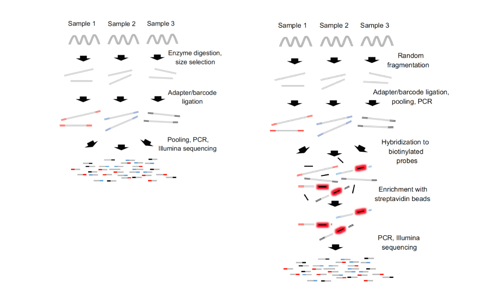

# RADseq vs UCEs
### Natalia Delgado, Ernesto Samacá

Entre los métodos de representación reducida del genoma frecuentemente utilizados para análisis filogenéticos se destacan:

+ Captura de secuencias de elementos ultraconservados **(UCEs)**

+ Secuenciación asociada a sitios de restricción **(RADSeq)** 

Debido a que resultan útiles para investigar la evolución de los organismos a diferentes escalas de tiempo evolutivo. 

##  Principales diferencias
 

|UCEs|RADseq|
|----------|---------|
|Escalas de tiempo conservadas|Escalas de tiempo recientes|
|Filogenias a nivel supraespecífico|Estudios poblacionales y filogeográficos|
|Costoso|No tan costoso|
|Funciona con muestras de museo antiguas |Preferible usar muestras mejor conservadas|
|Requiere poca concentración de DNA inicial|Requiere concentraciones de DNA óptimas|
|Recupera genomas mitocondriales|No recupera genomas mitocondriales

### Variantes de RADSeq:   

* Tamaño de los fragmentos
* Tipo de enzimas 
* Número de enzimas (ddRAD, 3RAD)

## Posibles fuentes de error

### Metodológicas: 
 
* Contaminación 
* Errores de secuenciación

**RADSeq**

* Digestión enzimática adecuada
* Duplicados de PCR  
* Limpieza usando Beads: Pérdida de DNA
* Pooling de muestras 

**UCEs**

* Sonicación: Diferente para muestras antiguas y conservadas
* Concentración de Beads (Preparación de librerías y enriquecimeinto): Pérdida de DNA
* Dilución de sondas: Problemas en la hibridación
* Pooling de muestras

### Bioinformáticas:

* Identificación de parálogos (RADseq)
* Altos requerimientos computacionales
* Recuperación de pocos loci compartidos 

## Muestreo ideal

**UCEs**: Requiere un buen muestreo táxonomico para evitar inferencia de topologías incorrectas. Funciona con especimenes de eventos de colecta antiguos (hasta 100 años)

**RADseq**: Depende del tipo de estuido.  

Para filogeografía y genética de poblaciones: muestreo completo en el área de distribución. 
Menor número de muestras por población y más poblaciones. Requiere de matrices completas.

Para filogenómica: Grupos de reciente divergencia para evitar mutaciones en sitios de restricción. Permite un mayor número de datos faltantes. 

## Software 

### UCEs

PHYLUCE: Incluye subprogramas

1. Trimming: Trimmomatic - Illumiprocessor
2. Ensamble de contigs: Trinity, ABySS, Velvet
3. Alineamiento: MAFFT, Muscle
4. Limpieza y filtrado: Gblocks

**Análisis**: 

- Árboles de genes (Mr Bayes, ExaBayes, RAxML)
- Árboles de especies (ASTRAL, STRAW) 

### RADseq

Stacks: genética de poblaciones

1. Limpieza y filtrado `process_radtags`
2. Ensamblaje `denovo_map.pl` o con base en un genoma de referencia `ref_map.pl`
3. Análisis de genética de poblaciones y obtención de outputs `populations` 
 
ipyrad: Filogenómica 

7 pasos independientes para limpiar, enzamblar y procesar outputs. 

## Referencias y más información

Harvey, M.G., Tilston Smith, B., Glenn, T.C., Faircloth, B.C., Brumfield, R.T. 2016. Sequence Capture versus Restriction Site Associated DNA Sequencing for Shallow Systematics. Systematic Biology, 65(5), 910-924

Baird, N.A., Etter, P.D., Atwood, T.S., Currey, M.C., Shiver, A.L., Lewis, Z.A., Selker, E.U., Cresko, W.A., Johnson, E.A. 2008. Rapid SNP Discovery and Genetic Mapping Using Sequenced RAD Markers. PLoS ONE: e3376.

Peterson, B.K., Weber, J.N., Kay, E.J., Fisher, H.S., Hoeakstra, H.E. 2012. Double digest RADseq: an inexpensive method for de Novo SNP discovery and genotyping in model and non-model species. PLsoS One: e37135.

Faircloth, B.C., McCormack, J.E., Crawford, N.G., Harvey, M.G., Glenn, T.C. 2012. Ultraconserved elements anchor thousands of genetic markersspanning multiple evolutionary timescales. Systematic Biology: 61, 717-726.

Smith, B.T., Harvey, M.G., Faircloth, B.C., Glenn, T.C., Brumfield, R.T. 2014. Target capture and massively parallel sequencing of ultraconserved elements (UCEs) for comparative studies at shallow evolutionary time scales. Systematic Biology: 63, 83–95.

[Para parender más de UCEs](http://ultraconserved.org)

