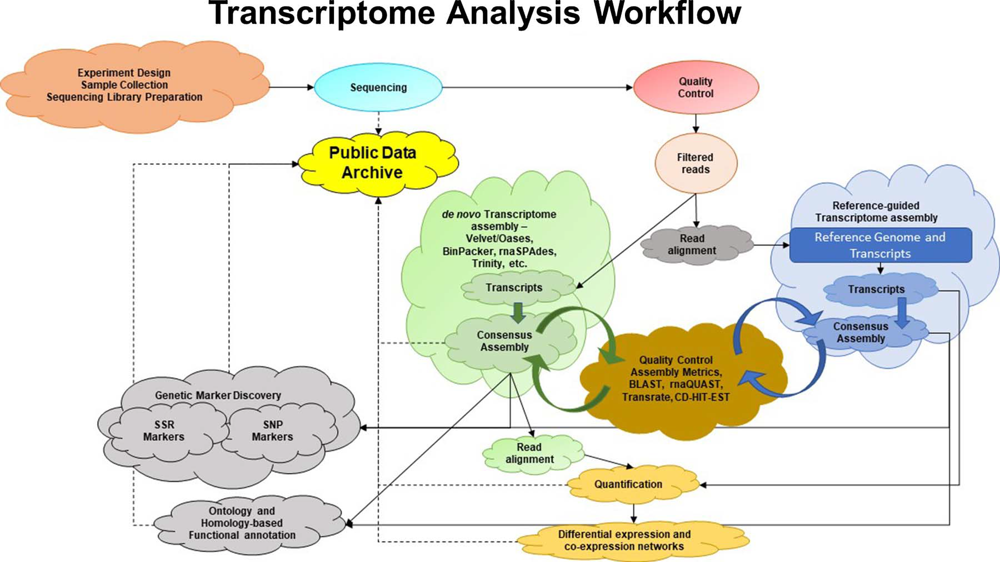
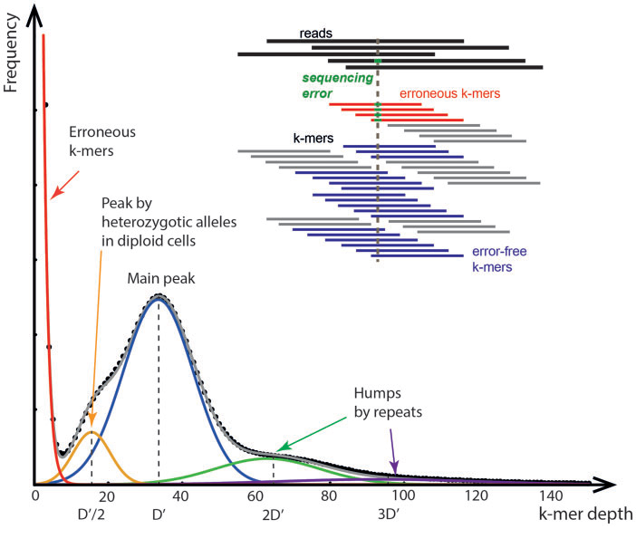
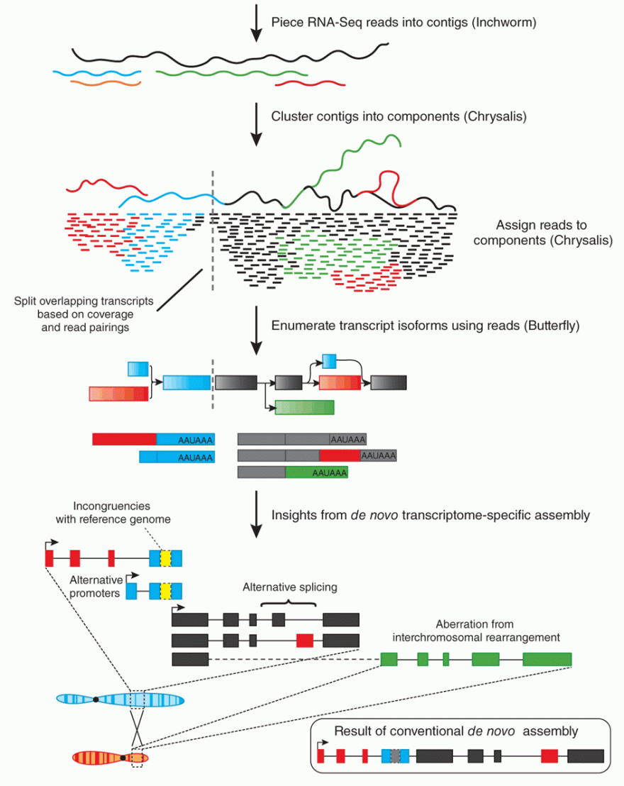
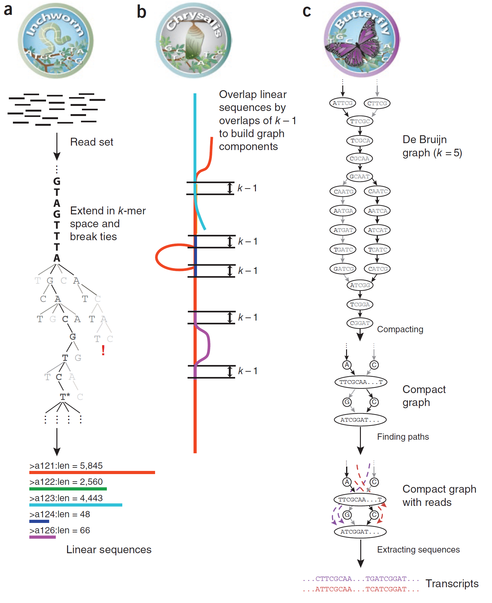

# ENSAMBLADO DE TRANSCRIPTOMA *DE NOVO*


Guadalupe Andraca Gómez 

David Xochipiltecatl García

Miguel Angel Espinoza Camacho


## 1.¿Cuáles son las principales variantes del método de laboratorio para generar mis datos y cuándo es más útil cada una?

Para transcriptomas de novo las principales variantes del experimento de secuenciación es la generación de reads Pair-ends y Single-ends. Los reads Pair-ends es una estrategia que conserva información de ambos sentidos de un transcrito, se recomienda cuando no existe genoma de referencia. Por otro lado, la estratégia de Single-end brinda una relación costo-efectiva ideal en la secuenciación con genoma de referencia o bien genomas de organismos emparentados. Existen otros factores que varian en el estudio de RNA-seq de novo, número de replicados biológicos no menor a 3 y la inclusión de controles. Así como el uso de ontologías específicas.

El ensablado *de novo* para transcriptomas consiste en la conformación de secuencias coherentes a partir de los
datos del secuenciador cuando no existe un genoma de referencia con el cual comparar los datos de la secuenciación. El estudio de secuenciación de novo de transcriptoma se centra en el estudio dinámico de la expresión genómica cuantificable y también en el análisis de variantes, splicing y de algunas secuencias no codificantes.

## 2.¿Qué limitantes y posibles fuentes de error puede presentar este método (en el laboratorio o la bioinformática)? ¿Qué puede hacerse para amortiguarlos?

Bioinformática:En el caso de transcriptoma de novo al aumentar el número de *reads* la exactitud de la secuenciación será mayor. Aunque el aumento de *reads pair-end* conllevan a una demanda de almacenamiento bioinformático mayor.Por otro lado, la ausencia de muestras control limitan un análisis de contraste de expresión. Solución, contar con repositorios e infraestructura adecuada. 

## 3.¿El muestreo requiere algún diseño específico? Por ejemplo, si se quiere secuenciar un genoma de novo ¿qué individuo sería ideal?
 Para un estudio de transcriptoma de novo podamos evaluar transcritos y su expresión, es necesario tener muestras de dos grupos diferentes, preferentemente tres individuos por condición. 
El transcriptoma de una célula se puede modular en lapsos relativamente cortos de tiempo (minutos, horas, días). Por tal motivo el transcriptoma es altamente dinámico y es diferente en cada tipo celular. Así mismo, el momento celular o momento metabólico lo va a influir. Dada su dinámica de cambio La extracción de RNA para comparar ṕoblaciones o condiciones particulares debe realizarse en el tejido de interés.
Un ejemplo de colecta de mRNA realizada para ensamblaje del transcriptoma lo encontramos en Ibarra-Laclette et al. (2015) en *Lophophora williamsii* (peyote), quienes realizaron la colecta a partir de las raíces y botones de las plantas colectadas. Por otro lado, Grabherr et al (2011), extrajeron el mRNA a partir de cultivos celulares de levadura y de celulas dendríticas lisadas de ratón para el ensamblaje del transcriptoma de ambas especies.

Se debe tomar en cuenta El objetivo claro del estudio.
  
  Tipo de medición (RNA-DNA).
 
 
 Tipo de tecnología.
 
 Tipo de factor o muestra.
 
 Características de la muestra.


**Coverage Equation**

The Lander/Waterman equation is a method for computing coverage1.

The general equation is:

C = LN / G

• C stands for coverage

• G is the haploid genome length

• L is the read length

• N is the number of reads


## ENSAMBLADO *de novo*


Consiste en: 

a) Designación del experimento y sobrelapamiento de reads y conformación-ensamblado de contings. 

b) Generación de scafoldings. 

c) Rellenado de huecos entre scafolds. 

d) Generación de borradores parciales del genóma en cuestión.




M. Geniza, P., 2017


**K mers**



Sohn.*et. al*., 2018

**Ensamblado**



Sohn.*et. al*., 2018


**Ensamblado de novo de transcriptoma**

Este proceso consiste en:

a) Designación experimental, generación de bibliotecas y secuenciación. 


b) Análisis de control de calidad y filtrado de reads. 

c) Ensamblado de *novo* mediante software como: velver, Oases, SPAdes, Trinity o BinPacker. Estos software generalmente utiliza para generar el ensablado los algoritmos o métodos:

**OLC: Overlap-Layout-Consensus assembly**

**DBG: De Bruijn graph assembly**


## 4.Menciona al menos dos softwares principales que se utilicen para realizar la parte medular de los análisis bioinformáticos de este tipo de análisis (e.g. si es ensamblado de novo con qué se ensambla, no con qué se hace el pre-procesamiento) y cuáles son los pros y contras de cada uno. 
Para el ensamblado de transcriptoma de novo sin genoma de referencia existe una diversidad amplia en software.

Velvet/Oases (2008): Ambos software generan ensamblado de novo de transcriptoma a partir de pair-end cortos. También, generan análisis de splicing, sin embargo para realizar analisis adicionales, requieren de actualizaciones.
SPAdes (2012): este software genera ensamblado de novo en una amplia variedad de especies y tamaños de transcriptomas, además puede generar análisis de expresión.
 Sin embargo, los paquetes con los que se han obtenido mejores resultados al realizar los ensamblados son:
1)BinPacker (2016): este software construye transcritos, incorpora información de la covertura y genera análisis de splicing. En específico este sistema profundiza en los análisis de splicing y su ensamblado. Sinembargo tiene como desventaja que no es un software libre


2)Trans-ABySS Es un programa capaz de analizar hasta 7.4 Gb en lecturas de 50 pares de bases pairedend en poco tiempo y sin consumir mucha memoria. Fusiona todos los contig producidos por el programa ABySS en un conjunto de fragmentos transcritos no redundantes. Trans-ABySS puede predecir sitios de poliadelinación, identificar fusión genica y calcular la expresión del gen. Produce en promedio más isoformas por gen , el método de reconstrucción por múltiples ensamblajes permite reconstruir varios fragmentos. Sin embargo, es poco eficiente con datos single end, produciendo fragmentos de secuencias de transcrito con colas de poly A desde 35pb. 

3)Trinity Es un ensamblador de tres modulos: 1)Larva, admite las lecturas de la secuenciación en los transcritos, 2)Crisalida, realiza el empalme de parálogos y genera gráficas de Buijin y 3)Mariposa,analiza los gráficos y genera la enumeración de transcritos completos. Esta modularidad otorga una mayor flexibilidad para extender los pasos, permitiendo incluso remplazar algún módulo por otro más eficiente. Este software sobre otros es que tiene una mejor complementatización y la contiguedad más grande. Produce poca cantidad de isoformas. Tiene como desventaja que utiliza mucha memoria y el proceso lo realiza en mucho tiempo.  Ambos programas han identificado estructuras conocidas, nuevas y expresiones alternas en transcritos. 
Además trinity brinda métricas de calidad de ensamblado y ensayos. En particular para transcritptoma examina con la metrica de “exN50” (top de transcritos que representan el 50% del transcriptoma).
Nota: Todos lo software anteriores utilizan entre sus herramientas, el algoritmo Bruijn Graph, que consiste en el traslape de reads para contruir transcritos o cadenas.
Todos los programas son poco sensibles con secuenciaciones de baja profundidad. Con el aumento en la cobertura de las secuencias estos softwares de novo se consideran más eficientes que los ensambladores guiados por un genoma.


**Paqueteria de Triniti (2011-2013)**



Grabherr., *et al*., 2011


Ejemplo de triniti.

TRINITY
http://evomics.org/learning/genomics/trinity/
https://github.com/Jaiswal-lab/Transcriptome_Assembly_Scripts.git

```
Trinity --seqType fq --left <left_reads> --right <right_reads> --output test-trinity-cotton 
## where --seqType is read type "fq" fastq or "fa" fasta
## where --left is name and location of left reads
## where --right is name and location of right reads
## where --output is the name and location output
```

Ejemplo: Basic Trinity usage is as follows:

`
Trinity.pl --seqType (fq for fastq or fa for fast) --left ~/path/to/reads_1.fq --right ~/path/to/reads_2.fq (or --single for single reads) --CPU 4 --bflyHeapSpace 10G --output ~/path/to/output_dir
`

**NOTE**: It is recommended to use fully specified paths for sequence files with Trinity.


## EVALUACIÓN DE ENSAMBLADO

El análisis posterior es la evaluación del ensablado donde se analizan métricas como N50 o exN50.

Software para evaluación de ensamblado:


BLAST

rnaQUAST

Transrate

CD-HIT-EST


## PERSPECTIVAS


**Disminición en la tasa de errores (Pacbio).**

**Dsitinguir contaminación.**

**Disminución de costo para un mayor estudio de organismos específicos.**


 http://www.nature.com.pbidi.unam.mx:8080/articles/nmeth.1517.pdf

 http://europepmc.org/backend/ptpmcrender.fcgi?accid=PMC3571712&blobtype=pdf