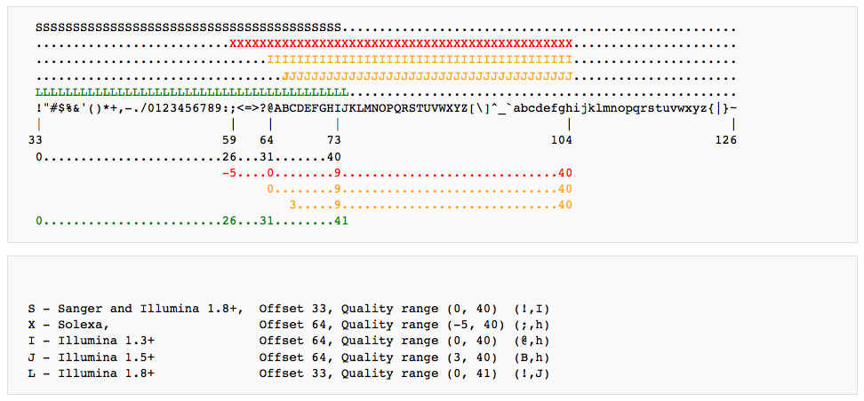
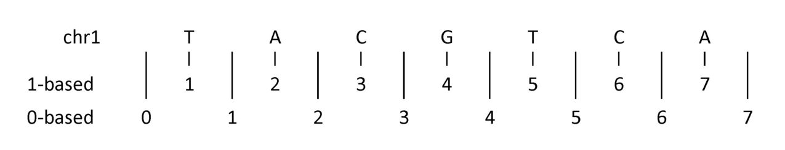

# Unidad 6 Datos y análisis genéticos utilizados en bioinformática 

Referencias recomendadas para esta Unidad:

* [Next Generation Sequencing (NGS)/Pre-Processing - Wikibooks, Open Books for an Open World (2014)](http://en.wikibooks.org/wiki/Next_Generation_Sequencing_(NGS)/Pre-processing#Sequence_Quality)

	

## 6.1. Datos crudos 	

### ¿Qué son los datos *crudos*?

Son las secuencias tal cual salen de la plataforma de secuenciación (Illumina, IonTorrent, PacBio, entre otros). Es decir los **reads** (lecturas).  


Los datos crudos (sin importar la plataforma y el método de laboratorio utilizado) conllevan cierto nivel de basura, es decir:

* *reads* de baja calidad que deben ser descartados por completo o en parte (*trimmed*) antes de proceder a los análisis biológicos de los datos. 

* Secuencias sobrerepresentadas, por ejemplo dímeros de adaptadores.

La longitud y distribución de la calidad de los *reads* varían de plataforma a plataforma, pero también el tipo de error más común:

* Illumina: errores puntuales en la asignación de un nucleótido
* IonTorrent y símiles: se les complica determinar el número correcto de nucleótidos en cadenas como AAAAA.
* PacBio: secuencias muuuucho más largas, pero con menor calidad en general.

Dado que los datos crudos son muy pesados (espacio de disco) y que buena parte de los datos crudos son basura, en general los datos crudos a este nivel no se guardan en repositorios públicos (e.g. SRA) hasta que hayan pasado por los filtros del pre-procesamiento.

Como veremos más adelante, los filtros de pre-procesamiento ayudan a identificar las buenas secuencias de la basura a partir de su calidad asociada.


## 6.2. Información en los archivos FASTQ 		
### Representación de secuencias

En cómputo las secuencias de ADN son una *string* (cadena) de caracteres. 

* Secuencias genómicas

{A,C,G,T}+

* Secuencias mRNA

{A,C,G,U}+


##### Secuencias simples: FASTA/Pearson Format

Línea 1: información de la secuencia

Línea 2: la secuencia.

```

>gi|365266830|gb|JF701598.1| Pinus densiflora var. densiflora voucher Pf0855 trnS-trnG intergenic spacer, partial sequence; chloroplast
GCAGAAAAAATCAGCAGTCATACAGTGCTTGACCTAATTTGATAGCTAGAATACCTGCTGTAAAAGCAAG
AAAAAAAGCTATCAAAAATTTAAGCTCTACCATATCTTCATTCCCTCCTCAATGAGTTTGATTAAATGCG
TTACATGGATTAGTCCATTTATTTCTCTCCAATATCAAATTTTATTATCTAGATATTGAAGGGTTCTCTA
TCTATTTTATTATTATTGTAACGCTATCAGTTGCTCAAGGCCATAGGTTCCTGATCGAAACTACACCAAT
GGGTAGGAGTCCGAAGAAGACAAAATAGAAGAAAAGTGATTGATCCCGACAACATTTTATTCATACATTC
AGTCGATGGAGGGTGAAAGAAAACCAAATGGATCTAGAAGTTATTGCGCAGCTCACTGTTCTGACTCTGA
TGGTTGTATCGGGCCCTTTAGTTATTGTTTTATCAGCAATTCGCAAAGGTAATCTATAATTACAATGAGC
CATCTCCGGAGATGGCTCATTGTAATGATGAAAACGAGGTAATGATTGATATAAACTTTCAATAGAGGTT
GATTGATAACTCCTCATCTTCCTATTGGTTGGACAAAAGATCGATCCA

```


##### Fastq: formato para secuencias de secuenciación de siguiente generación

Secuencia fasta + detalles calidad de la información (la Q es de Quality).

* Línea 1: Encabezado (*Header*): comienza con @. Sigue el identificador (*identifier*). Si son datos crudos contiene info del secuenciador que identifica a esta secuencia y el read pair (/1 o /2), si son datos ya procesados en SRA contiene una descripción de la secuencia.

* Línea 2: la secuencia. 

* Línea 3: Comienza con +. Puede ser sólo el símbolo + o repetir la info del Header. 

* Línea 4: Información de la calidad de secuenciación de cada base. Cada letra o símbolo representa a una base de la secuencia codificado en formato [ASCII](http://ascii.cl/). 


La info de calidad se codifica en ASCII porque esto permite en 1 sólo caracter codificar un valor de calidad. Por lo tanto la línea 2 y la 4 tienen el mismo número de caracteres. 
 

Ordenados de menor a mayor estos son los caracteres ASCII usados para representar calidad en FASTQ:

```
!"#$%&'()*+,-./0123456789:;<=>?@ABCDEFGHIJKLMNOPQRSTUVWXYZ[\]^_`abcdefghijklmnopqrstuvwxyz{|}~
```
Dependiendo del tipo y versión de plataforma de secuenciación se toman diferentes caracteres (pero sin desordenarlos):




(Tomé la imágen de [aquí](http://en.wikibooks.org/wiki/Next_Generation_Sequencing_(NGS)/Pre-processing#Sequence_Quality)
)

Pero en todos los casos el **valor máximo de calidad es = ~40** y los valores **< 20 se consideran bajos**.


**Ojo:**
 @ y + están dentro de los caracteres ASCII utilizados para codificar la calidad, lo que hace que usar `grep` en archivos FASTQ pueda complicarse, ojo.

**Ejemplos:**

Ejemplo de datos FASTQ recién salidos de Illumina:

```
@HWI-ST999:102:D1N6AACXX:1:1101:1235:1936 1:N:0:
ATGTCTCCTGGACCCCTCTGTGCCCAAGCTCCTCATGCATCCTCCTCAGCAACTTGTCCTGTAGCTGAGGCTCACTGACTACCAGCTGCAG
+
1:DAADDDF<B<AGF=FGIEHCCD9DG=1E9?D>CF@HHG??B<GEBGHCG;;CDB8==C@@>>GII@@5?A?@B>CEDCFCC:;?CCCAC
```
Y uno más:

```
@OBIWAN:24:D1KUMACXX:3:1112:9698:62774 1:N:0:
TAATATGGCTAATGCCCTAATCTTAGTGTGCCCAACCCACTTACTAACAAATAACTAACATTAAGATCGGAAGAGCACACGTCTGAACTCAGTCACTGACC
+
CCCFFFFFHHHHHIJJJJJJJJJJJJIIHHIJJJJJJJJJJJJJJJJJJJJIJJJJJJIJJJJIJJJJJJJHHHHFDFFEDEDDDDDDDDDDDDDDDDDDC

```
¿Quieres saber cuáles son las partes del Header? [Clic aquí](https://en.wikipedia.org/wiki/FASTQ_format#Illumina_sequence_identifiers). Y sí, el último ejemplo es real y por lo tanto hay un Illumina HiSeq2000 que se llama Obiwan :)

 Ejemplo de datos FASTQ del SRA:

```
@SRR001666.1 071112_SLXA-EAS1_s_7:5:1:817:345 length=36
GGGTGATGGCCGCTGCCGATGGCGTCAAATCCCACC
+SRR001666.1 071112_SLXA-EAS1_s_7:5:1:817:345 length=36
IIIIIIIIIIIIIIIIIIIIIIIIIIIIII9IG9IC
```


Los datos FASTQ típicamente están comprimidos en formato 
`gzip` (.gz) o `tar` (.tar.gz o .tgz).

**Ejercicio**:

En la Unidad 1 vimos cómo descomprimir archivos .tar.gz ¿Cómo descomprimir un archivo .gz?


## 6.3. Análisis básicos de calidad y preparación de datos (Pre-procesamiento)

### Visualización e interpretación de la calidad de secuencias FASTQ

Antes de saltar a filtrar tus datos con filtros de calidad que la terminal ejecute muy obediente, lo mejor es ver algunos gráficos básicos que nos dicen mucho más que una serie semi-eterna de caracteres ASCII. 

[FASTQC](http://www.bioinformatics.babraham.ac.uk/projects/fastqc/) es un programa que hace una serie de análisis básicos y estándar de calidad. La mayoría de las empresas de secuenciación efectúan este análisis y te mandan los resultados junto con tus datos crudos.

Los análisis de FASTQC son útiles para identificar problemas que pudieron surgir durante el laboratorio o durante la secuenciación. 

El análisis de FASTQC consiste en los siguientes campos:


* [Basic Statistics](http://www.bioinformatics.babraham.ac.uk/projects/fastqc/Help/3%20Analysis%20Modules/1%20Basic%20Statistics.html)
* [Per Base Sequence Quality](http://www.bioinformatics.babraham.ac.uk/projects/fastqc/Help/3%20Analysis%20Modules/2%20Per%20Base%20Sequence%20Quality.html)
* [Per Sequence Quality Scores](http://www.bioinformatics.babraham.ac.uk/projects/fastqc/Help/3%20Analysis%20Modules/3%20Per%20Sequence%20Quality%20Scores.html)
* [Per Base Sequence Content](http://www.bioinformatics.babraham.ac.uk/projects/fastqc/Help/3%20Analysis%20Modules/4%20Per%20Base%20Sequence%20Content.html)
* [Per Sequence GC Content](http://www.bioinformatics.babraham.ac.uk/projects/fastqc/Help/3%20Analysis%20Modules/5%20Per%20Sequence%20GC%20Content.html)
* [Per Base N Content](http://www.bioinformatics.babraham.ac.uk/projects/fastqc/Help/3%20Analysis%20Modules/6%20Per%20Base%20N%20Content.html)
* [Sequence Length Distribution](http://www.bioinformatics.babraham.ac.uk/projects/fastqc/Help/3%20Analysis%20Modules/7%20Sequence%20Length%20Distribution.html)
* [Duplicate Sequences](http://www.bioinformatics.babraham.ac.uk/projects/fastqc/Help/3%20Analysis%20Modules/8%20Duplicate%20Sequences.html)
* [Overrepresented Sequences](http://www.bioinformatics.babraham.ac.uk/projects/fastqc/Help/3%20Analysis%20Modules/9%20Overrepresented%20Sequences.html)
* [Adapter Content](http://www.bioinformatics.babraham.ac.uk/projects/fastqc/Help/3%20Analysis%20Modules/10%20Adapter%20Content.html)
* [Kmer Content](http://www.bioinformatics.babraham.ac.uk/projects/fastqc/Help/3%20Analysis%20Modules/11%20Kmer%20Content.html)
* [Per Tile Sequence Quality](http://www.bioinformatics.babraham.ac.uk/projects/fastqc/Help/3%20Analysis%20Modules/12%20Per%20Tile%20Sequence%20Quality.html)

**Notas importantes:**

* FASTQ automáticamente dice si nuestra muestra "pasó" o "falló" la evaluación. Sin embargo debemos tomar esto dentro del **contexto de lo que esperamos de nuestra librería**, ya que FASTQ espera una distribución al diversa y al azar de nucleótidos (e.g. como si estuviéramos secuenciando un genoma completo), lo que puede **no cumplirse en algunos protocolos distintos sec de genoma completo y es normal**, por ejemplo las lecturas de un estudio de metabarcoding evidentemente no cumplirán las espectativas de distribución de nucleótidos de un genoma completo.

Vamos a la página de dicho programa a ver ejemplos de:

* [Buenos datos Illumina](http://www.bioinformatics.babraham.ac.uk/projects/fastqc/good_sequence_short_fastqc.html)
* [Malos datos Illumina](http://www.bioinformatics.babraham.ac.uk/projects/fastqc/bad_sequence_fastqc.html)
* [Corrida Illumina contaminada con dímeros de adaptadores (*adapter dimers*)](http://www.bioinformatics.babraham.ac.uk/projects/fastqc/RNA-Seq_fastqc.html)


**¿Qué que son los dímeros de adaptadores?**

Los adaptadores se ligan al ADN de nuestras muestras en un paso de ligación, sin embargo, también pueden ligarse entre sí y luego pegarse a la *flow cell* (que lo traduzca quién sepa cómo). Resultado: son secuenciados pero no proven datos útiles, simplemente la secuencia de los adaptadores repetida  muchas veces. Adelante veremos cómo lidiar con ellos bioinformáticamente, pero se recomienda intentar deshacerse de ellos desde el laboratorio (con pequeños, pequeños imanes como [Agencourt](https://www.beckmancoulter.com/wsrportal/wsrportal.portal;jsessionid=jhp2WT8G5B4zYXhzKCPnWk8J1n3TL1JRGLsDbp130t9VRWtbFrY4!-1744838288!-683502135?_nfpb=true&_windowLabel=UCM_RENDERER&_urlType=render&wlpUCM_RENDERER_path=%2Fwsr%2Fcountry-selector%2Findex.htm&_WRpath=%252Fwsr%252Fresearch-and-discovery%252Fproducts-and-services%252Fnucleic-acid-sample-preparation%252Fagencourt-ampure-xp-pcr-purification%252Findex.htm&intBp=true) o símiles de otras marcas). 


**¿Qué tanto importa el análisis FASTQC?**

Mucho, a partir del análisis FASTQC es que decidirás si tu secuenciación fue exitosa y qué parámetros de pre-procesamiento deberás utilizar para deshacerte del ruido y quedarte con **datos limpios**. 

Escoger los parámetros adecuados de pre-procesamiento es vital ya que todas las corridas de secuenciación son diferentes. Lo más seguro es que el default del programa o lo que Perenganos *et al* 2015 reportaron en su artículo magno no sea lo mejor para procesar **tus** datos.

Además entender bien tu FASTQC puede permitirte **rescatar** datos usables incluso dentro de una mala corrida. 

**Ejercicio**.

Utiliza un contenedor de docker con fastqc para correr el análisis del archivo: `Unidad6/Prac_Uni6/FastqsEjemplo/datos/human_Illumina_dataset.fastq` y examina cada uno de los módulos de FastQC ¿Qué opinas del resultado? ¿Qué harías para limpiarlo?

Pista: FASTQC corre con el siguiente comando: `fastqc [ARCHIVO A EXAMINAR]`


Estos datos ejemplo vienen de [Galaxy Data Libraries](https://usegalaxy.org/library/list#folders/F5bee13e9f312df25/datasets/99fa250d93e003f7) y son de libre uso.

### Pre-procesamiento 

El pre-procesamiento se refiere al filtrado y edición de los datos crudos para quedarnos con los **datos limpios**, que son los que se analizarán para resolver preguntas biológicas.

El input son archivos .fastq y el output son también archivos .fastq (o más posiblemente sus versiones comprimidas).

El pre-procesamiento por lo común incluye los siguientes pasos:

##### Recortar secuencias por calidad (*Sequence Quality Trimming*)
Recortar (quitar) las bases de baja calidad de la secuencia. En Illumina por lo general se trata de las últimas bases (-3' end). Cuántas bases cortar puede determinarse tras la inspección visual de análisis FASTQC o automáticamente con un parámetro de calidad. 

**Factor a considerar**: algunos programas de ensamblado requieren que las secuencias a ensamblar sean del mismo largo, por lo que si ocuparás uno de esos programas es necesario recortar todos tus datos al mismo largo (incluso si se secuenciaron en lanes distintas y una tiene buena calidad).

##### Recortar secuencias (*Trimming*)
Recortar (quitar) x bases de la secuencia porque no nos interesa conservarlas para el análisis (por ejemplo barcodes o sitios de restricción). 

##### Filtrar secuencias por calidad
Remueve del conjunto de datos todas las secuencias que estén por debajo de un mínimo de calidad (número de bases con calidad <x, promedio de calidad <x y símiles).

##### Quitar adaptadores 
Busca la secuencia de los adaptadores y los recorta de las secuencias finales. También es posible limitar las secuencias finales a sólo aquellas con un adaptador especificado (en vez de otro que pudiera ser contaminación). 

##### Filtrar artefactos
Detecta primers de PCRs, quimeras y otros artefactos y los desecha de los datos finales.

##### Separar por barcodes "demultiplexear" (*demultiplexing*)
Identifica las secuencias que contienen uno o más *barcodes* (también llamado índices), que son secuencias cortas (4-8 bp por lo general) que se incluyen en los adaptadores y que son únicos por muestra. Esto permite identificar y separar todas las secuencias pertenecientes a una muestra de otra secuenciadas al mismo tiempo. 

Requiere que le demos la lista de barcodes utilizados y en qué extremo se localizan. Muchos programas tendrán como output un archivo llamado algo como GATCATGC.fastq.gz, donde se encuentran todas las secuencias del barcode GATCATGC. El nombre de tu muestra deberás ponerlo en un paso subsecuente.

**Ojo** Tu lista barcodes-nombremuestra es de la info más valiosa de tu proyecto, no la pierdas.

##### *Paired end merging*
Si se realizó secuenciación Illumina a ambos lados (*pair end*) es posible unir las lecturas si se detecta que coinciden (aunque sea parcialmente). Esto permite corregir errores de secuenciación al tomar la base de la lectura de mayor calidad.

##### Remover otras secuencias no deseadas
Busca secuencias no deseadas, como genoma de *E. coli*, restos de PhiX o partes del genoma que no son de interés (e.g. cpDNA).  

**Ejercicio**: busca un artículo con datos y análisis parecidos a los que tendrás en tu proyecto y determina con qué programas y parámetros realizaron el pre-procesamiento. 

#### Software para realizar el pre-procesamiento

##### Línea de comando con programa especializado

La mayoría de los pasos del pre-procesamiento puede hacerse con programas dedicados a esto como [FASTX-Toolkit](http://hannonlab.cshl.edu/fastx_toolkit/), O [Trimmomatic](http://www.usadellab.org/cms/index.php?page=trimmomatic) pero también algunos programas especializados (e.g. en datos RAD, como pyRAD o Stacks) tienen sus propios módulos para el pre-procesamiento. 

Es importante hacer el pre-procesamiento acorde a la naturaleza y calidad de nuestros datos. 


**Ejercicio**

Utiliza un contenedor con FastXtools y otro con FASTQC para limpiar las secuencias del archivo `Prac_Uni5/FastqsEjemplo/datos/human_Illumina_dataset.fastq`, y visualizar el resultado del clipeo antes y después con FastQC. Deberás utilizar docker en la forma `docker run -v [rutaabsoutaalosdatos] fastxtools [comandosfastxtools]`, es decir **no** entrando a los contenedores.

Primero conseguir las imágenes de los contenedores:

```
# docker pull biocontainers/fastxtools
# docker pull biocontainers/fastqc
```

Como sabemos, necesitaremos montar un volumen a `Prac_Uni6/FastqsEjemplo/datos/human_Illumina_dataset.fastq` utilizando la respectiva ruta absoluta dentro de nuestros equipos. Para no andar copiando la ruta tan larga todo el tiempo, recuerda que es buena idea crear una variable que la contenga.

```
pmisdatos=/Users/ticatla/hubiC/Science/Teaching/Mx/BioinfInvgRepro/BioinfinvRepro/Unidad6/Prac_Uni6/FastqsEjemplo/datos
```

Ahora sí, ¿qué comandos correr de fastxtools y de fastqc? 


**Ejercicio**

Integra todo lo que hicimos antes en un script.


## 6.4. Datos procesados

Son los datos *output* de procesar los datos crudos (ya limpios) con un programa bioinformático para darles significado biológico, como son (dependiendo de la naturaleza de los datos): 

* Ensamblado *de novo*
* Mapeo a genoma de referencia
* Genotipificación
* Asignación de OTUs

Los datos procesados en dicho formato específico serán a su vez el *input* de nuevos análisis, por ejemplo de genómica de poblaciones, genómica comparativa, filogenética, niveles de expresión génica o diferenciación de comunidades. 

### Formatos de datos procesados

Dependiendo del **tipo de procesamiento** y del **software** que se utilizó los datos procesados podrán pasar del formato .fastq (y considerarse meramente *reads*) a un **formato específico** según si se trata de alineamientos, genotipificaciones, etc. 

Muchos formatos están asociados a un programa en particular, aunque los más usados son relativamente convencionales y ya pueden ser utilizados por otros programas y herramientas.

Otros programas tienen sus propios formatos y hay que transformarlos manualmente (bueno, con la línea de comando) para analizarlos con otro software (lo cual puede ser doloroso).

Por lo tanto hay decenas de formatos. Algunos listados ejemplo:

[Utilizados por la UCSC](https://genome.ucsc.edu/FAQ/FAQformat.html) 

[Utilizados por the Ensembl Project](http://www.ensembl.org/info/website/upload/index.html#formats)

[Recomendados por the Broad Institute según tipo de datos](https://www.broadinstitute.org/software/igv/RecommendedFileFormats)

[Formatos de OBITools](http://pythonhosted.org/OBITools/welcome.html) y [QUIME](http://qiime.org/documentation/index.html) (metabarcoding).

[Plink porque es bastante estándar](https://www.cog-genomics.org/plink2/)

y [VCF también](http://www.1000genomes.org/wiki/Analysis/variant-call-format)

A continuación explicaremos algunos de los formatos más comunes. A cada quién le tocara


#### BED 
"Browser Extensible Data" [Ref](https://genome.ucsc.edu/FAQ/FAQformat.html#format1)

Se utiliza en genomas anotados, determina la localización precisa y estructura (intervalos, listas de intervalos e info biológica asociada a ellos) de características genómicas (genes, promotores, sitios de inicio/fin de la traducción, etc) a lo largo del genoma. 

Por ejemplo: 
coordenadas de inicio/fin de exon/intron

Contenido del Formato Básico (obligatorios):

`#Chr start end`

Contenido del Formato Extendendido (opcionales)

`#Chr start end name score strand thick_start thick_end rgb blockCount blockSizes blockStarts`

Ejemplo:

```
track name=pairedReads description="Clone Paired Reads" useScore=1
chr22 1000 5000 cloneA 960 + 1000 5000 0 2 567,488, 0,3512
chr22 2000 6000 cloneB 900 - 2000 6000 0 2 433,399, 0,3601
```

Los formatos BED se pueden ver en Genome Browsers, [ejemplo](https://genome.ucsc.edu/cgi-bin/hgTracks?db=hg38&lastVirtModeType=default&lastVirtModeExtraState=&virtModeType=default&virtMode=0&nonVirtPosition=&position=chr7%3A127471196-127495720&hgsid=480754503_SpAYN0AAYEaAqBRCoWi1iwwRkgpK)

**Ojo: hay diferentes formas de contar inicio/fin de coordenadas**

* 0-based: cuenta espacios (entre letra y letra) 
* 1-based: cuenta las bases



Imagen tomada de [este acordeón](https://www.biostars.org/p/84686/), que además trae más detalles y ayuda. 


#### GTF y GFF
"Genetic transfer format" y "Genomic feature format" [Ref](http://www.ensembl.org/info/website/upload/gff.html)

Sirven para representar características genéticas con una función anotada (gen, mRNA, rRNA, tRNA, etc).

Contenido del formato GTF:
`seqname(#chr) program feature start end score strand frame attribute(gene_id; txpt_id, etc)`

Cada intervalo toma una línea, con info en difernetes columnas.
Columnas 1-9 separadas por tab y campos *dentro* de la col 9 separados por espacio.
La columna 9 es compuesta y puede tener varios atributos: (mínimo el identificador id del gen), separados por `;`.
Las coordenadas son 1-based

Ejemplo:

```
1 transcribed_unprocessed_pseudogene  gene        11869 14409 . + . gene_id "ENSG00000223972"; gene_name "DDX11L1"; gene_source "havana"; gene_biotype "transcribed_unprocessed_pseudogene"; 
1 processed_transcript                transcript  11869 14409 . + . gene_id "ENSG00000223972"; transcript_id "ENST00000456328"; gene_name "DDX11L1"; gene_sourc e "havana"; gene_biotype "transcribed_unprocessed_pseudogene"; transcript_name "DDX11L1-002"; transcript_source "havana";
```
 

#### Formato SAM/BAM
"Sequence Alignment Map", su versión binaria (comprimida) BAM.
[Ref](https://samtools.github.io/hts-specs/SAMv1.pdf)

Formato para representar un alineamiento de NGS seq.

Programa asociado: [Samtools](https://github.com/samtools/samtools)

Alineamiento: Mapear las letras (bases) de dos o más secuencias, permitiendo algunos espaciadores (indels). 

Variaciones dentro de un alineamiento:
Indels
Substituciones

El ADN se alinea de forma continua al genoma

Pero el mRNA puede tener un alineamiento dividido (spliced aligment) -> <- y forman un continuo

Contenido del formato SAM:

Header: líneas que empiezan con `@` y dan información del alineamiento, la longitud de cada cromosoma, programa con el que se hizo, etc.

Alineamiento: una línea por cada alineamiento.

Contenido de las columnas: 
```
Read id
FLAG
Chr
Start
Mapping quality
CIGAR (aligment)
MateChr
MateStart
MateDist
QuerySeq
QueryBaseQuals
AlignmentScore
Edot-distance-to-reference
Number-of-hits
Strand
Hit-index
```

Ejemplo:

Un alineamiento así:

```
Coor     12345678901234  5678901234567890123456789012345
ref      AGCATGTTAGATAA**GATAGCTGTGCTAGTAGGCAGTCAGCGCCAT
+r001/1        TTAGATAAAGGATA*CTG
+r002         aaaAGATAA*GGATA
+r003       gcctaAGCTAA
+r004                     ATAGCT..............TCAGC
-r003                            ttagctTAGGC
-r001/2                                        CAGCGGCAT
```

En SAM se codifica así:

```
@HD VN:1.5 SO:coordinate
@SQ SN:ref LN:45
r001   99 ref  7 30 8M2I4M1D3M = 37  39 TTAGATAAAGGATACTG *
r002    0 ref  9 30 3S6M1P1I4M *  0   0 AAAAGATAAGGATA    *
r003    0 ref  9 30 5S6M       *  0   0 GCCTAAGCTAA       * SA:Z:ref,29,-,6H5M,17,0;
r004    0 ref 16 30 6M14N5M    *  0   0 ATAGCTTCAGC       *
r003 2064 ref 29 17 6H5M       *  0   0 TAGGC             * SA:Z:ref,9,+,5S6M,30,1;
r001  147 ref 37 30 9M         =  7 -39 CAGCGGCAT         * NM:i:1
```

#### VCF
"Variant Call Format"
[Ref](http://samtools.github.io/hts-specs/VCFv4.2.pdf)

Formato para representar una posición en el genoma (posiblemente con variantes) y su información asociada. También puede contener información de genotipos de varias muestras para cada posición. 

Programa asociado: [VCFtools](https://vcftools.github.io/index.html) y [BCFtools](https://github.com/samtools/bcftools)

Ejemplo:

```
##fileformat=VCFv4.2
##fileDate=20090805
##source=myImputationProgramV3.1
##reference=file:///seq/references/1000GenomesPilot-NCBI36.fasta
##contig=<ID=20,length=62435964,assembly=B36,md5=f126cdf8a6e0c7f379d618ff66beb2da,species="Homo sapiens",taxonomy=x>
##phasing=partial
##INFO=<ID=NS,Number=1,Type=Integer,Description="Number of Samples With Data">
##INFO=<ID=DP,Number=1,Type=Integer,Description="Total Depth">
##INFO=<ID=AF,Number=A,Type=Float,Description="Allele Frequency">
##INFO=<ID=AA,Number=1,Type=String,Description="Ancestral Allele">
##INFO=<ID=DB,Number=0,Type=Flag,Description="dbSNP membership, build 129">
##INFO=<ID=H2,Number=0,Type=Flag,Description="HapMap2 membership">
##FILTER=<ID=q10,Description="Quality below 10">
##FILTER=<ID=s50,Description="Less than 50% of samples have data">
##FORMAT=<ID=GT,Number=1,Type=String,Description="Genotype">
##FORMAT=<ID=GQ,Number=1,Type=Integer,Description="Genotype Quality">
##FORMAT=<ID=DP,Number=1,Type=Integer,Description="Read Depth">
##FORMAT=<ID=HQ,Number=2,Type=Integer,Description="Haplotype Quality">
#CHROM POS     ID        REF    ALT     QUAL FILTER INFO                              FORMAT      NA00001        NA00002        NA00003
20     14370   rs6054257 G      A       29   PASS   NS=3;DP=14;AF=0.5;DB;H2           GT:GQ:DP:HQ 0|0:48:1:51,51 1|0:48:8:51,51 1/1:43:5:.,.
20     17330   .         T      A       3    q10    NS=3;DP=11;AF=0.017               GT:GQ:DP:HQ 0|0:49:3:58,50 0|1:3:5:65,3   0/0:41:3
20     1110696 rs6040355 A      G,T     67   PASS   NS=2;DP=10;AF=0.333,0.667;AA=T;DB GT:GQ:DP:HQ 1|2:21:6:23,27 2|1:2:0:18,2   2/2:35:4
20     1230237 .         T      .       47   PASS   NS=3;DP=13;AA=T                   GT:GQ:DP:HQ 0|0:54:7:56,60 0|0:48:4:51,51 0/0:61:2
20     1234567 microsat1 GTC    G,GTCT  50   PASS   NS=3;DP=9;AA=G                    GT:GQ:DP    0/1:35:4       0/2:17:2       1/1:40:
```


#### Plink

Sirve para analizar SNPs de varias (miles) de muestras a la vez. [Ref](https://www.cog-genomics.org/plink2/)

Programa asociado: [Plink](http://pngu.mgh.harvard.edu/~purcell/plink/) y [Plink2]((https://www.cog-genomics.org/plink2/))

En realidad hay varios [tipos de formato plink](https://www.cog-genomics.org/plink2/formats), y normalmente no son uno sino **varios archivos**. 

La manera de manejar los formatos cambió un poco entre las versiones <1.9 y 1.9. Siguen siendo compatibles, pero aguas.

**Plink text (`ped`)**

Consta de min 2 archivos: 

`.ped` que contiene los SNPs
```
plink.ped:
  1 1 0 0 1  0  G G  2 2  C C
  1 2 0 0 1  0  A A  0 0  A C
  1 3 1 2 1  2  0 0  1 2  A C
  2 1 0 0 1  0  A A  2 2  0 0
  2 2 0 0 1  2  A A  2 2  0 0
  2 3 1 2 1  2  A A  2 2  A A
```

`.map` que contiene la localización de esos SNPs

```
plink.map:
  1 snp1 0 1
  1 snp2 0 2
  1 snp3 0 3
```

**Plink 1 binario (`bed`)**
Es una versión binaria de lo anterior. Consta de 3 archivos:

`.bed` (PLINK binary biallelic genotype table). Ojo, no confundir con el `BED` que vimos arriba.

`.bim` que contiene las bases originales de cada SNP

```
plink.bim  
  1  snp1  0  1  G  A
  1  snp2  0  2  1  2
  1  snp3  0  3  A  C
```

`.fam` (PLINK sample information file) que contiene info de las muestras. Una línea por muestra con la siguiente info:

    Family ID ('FID')
    Within-family ID ('IID'; cannot be '0')
    Within-family ID of father ('0' if father isn't in dataset)
    Within-family ID of mother ('0' if mother isn't in dataset)
    Sex code ('1' = male, '2' = female, '0' = unknown)
    Phenotype value ('1' = control, '2' = case, '-9'/'0'/non-numeric = missing data if case/control)

Plink está pensado para datos humanos (de ahí lo de familia, madre, sexo, etc), pero es posible tener datos en formato plink sin ese tipo de información. 

Muchos programas de genética de poblaciones y R utilizan plink para correr. 

**Plink `raw`** (additive + dominant component file)

Es un formato producido por Plink para realizar análisis en R (pero no en Plink).

Contenido:

Header line y luego una línea por muestra con: 

```
V+6 (for '--recode A') or 2V+6 (for '--recode AD') fields, where V is the number of variants. 
FID	Family ID
IID	Within-family ID
PAT	Paternal within-family ID
MAT	Maternal within-family ID
SEX	Sex (1 = male, 2 = female, 0 = unknown)
PHENOTYPE	Main phenotype value
```

Ejemplo:

```
FID	IID	PAT	MAT	SEX	PHENOTYPE	abph1.15_G	ae1.8_A	an1.3_A	ba1.5_G	ba1.7_A	csu1138.4_A	csu1171.2_A	Fea2.2_A	fea2.3_G	MZB00125.2_A	pbf1.3_G
1	maiz_3	0	0	0	-9	2	0	0	2	0	0	2	0	0	0	0
2	maiz_68	0	0	0	-9	0	0	2	1	0	0	0	0	0	0	0
3	maiz_91	0	0	0	-9	2	0	0	0	0	0	2	0	0	1	0
```


#### Documentos de texto 

Archivos cvs con las secuencias e información asociada. Programas como Stacks, pyRAD, OBITools y muchos otros los manejan. 


**Ejercicio**

1) En un contenedor donde tengas instalado vcftools realiza los siguientes ejercicios: 


a) Utiliza un comando para bajar los datos en formato vcf del repositorio Schweizer RM, Robinson J, Harrigan R, Silva P, Galaverni M, Musiani M, Green RE, Novembre J, Wayne RK (2015) Data from: Targeted capture and resequencing of 1040 genes reveal environmentally driven functional variation in gray wolves. Dryad Digital Repository. [http://dx.doi.org/10.5061/dryad.8g0s3](http://datadryad.org/resource/doi:10.5061/dryad.8g0s3)

b) Cambia el nombre del archivo que acabas de bajar a `wolves.vcf`.

c) ¿Cuántos MB pesa el archivo?

d) ¿Cuántos individuos y variantes (SNPs) tiene el archivo?

e) Calcula la frecuencia de cada alelo para todos los individuos dentro del archivo y guarda el resultado en un archivo.

f) ¿Cuántos sitios del archiov no tienen missing data?

g) Calcula la frecuencia de cada alelo para todos los individuos pero solo para los sitios sin missing data y guarda el resultado en un archivo. 

h) ¿Cuántos sitios tienen una frecuencia del alelo menor <0.05?

i) Calcula la heterozygosidad de cada individuo.

j) Calcula la diversidad nucleotídica por sitio.

k) Calcula la diversidad nucleotídica por sitio solo para los sitios del cromosoma 3

l) Filtra los sitios que tengan una frecuencia del alelo menor  <0.05 y crea un archivo nuevo llamado `wolves_maf05.vcf`.

m) Convierte el archivo `wolves_maf05.vcf` a formato plink. 


2) Una vez que tengas la respuesta a cada punto anterior, crea un script que corra todos los puntos. Luego corre este script.


### Ejercicio y expo por equipos

* Divídanse en equipos por tipo de datos (transcriptoma, genoma, RAD, metabarcoding, etc) y tipo de análisis (ensamblado de novo, mapeo, filogenética, genética de poblaciones).
* Discutan los artículos relevantes conforme a las secciones de abajo y cualquier otro que deseen consultar
* Contesta lo siguiente:

1. ¿Cuáles son las principales variantes del método de laboratorio para generar mis datos y cuándo es más útil cada una?
2. ¿Qué limitantes y posibles fuentes de error puede presentar este método (en el laboratorio o la bioinformática)? ¿Qué puede hacerse para amortiguarlos?
3. ¿El muestreo requiere algún diseño específico? Por ejemplo, si se quiere secuenciar un genoma *de novo* ¿qué individuo sería ideal? Si trabajo con trascriptomas, ¿cómo afecta el tejido, la edad, las condiciones, etc. mi muestreo?
4. Menciona al menos dos softwares principales que se utilicen para realizar la parte medular de los análisis bioinformáticos de este tipo de análisis (e.g. si es ensamblado *de novo* con qué se ensambla, no con qué se hace el pre-procesamiento) y cuáles son los pros y contras de cada uno. 

* Contesten las preguntas anteriores en un archivo markdown llamado `Resumen-EquipoX.md` (donde X será  cada uno de los tipos de datos). Si requieres poner imágenes ponles el prefijo `Resumen-EquipoX-FigN`. Pongan los integrantes del equipo al inicio del documento.
* Realicen un pull-request para subir dicho archivo(s) al master del repositorio de la clase en la ruta `Unidad6/Prac_Uni6`.
* Unx o varixs representantes por equipo pasen a exponer brevemente (5 mins) las conclusiones utilizando como apoyo los archivos anteriores.


## 6.5. Ensamblando *de novo* genomas y transcriptomas 		

Para esta sección leeremos los artículos:

[Ekblom R, Wolf JBW (2014) A field guide to whole-genome sequencing, assembly and annotation. Evolutionary Applications, 7, 1026–1042.](http://onlinelibrary.wiley.com/doi/10.1111/eva.12178/full)

[De Wit P, Pespeni MH, Ladner JT et al. (2012) The simple fool’s guide to population genomics via RNA-Seq: an introduction to high-throughput sequencing data analysis. Molecular Ecology Resources, 12, 1058–1067.](http://onlinelibrary.wiley.com/doi/10.1111/1755-0998.12003/full)

Y su sitio asociado [http://sfg.stanford.edu/scripts.html](http://sfg.stanford.edu/scripts.html)

[Baker M (2012) De novo genome assembly: what every biologist should know. Nature Methods, 9, 333–337](http://www.nature.com/nmeth/journal/v9/n4/full/nmeth.1935.html)


## 6.6. Mapeo a genoma de referencia 		
Para esta sección leeremos los artículos:

Otra vez:
[De Wit P, Pespeni MH, Ladner JT et al. (2012) The simple fool’s guide to population genomics via RNA-Seq: an introduction to high-throughput sequencing data analysis. Molecular Ecology Resources, 12, 1058–1067.](http://onlinelibrary.wiley.com/doi/10.1111/1755-0998.12003/full)

Y este tutorial asociado [http://sfg.stanford.edu/mapping.html](http://sfg.stanford.edu/mapping.html)


## 6.7. Metabarcoding y símiles 

Para esta sección leeremos los artículos:

[Creer S, Deiner K, Frey S et al. (2016) The ecologist’s field guide to sequence-based identification of biodiversity. Methods in Ecology and Evolution, 7, 1008–1018.](http://onlinelibrary.wiley.com/doi/10.1111/2041-210X.12574/full)

[Coissac E, Riaz T, Puillandre N (2012) Bioinformatic challenges for DNA metabarcoding of plants and animals. Molecular ecology, 21, 1834–1847.](http://onlinelibrary.wiley.com/doi/10.1111/j.1365-294X.2012.05550.x/full)


## 6.8. Ensamblando datos RAD, GBS y símiles 		

Para esta sección leeremos el artículo:

[Andrews KR, Good JM, Miller MR, Luikart G, Hohenlohe PA (2016) Harnessing the power of RADseq for ecological and evolutionary genomics. Nature Reviews Genetics, 17, 81–92.](http://www.nature.com/nrg/journal/v17/n2/full/nrg.2015.28.html)


		
## 6.9. Importancia de elección de parámetros en análisis bioinformáticos

Para esta sección leeremos el artículo:

[Mastretta-Yanes A, Arrigo N, Alvarez N et al. (2015) Restriction site-associated DNA sequencing, genotyping error estimation and de novo assembly optimization for population genetic inference. Molecular Ecology Resources, 15, 28–41.](http://onlinelibrary.wiley.com/wol1/doi/10.1111/1755-0998.12291/full)

Y lo discutiremos con el apoyo de esta [presentación](./S2_1640_Mastretta-Yanes_5_noanimation.pdf) y los [Materiales Suplementarios 1](./SupportingInformation_1_diagram_corrected.pdf) del artículo.

También puedes ver el [video de una plática al respecto](https://www.youtube.com/watch?v=015pC1lD6mY#t=03h21m36s).


