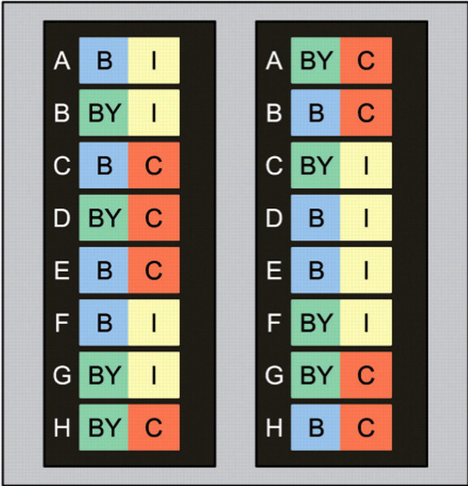
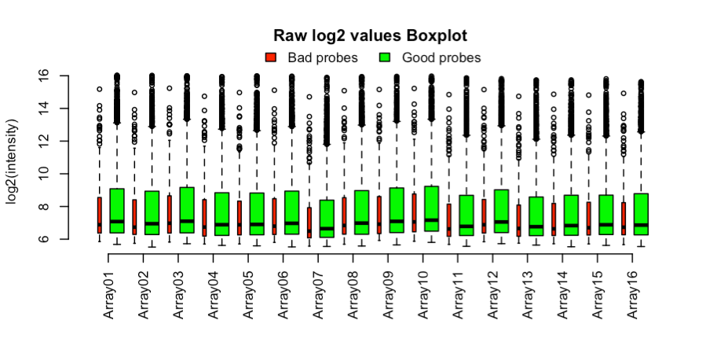
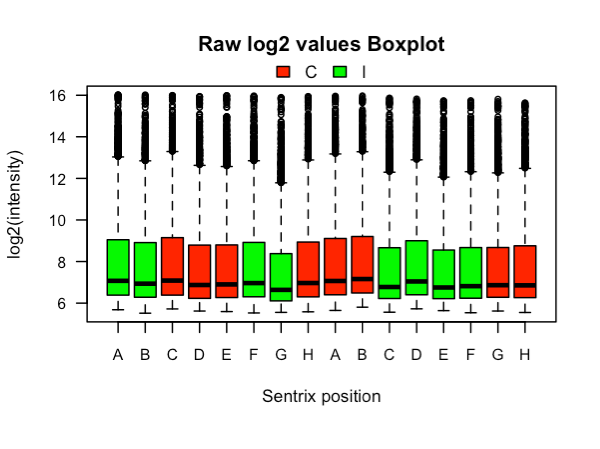
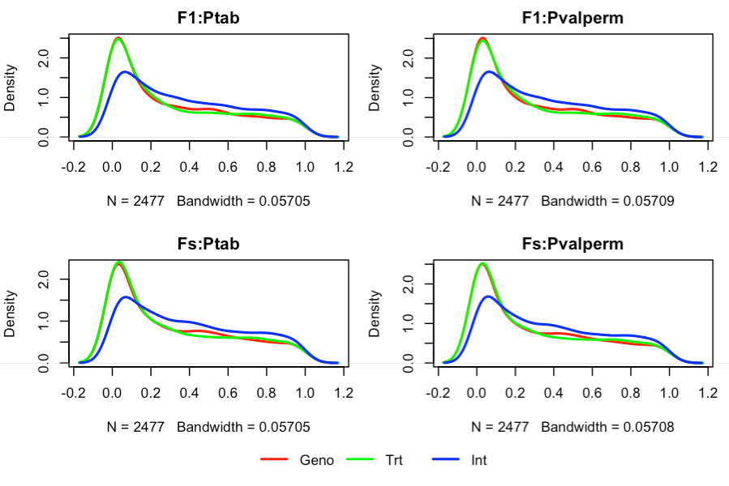
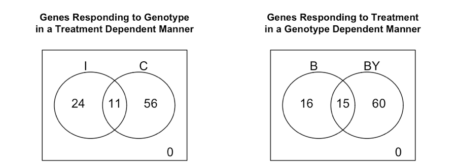

# Tutorial de análisis de expresión diferencial en R

## Ricardo A. Verdugo

### Acerca de este tutorial

  El  objetivo del tutorial es introducir técnicas de el análisis de datos de microarreglos para detectar **genes diferencialmente expresados (DE** por su sigla en inglés**)** producto de factores experimentales o de sus interacciones. Se presenta un flujo de trabajo de análisis completo utilizando el lenguaje R.  Aunque se utilizan varios paquetes de R durante el tutorial no intento cubrir toda la funcionalidad disponible en cada uno de ellos.  Consulte la documentación de cada paquete para obtener más detalles sobre las funciones desponibles en cada paquete o tutoriales más específicos. El contenido de este tutorial es responsabilidad exclusiva del autor y no ha sido respaldado por los autores de los paquetes de R aquí utilizados. 

### Descripción de los datos

  Este tutorial utilizará datos de perfiles de expresión génica en el tejido cardíaco de ratones.  El objetivo es evaluar el efecto de la variación genética en el cromosoma Y del ratón sobre el tamaño de los cardiomiocitos y la posible dependencia de tales efectos en niveles de testosterona.

  El diseño experimental fue el siguiente.  Se ensayaron ocho ratones machos adultos de dos cepas, C57BL/6J y C57BL/6J-chrY<A/J/NaJ> , denominadas B y BY de aquí en adelante.  De cada cepa (genotipo), cuatro animales fueron castrados y cuatro fueron intervenidos con el mismo procedimiento quirúrjuico, excepto que no se realizó la castración (animales intactos usados como control) .  El ARN se hibridizó a BeadChips Illumina MouseRef-8 v2.0 que contienen ocho microarreglos con 25,697 sondas cada uno.  Solo se seleccionaron arbitrariamente 5000 sondas para este tutorial (Figura 1).

  Objetivos del análisis de datos: 
  1) Determinar si existe expresión diferencial entre genotipos. 
  2) Determinar si existe expresión diferencial entre tratamientos. 
  3) Evaluar las diferencias en la respuesta al tratamiento entre los dos genotipos. 

  Para obtener más información sobre los datos y los resultados biológicos, consulte (Llamas et al. 2009) .  Para un análisis más técnico y una descripción de metodologías estadísticas y diseño experimental, ver (Verdugo et al. 2009) . 

  Para acelerar el tutorial, solo se incluyen las primeras 5000 sondas del micromicroarreglo.  El conjunto de datos completo está disponible en la base de datos GEO por ID GSE15354 en  http://www.ncbi.nlm.nih.gov/geo/query/acc.cgi?acc=GSE15354.

 

**Figura 1**. Diseño de las hibridaciones de muestras por chip y dentro de chip.  Los colores representan el genotipo [azul = C57BL/6J (B);  verde = C57BL/6J-chrY<A/J/NaJ> (BY) y tratamiento de castración [amarillo = intacto (I);  rojo = castrado (C)]. 

### Ubicación de los archivos del tutorial
Los *scripts* y datos necesarios para ejecutar este tutorial se encuentran disponibles en [DE_tutorial](DE_tutorial). Si ejecuta el tutorial en el servidor `genoma`, podrá encontrar el tutorial descomprimido en el directorio `DE_tutorial` del `home`.

### Antes de ejecutar el tutorial

  Para seguir este tutorial, necesitará ***R*** (de preferencia una versión reciente) y varios paquetes.  Puede obtener ***R*** en http://cran.r-project.org.  Siga las instrucciones para instalar ***R*** en su sistema operativo.  Deberá instalar también los siguientes paquetes, disponibles en Bioconductor (http://www.bioconductor.org): 

1.   org.Mm.eg.db 
2.   preprocessCore 
3.   maanova 
4.   limma 
5.   topGO 

  Para facilitar esto, puede ejecutar un script proporcionado con el tutorial que automatiza la instalación de estos paquetes.  Una vez en R, cambie el directorio de trabajo a la carpeta del tutorial y escriba: 

```R
> source("install_packages.R", echo=T)
```
*Nota:* este paso no es necesario si ejecuta el tutorial en el servidor `genoma`.

### Ejecutar el análisis completo

  Puede ejecutar el flujo completo k análisis WOR por “fuente” de Tutorial_DE.R *script* desde el directorio del tutorial (es decir, la carpeta): 
1.   Descomprima el archivo DE_tutorial.zip en algún lugar de su computadora. 
2.   R abierta. 
3.   Cambie el directorio de trabajo a la ubicación del tutorial.  Por ejemplo, si lo colocó en su casa, escriba: 
```R
> setwd("~/DE_tutorial.R") 
```
4.   Ejecute la secuencia completa de comandos de R escribiendo esto en la consola: 
```R
> source("Tutorial_DE.R", echo=T, max.deparse.length=9000)
```
  El código en el script y su salida se mostrarán en la consola R.  Las figuras y tablas generadas serán depositadas en el directorio llamado "resultados". 

### Ejecutando el tutorial paso a paso

  La mejor forma de aprender, es realizando el tutorial paso a paso, revisando en detalle lo que se está haciendo y el resultado obtenido. Le recominedo revisar la página de ayuda de las funciones utilizadas para entender qué están haciendo y para qué sirve cada cada argumento.  Con el fin de fa cilitar el ecuting los siguientes pasos, puede copiar y pegar la línea por línea del *script* Tutorial_DE.R. 

#### Preliminares
  Defina algunas constantes (es una buena práctica declararlas al comienzo de los scripts) .
```R
> outdir     <- "output"
> fdr_th     <- 0.2 # Proporción de descubrimientos falsos que son aceptables 
```
  Lea un archivo que define algunas funciones que son necesarias para el análisis . 
```R
> source("Rfxs.R")
```
  Crear un directorio de salida , si no existe. 
```R
> if(!file.exists(outdir)) {
+  dir.create(outdir, mode = "0755", recursive=T)
+ }
```
  Lea los datos en bruto, es decir, no normalizados y tal cual fueron generados.  Los archivos de Illumina contienen muchos tipos diferentes de datos.  Los valores de intensidad, es decir, un indicador de la expresión del gen, se encuentran en la columna *AVG_Signal* (promedio entre esferas).  La columna *Detection.Pval* contiene valores *p* para la detección de transcritos, que se utilizarán para determinar si un gen se expresa.
```R
> Data.Raw  <- read.delim("Illum_data_sample.txt")
> signal    <- grep("AVG_Signal", colnames(Data.Raw)) # vector de columnas con datos 
> detection <- grep("Detection.Pval", colnames(Data.Raw)) # vector de columnas con valores p 
n.Pval", colnames (Data.Raw)) # 
```
  Importe las anotaciones de las sondas. 
```R
annot     <- read.delim("MouseRef-8_annot.txt")
```
  No todas las sondas muestran la misma calidad al ser alineadas contra el genoma de referencia.  Para obtener más información, consulte el documento ReMOAT (Barbosa-Morais et al. 2010) . 
```R
> table(annot$ProbeQuality)

        Bad        Good    Good****    No match     Perfect  Perfect*** Perfect**** 
        289          60          15           5        4468          53         110

```
  Agruparemos 'Bad' con 'No match' como ' Bad sones' y todo lo demás como 'Good probes'.
```R
 > probe_qc <- ifelse(annot$ProbeQuality %in% c("Bad", "No match"), "Bad probes",
+  "Good probes")
```
  Leer la tabla con el diseño de las hibridaciones. 
```R
> design <- read.csv("YChrom_design.csv")
> print(design)
   Array Sample_Name Sentrix_ID Sentrix_Position Genotype Treatment Group
1      1  CDR017-DIL 4340571022                A        B         I   B.I
2      2      CDR025 4340571022                B       BY         I  BY.I
3      3      CDR021 4340571022                C        B         C   B.C
4      4  CDR029-DIL 4340571022                D       BY         C  BY.C
5      5      CDR022 4340571022                E        B         C   B.C
6      6      CDR018 4340571022                F        B         I   B.I
7      7  CDR026-DIL 4340571022                G       BY         I  BY.I
8      8  CDR030-DIL 4340571022                H       BY         C  BY.C
9      9  CDR031-DIL 4340571033                A       BY         C  BY.C
10    10      CDR023 4340571033                B        B         C   B.C
11    11  CDR027-DIL 4340571033                C       BY         I  BY.I
12    12      CDR019 4340571033                D        B         I   B.I
13    13      CDR020 4340571033                E        B         I   B.I
14    14  CDR028-DIL 4340571033                F       BY         I  BY.I
15    15  CDR032-DIL 4340571033                G       BY         C  BY.C
16    16      CDR024 4340571033                H        B         C   B.C
```
  Luego, los cuatro grupos experimentales se pueden denotar por BC, BI, BY.C y BY.I. 

#### Control de calidad
  Crea gráicos de cajas coloreados por la calidad de la sonda.  La salida está en la Figura 2. 
```R
> palette(rainbow(4))
> alabel <- sprintf("Array%02i", 1:length(signal))
> afact  <- factor(rep(alabel, each=nrow(Data.Raw)))
> qcfact <- factor(rep(probe_qc, length(signal)))
> png(file.path(outdir,"boxplot_raw_probe_qc.png"), width=6.5, height=4, unit="in", res=150)
+  par(xpd=NA, mar= c(6.1, 5.1, 4.1, 2.1), cex=.7, las=3)
+  boxplot(unlist(log2(Data.Raw[,signal]))~qcfact+afact, horiz=T, main="Raw log2 values Boxplot",
+          col=rep(1:2, length(signal)), axes=F, varwidth=TRUE)
+  axis(1, at=seq(1, length(signal)*2, by=2)+.5, labels=alabel)
+  axis(2)
+  legend("top", legend=levels(qcfact), fill=1:2, ncol=2, xjust=.5, bty="n", inset=-.1)
> dev.off()
```

  Crea cuadros de caja de colores por tratamiento.  La  salida se muestra en la Figura 3. La posición de las matrices, desde A a  H, se muestra en el eje x porque las matrices de Illumina pueden tener  un efecto de posición, con una mayor intensidad en las primeras  posiciones y una más baja en las últimas (Verdugo et al. 2009) .  Este fue el caso en este experimento, aunque el efecto no es obvio en el subconjunto de 5000 sondas utilizadas en este tutorial. 

```R
> png(file.path(outdir,"boxplot_raw_treatment.png"), width=4, height=4, unit="in", res=150)
> par(xpd=NA, mar= c(6.1, 4.1, 4.1, 2.1), cex=.7)
> boxplot(as.data.frame(log2(Data.Raw[,signal])), horiz=T, main="Raw log2 values Boxplot", las=1, col=design$Treatment, names=design$Sentrix_Position, cex.axis=.9)
> legend(8, 2.5, legend=levels(design$Treatment), fill=1:2, ncol=2, xjust=.5)
> dev.off()
```


  **Figura 2**. Diagramas de caja de datos sin procesar en escala log por microarreglo y calidad de sonda.  El ancho de las cajas es proporcional al número de sondas. 



**Figura 3.**    Diagramas de caja de datos en bruto por microarreglo. Las cajas están coloreadas según tratamiento. 

  Cree diagramas de dispersión de datos sin procesar en escala log2.  Salida no mostrada. 
```R
> png(file.path(outdir,"Pairs_scatter_log2.png"), width=8, height=8, unit="in", res=150)
> par(cex=.2, mar=c(2.1,2.1,2.1,1.1))
> pairs(log2(Data.Raw[,signal]), main="Log2 Raw Intensity Values", pch=".",  gap=.5, cex.labels=.5)
> dev.off()
```

#### Filtrado de la sonda por QC

  Las sondas de mala calidad tienden a tener una señal más baja que las sondas buenas. Por lo tanto se recomienda para eliminarlas. Hay 4706 sondas que permanecen después de este paso. 
```R
> Data.Raw <- Data.Raw[probe_qc %in% "Good probes",]
> annot    <- annot[probe_qc %in% "Good probes",]
```
  Crear un microarreglo de datos brutos. 
```R
> rawdata           <- as.matrix(Data.Raw[,signal])
> rownames(rawdata) <- Data.Raw$PROBE_ID
> colnames(rawdata) <- design$Sample_Name
```

#### Normalización de datos

  Cargue el paquete `preprocessCore` con funciones de normalización y aplique una normalización de *cuantiles* (hay otros métodos disponibles este y otros  paquetes como affy). 
```R
> library(preprocessCore)
> normdata           <- normalize.quantiles(rawdata) 
> colnames(normdata) <- colnames(rawdata)
> rownames(normdata) <- rownames(rawdata)
```
#### Filtrado de sondas

  Este paso tiene como objetivo eliminar las sondas que no detectaron trasncritos en ninguno de los grupos experimentales.  Tenga en cuenta que este paso puede ser opcional pero recomendado (McClintick y Edenberg 2006). 

  Crear una matriz de valores lógicos, T / F, usando las probabilidades de detección calculadas por BeadStudio (software Illumina para la extracción de características desde las imágenes). Cuente el número de valores T por nivel de `Group` y seleccione una sonda si el recuento es ≥ 2 (correspodiente 50% de las réplicas en este caso) en cualquier grupo experimental.  Luego aplique el vector de filtrado a las matrices de datos y de anotaciones. 
```R
> probe_present      <- Data.Raw[,detection] < 0.04
> detected_per_group <- t(apply(probe_present, 1, tapply, design$Group, sum))
> present  <- apply(detected_per_group >= 2, 1, any)
> normdata <- normdata[present,]
> annot    <- annot[present, ]
```

#### Prueba de expresión diferencial

  Cargue el paquete MAanova y cree un objeto de clase `madata` que solo incluye sondas que detectaron transcritos. Este objeto almacena tanto la matriz de datos como de tabla de diseño.
```R
> library(maanova)
> madata <- read.madata(normdata, design, log.trans=T)
```
  Ajustar el modelo. 
```R
> fit.fix <- fitmaanova(madata, formula=~Group)
```
  Estime algunas estadísticos básicos para cada grupo experimental para ser incluidas en la tabla final de los resultados. 
```R
> Means           <- t(apply(madata$data, 1, tapply, design$Group, mean)) 
> colnames(Means) <- paste("Mean", colnames(Means), sep=":")
> SEs             <- t(apply(madata$data, 1, tapply, design$Group, function(x) sqrt(var(x)/length(x))))
> colnames(SEs)   <- paste("SE", colnames(SEs), sep=":")
```

#### Construya una matriz de contrastes de interés

  Dado que este estudio utilizó un diseño factorial, es posible hacer diferentes preguntas a partir de los datos.  Cada pregunta puede ser puesta a prueba por una contraste entre grupos experimentales.  La función `matest` del paquete R/MAanova puede  utilizar una matriz de contrastes y evaluar si esas comparaciones explican una proporción significativa de la varianza en los datos de expresión.  Definamos algunos términos para simplificar la nomenclatura. 

  Término     | Descripción 
          ---|:---
  Geno                | genotipo 
  Trt                     | tratamiento 
  Int                     | interacción genotipo x tratamiento 
  Geno_I              | efecto genotipo en animales intactos (no castrados)
  Geno_C            |  efecto genotipo en animales castrados
  Trt_B                 |  efecto del tratamiento en el genotipo B 
  Trt_BY               | efecto del tratamiento en el genotipo BY 

  Los  contrastes son vectores de coeficientes que cuando se multiplican con un vector de promedios por grupo experimental, crean contrastes que pueden evaluarse estadísticamente.  Para crear los vectores de coeficientes de contraste, asuma que los grupos experimentales están ordenados alfabéticamente.

  Ahora, construya un matriz de contrastes donde las filas son contrastes y las columnas son grupos experimentales: 
```R
#                            B.C  B.I BY.C BY.I
> cmat <- rbind(Geno     =  c( 1,   1,  -1,  -1 )*.5,
+               Trt      =  c( 1,  -1,   1,  -1 )*.5,
+               Int      =  c( 1,  -1,  -1,   1 ),
+               Geno_I   =  c( 0,   1,   0,  -1 ),
+               Geno_C   =  c( 1,   0,  -1,   0 ),
+               Trt_B    =  c( 1,  -1,   0,   0 ),
+               Trt_BY   =  c( 0,   0,   1,  -1 ),
+               B.C_BY.I =  c( 1,   0,   0,  -1 ),
+               B.I_BY.C =  c( 0,   1,  -1,   0 ))
```
  Podemos usar estos contrastes para calcular algunas razones (conocidas como *fold change* en inglés y abreviado por *FC*) que pueden ser de interés.  Calculemos el producto matricial de medias por grupo con la transpuesta de la matriz de contrastes. El resultado es una matriz de diferencias entre grupos en la escala logarítmica. 
```R
> logDiff  <- Means %*% t(cmat)
```
  Transforme las diferencias de registro a la escala FC (la función `lofdiff2FC` está definida en Rfxs.R) . 
```R
> FC <- apply(logDiffs, 2, logdiff2FC)
```
  Pruebe cada contraste utilizando 200 permutaciones de las muestras.  En una situación real se recomiendan al menos 1.000 permutaciones.  Las pruebas de *F* se realizarán utilizando una estimación de  varianza residual por sonda (*F1*) y una estimación basada en contracción de varianza residual que utiliza información de múltiples sondas (*Fs*) (Cui et al. 2005) . 
```R
> test.cmat <- matest(madata, fit.fix, term="Group", Contrast=cmat, n.perm=200, 
+                     test.type = "ttest", shuffle.method="sample", verbose=TRUE)
Doing F-test on observed data ...
Doing permutation. This may take a long time ... 
Finish permutation #  100 
Finish permutation #  200 
```
  Los nombres de los contrastes no se guardan en la microarreglo de los resultados de la permutación, por lo que vamos a copiarlos de la microarreglo de valores *p* tabulares (error en R/MAanova ). 
```R
> colnames(test.cmat$Fs$Pvalperm) <- colnames(test.cmat$Fs$Ptab)
```
  Control de comparaciones múltiples usando transformación FDR:
```R
> test.cmat <- adjPval(test.cmat, method="adaptive")
```
  Grafique los valores de *p* comparando diferentes formas de calcularlos ( consulte `?matest`).  El resultado se muestra en la Figura 4. 
```R
> png(file.path(outdir,"P-values Hist.png"), width=6, height=6, unit="in", res=150)
> par(mfrow=c(2,2), oma=c(2,0,2,0), cex=.8, xpd=NA)
> palette(rainbow(3))
> plot(density(test.cmat$F1$Ptab[,1]), col=1, main="F1:Ptab", lwd=2)
> lines(density(test.cmat$F1$Ptab[,2]), col=2, lwd=2)
> lines(density(test.cmat$F1$Ptab[,3]), col=3, lwd=2)

> plot(density(test.cmat$F1$Pvalperm[,1]), col=1, main="F1:Pvalperm", lwd=2)
> lines(density(test.cmat$F1$Pvalperm[,2]), col=2, lwd=2)
> lines(density(test.cmat$F1$Pvalperm[,3]), col=3, lwd=2)

> plot(density(test.cmat$Fs$Ptab[,1]), col=1, main="Fs:Ptab", lwd=2)
> lines(density(test.cmat$Fs$Ptab[,2]), col=2, lwd=2)
> lines(density(test.cmat$Fs$Ptab[,3]), col=3, lwd=2)

> plot(density(test.cmat$Fs$Pvalperm[,1]), col=1, main="Fs:Pvalperm", lwd=2)
> lines(density(test.cmat$Fs$Pvalperm[,2]), col=2, lwd=2)
> lines(density(test.cmat$Fs$Pvalperm[,3]), col=3, lwd=2)

> legend(-.5, -1.6, legend=c("Geno", "Trt", "Int"), col=1:3,lwd=2,xjust=.5,ncol=3,xpd=NA)
> dev.off()
```


  **Figura 4**. Densidad de la distribución de los valores de *p*. Ptab: tabular, Pvalperm: permutación, F1: prueba de *F* convencional, Fs: prueba de *F* con contracción de la varianza usando información de múltiples sondas (técnica para aumentar el poder de la prueba). 

  Resuma en una tabla los resultados para todas los transcriptos presentes.  Exportaremos solo los resultados de las pruebas `Fs` y los vapores `Pvalperm` de permutaciones.
```R
> results <- data.frame(annot, Means, SEs, F_val=test.cmat$Fs$Fobs,
+                       P_val=test.cmat$Fs$Pvalperm, FDR=test.cmat$Fs$adjPvalperm, FC=FC)
```
  Exportar todos los resultados.  Puede abrir DE_results.csv en Excel o Calc OpenOffice . 
```R
> write.table(results, file=file.path(outdir,"DE_results.csv"), sep=",", row.names=F)
```


#### Contar genes expresados diferencialmente

  En este experimento, una pregunta de interés fue cuántos genes responden de manera diferente al tratamiento de la castración en los dos genotipos. En otras palabras, ¿existe un efecto de interacción entre el genotipo y el tratamiento sobre la expresión génica en los cardiomiocitos? En segundo lugar, es interesante evaluar la naturaleza de la interacción.  ¿Ambos genotipos responden al tratamiento pero en direcciones opuestas?  ¿O el tratamiento tiene un efecto en uno de los genotipos y no en el otro?  Para responder a la primera pregunta, se podría contar el número de sondas que muestran un efecto significativo para el contraste Int, es decir, el número de sondas que tienen un FDR por debajo de un umbral para la prueba Int.Pvalperm.  Si aún no sabe cómo calcular esto en R, abra el archivo DE_results.csv un editor de hoja de cálculo como Calc OpenOffice y use filtros para calcular este número.  Luego trate de hacer esto en R y compare los resultados. 

  Para responder la segunda pregunta, podemos usar los diagramas de Venn. Queremos  contar el número de genes que se seleccionan en cada genotipo, pero solo entre aquellos que muestran un efecto de interacción significativo. 

  Advierta que los genes están representados por múltiples sondas en esta plataforma de microarreglos. Es  una buena idea contar los genes solo una vez, pero hay que decidir cómo contar un gen cuando diferentes sondas dan diferentes señales, es  decir, una está diciendo que el gen está seleccionado, mientras que la  otra dice que no.  Esta plataforma se basó en RefSeq  (http://www.ncbi.nlm.nih.gov/RefSeq/), que es una base de datos curada de transcriptos de referencia para genes conocidos y se diseñó para evitar la redundancia (http://www.illumina.com/products/mouseref-8_expression_beadchip_kits_v2.ilmn).  Por lo tanto, asumiremos que cada sonda está probando diferentes señales biológicas, y no una medida repetida de la mismo transcripto.  Contaremos un gen como seleccionado si se selecciona alguno de los transcriptos (sondas).  Para  otras plataformas donde las sondas proporcionan mediciones repetidas  para la misma transcripción, uno puede querer usar un enfoque de votación o promedios para resumir los resultados a nivel génico. 

  El  segundo tema a considerar es qué hacer con las sondas no anotadas, es  decir, aquellas que no se pueden anotar con ningún gen en la base de  datos de EntrezGene.  Aquí consideraremos cada una de ellos como un gen separado, aunque en una aplicación real, uno puede querer mejorar la anotación del gen utilizando fuentes alternativas como las bases de datos Ensembl o UCSC Genome Browser. 

  Crear un identificador del gen basado en EntrezGene y utilizar el ID de la sonda cuando no esté asociada a un gen:
```R
> results$GeneID <- results$EntrezID
> results$GeneID[is.na(results$GeneID)] <- results$ProbeID[is.na(results$GeneID)]
```
  Cuente las sondas seleccionadas por expresión diferencial por genotipo, tratamiento y/o interacción:
```R
> Probes.DE <- results[, c("FDR.Geno", "FDR.Trt", "FDR.Int")]  <= fdr_th
> Genes.DE  <- apply(Probes.DE, 2, tapply, results$GeneID, any)
```
  Ahora  cuente los genes significativos para comparaciones específicas de manera de determinar la dirección de las diferencias cuando la interacción es significativa. Debido a que estamos interesados en los genes que muestran una interacción, no podemos usar el contraste Geno, ya que prueba el efecto marginal del genotipo en todos los tratamientos.  En otras palabras, prueba los efectos que son consistentes en ambos tratamientos.  Este contraste puede ser cero incluso si el genotipo tiene efectos significativos y de magnitud idéntica en ambos tratamientos pero con signos opuestos.  Los mismo podría ocurrir para los efectos del tratamiento en cada genotipo.  Por lo tanto, necesitamos usar los contrastes que prueban las diferencias de genotipo dentro de cada nivel de tratamiento, y viceversa.

  Usando solo las sondas seleccionadas por efectos de interacción, cuente las sondas significativas para el efecto de genotipo en ratones intactos (I) y/o castrados (C) . 
```R
> Probes.Int_Geno <- results[results$FDR.Int <= fdr_th, 
+                            c("FDR.Geno_I", "FDR.Geno_C")] <= fdr_th
> Genes.Int_Geno  <- apply(Probes.Int_Geno, 2, tapply, 
+                          results$GeneID[results$FDR.Int <= fdr_th], any)
```
  Usando  solamente sondas seleccionadas por efectos de interacción, cuente  las sondas significativas para el efecto de tratamiento en ratones del genotipo B y/o del genotipo BY. 
```R
> Probes.Int_Trt  <- results[results$FDR.Int <= fdr_th,
+                            c("FDR.Trt_B", "FDR.Trt_BY")]  <= fdr_th
> Genes.Int_Trt   <- apply(Probes.Int_Trt, 2, tapply,
+                          results$GeneID[results$FDR.Int <= fdr_th], any)
```
  Cargue la librería `limma` para crear diagramas de Venn.  Contar genes para cada combinación de efectos marginales y de interacción. 
```R
> library(limma)
> Counts.DE <- vennCounts(Genes.DE)

> print(Counts.DE)
     FDR.Geno FDR.Trt FDR.Int Counts
[1,]        0       0       0    663
[2,]        0       0       1     29
[3,]        0       1       0    401
[4,]        0       1       1     27
[5,]        1       0       0    390
[6,]        1       0       1     42
[7,]        1       1       0    292
[8,]        1       1       1     60
attr(,"class")
[1] "VennCounts"
```
  Contar los genes DE entre niveles de un factor condicional en el otro factor. 
```R
> Counts.Int_Geno <- vennCounts(Genes.Int_Geno)

> print(Counts.Int_Geno)
     FDR.Geno_I FDR.Geno_C Counts
[1,]          0          0      3
[2,]          0          1    110
[3,]          1          0     31
[4,]          1          1     14
attr(,"class")
[1] "VennCounts"

> Counts.Int_Trt  <- vennCounts(Genes.Int_Trt) 

> print(Counts.Int_Trt)
     FDR.Trt_B FDR.Trt_BY Counts
[1,]         0          0      1
[2,]         0          1    101
[3,]         1          0     34
[4,]         1          1     22
attr(,"class")
[1] "VennCounts"
```
  Graficar los genes DE por efectos marginales o de interacción.  La salida se muestra en la Figura 5. 
```R
> png(file.path(outdir, "vennDiagram_DiffExprs.png"), width=3.5, height=3, unit="in", res=150)
> par(cex=.7)
> vennDiagram(Counts.DE, names=c("Geno", "Trt", "Int"), 
+             main="\n\n\nDifferentially Expressed Genes")
> dev.off()
```


  **Figura 5**. Genes DE por efectos marginales y de interacción. 


  **Figura 6**. Genes DE por efectos de interacción, divididos por tratamiento (izquierda) y genotipo (derecha) . 

  Generación de Diagramas de Venn de los genes que responden al genotipo de manera dependiente del tratamiento y viceversa (el resultado se muestra en la Figura 6):
```R
> png(file.path(outdir, "vennDiagram_Int.png"), width=6.5, height=3, unit="in", res=150)
> par(mfrow=c(1,2), cex=.7)
> vennDiagram(Counts.Int_Geno, names=c("I", "C"), 
+             main="\n\n\nGenes Responding to Genotype\nin a Treatment Dependent Manner")
> vennDiagram(Counts.Int_Trt, names=c("B", "BY"),
+             main="\n\n\nGenes Responding to Treatment\nin a Genotype Dependent Manner")
> dev.off()
```

#### Interpretation de los Diagramas de Venn

  Ambas gráficos en la Figura 6 muestran la misma prueba de dos formas diferentes, es decir, el número de genes con efectos de interacción, pero repartidos ya sea por tratamiento o por genotipo.  Debido a que en la práctica estamos mostrando los resultados de cuatro pruebas diferentes (pero relacionadas), el número total de genes seleccionados en cada diagrama puede no ser exactamente el mismo, pero deberían estar de acuerdo en gran medida. 

  Aunque  los números aquí son pequeños porque usamos solo una pequeña muestra de sondas, verá que has más genes respondiendo al tratamiento en el genotipo BY que en el genotipo B. Además, se pueden observar más diferencias entre los genotipos en los animales castrados. Este fue el patrón observado en el conjunto de datos completo también. Ver Figura 4 de (Llamas et al. 2009) . 

#### Pruebas funcionales
  Utilizaremos el paquete `topGO` para investigar si existen procesos biológicos enriquecidos en los genes seleccionados para los efectos de interacción Genotipo x Tratamiento. 
```R
> library("topGO")
```
  Las sondas no anotadas no se pueden usar para el análisis de enriquecimiento, así que las eliminaremos 
```R
results   <- results[!is.na(results$EntrezID),]
```
  Sondas seleccionadas por interacción 
```R
probes.int <- results[, "FDR.Int"]  <= fdr_th
```
  Resumir por gen.  Se selecciona un gen si se selecciona cualquier transcripto. 
```R
genes.int <- tapply(probes.int, results$EntrezID, any)
```
  Convertir de lógico a vector de 0 (no seleccionado) o 1 (seleccionado) 
```R
genes.int <- ifelse(genes.int, 1, 0)
```
  Convertir a un factor 
```R
genes.int <- as.factor(genes.int)
```
  Cree un objeto de datos de clase *topGO*, que contiene todo lo necesario para el enriquecimiento de las pruebas. 
```R
> GOdata <- new("topGOdata", ontology="BP", allGenes=genes.int,
+               description="Genes DE by Trt by GenoInteraction", nodeSize=5,
+               annotationFun=annFUN.org, mapping="org.Mm.eg.db", ID="entrez")               
```
  Pruebe si existe enriquecimiento de términos GO utilizando una prueba exacta de Fisher.  Usaremos dos algoritmos, la prueba clásica de término por término y el algoritmo " elim " , que tiene en cuenta la jerarquía de los términos GO para evitar la redundancia.  Para obtener detalles sobre estas y otras pruebas disponibles en topGO, consulte la documentación del paquete y (Alexa et al. 2006) . 
```R
> resultFisher.classic <- runTest(GOdata, algorithm = "classic", statistic = "fisher")
> resultFisher.elim    <- runTest(GOdata, algorithm = "elim", statistic = "fisher")

> GO_BP_Table <- GenTable(GOdata, , topNodes = 20, Fisher.classic=resultFisher.classic, 
+                         Fisher.elim=resultFisher.elim, 
+                         orderBy = "Fisher.elim", ranksOf = "Fisher.classic")

> print(GO_BP_Table)
        GO.ID                                        Term Annotated Significant Expected
1  GO:0001934 positive regulation of protein phosphory...        11           5     0.85
2  GO:0030334                regulation of cell migration        23           7     1.79
3  GO:0050730 regulation of peptidyl-tyrosine phosphor...         6           3     0.47
4  GO:0006357 regulation of transcription from RNA pol...        41           8     3.19
...
17 GO:0065008            regulation of biological quality       140          18    10.88
18 GO:0003008                              system process        72          11     5.60
19 GO:0048523     negative regulation of cellular process       142          18    11.04
20 GO:0030154                        cell differentiation       113          15     8.78
   Rank in Fisher.classic Fisher.classic Fisher.elim
1                       1        0.00083     0.00083
2                       3        0.00126     0.00126
3                      20        0.00772     0.00772
4                      23        0.01153     0.01153
...
17                     36        0.01965     0.01965
18                     37        0.02050     0.02050
19                     38        0.02248     0.02248
20                     39        0.02490     0.02490
```
  Algunas líneas fueron eliminadas por brevedad.  Tenga en cuenta que los resultados del análisis de enriquecimiento de GO term son solo para fines de demostración.  Este  tutorial se realizó en una lista arbitraria de 5000 sondas y, por lo  tanto, los principales términos de BP que se muestran aquí no son  representativos del conjunto de términos enriquecidos en el conjunto de  datos completo. 

  Ahora e xporte la tabla completa de los principales términos del formato CSV de GO (puede abrirse en Excel o Calc OpenOffice ) . 

```R
> write.table(GO_BP_Table, file.path(outdir, "GO_BP_Table.csv"), sep=",", 
+  row.names=F)
```

  ***¡Felicidades!***  Ha completado este tutorial.  Ahora puede usar el *script* de este tutorial como plantilla y modificarlo para el análisis de sus propios datos. 

### Referencias
  Alexa, Adrian, Jörg Rahnenführer y Thomas Lengauer.  2006.  "Mejora de la puntuación de los grupos funcionales a partir de los  datos de expresión génica al decorrelar la estructura del gráfico GO".  Bioinformática (Oxford, Inglaterra) 22: 1600-1607. 

  Barbosa-Morais, Nuno L, Mark J Dunning, Shamith A Samarajiwa, Jeremy FJ Darot, Matthew E Ritchie, Andy G Lynch y Simon Tavaré.  2010.  "Una canalización de recotización para Illumina BeadArrays: mejora la  interpretación de los datos de expresión génica". Nucleic Acids Research  38: e17. 

  Cui, X., J. T Hwang, J. Qiu, N. J Blades y G. A Churchill.  2005.  "Pruebas estadísticas mejoradas para la expresión génica diferencial al  reducir las estimaciones de los componentes de la varianza". Bioestadística 6: 59-75. 

  Llamas, Bastien, Ricardo A Verdugo, Gary A Churchill y Christian F Deschepper.  2009.  "Las variantes del cromosoma Y de diferentes cepas de ratones  consanguíneos están relacionadas con las diferencias en las respuestas  morfológicas y moleculares de las células cardíacas a la testosterona  pospúber". 

  McClintick, J. N, y H. J Edenberg.  2006. "Efectos del filtrado por la presente llamada en el análisis de experimentos de microarrays". BMC Bioinformatics 7: 49. 

  Verdugo, Ricardo A., Christian F. Deschepper, Gloria Muñoz, Daniel Pompa y Gary A. Churchill.  2009. “Importancia de la aleatorización en diseños experimentales de micromatrices con plataformas Illumina”. Nucl.  Acidos Res.  37: 5610-8. 

### Tarea
1. Obtener la matriz completa de datos desde GEO, ver link en la [Descripción de los datos](#Descripción-de-los-datos).
2. Importar la matriz en R, seleccionar aleatoriamente 5000 filas y exportar el subset de datos en un archivo plano separado por tabulaciones.
3. Ejecute este tutorial, pero con algunos cambios:
   1. usando su matriz de datos en vez de la usada en la demostración.
   2. En vez de considerar un transcrito presente si la sonda lo detectó en el 50% de las muestras de cualquier grupo experimental, hágalo cuando se detectó en al menos el 25% de las muestras de **todos** grupos experimentales. 
   3. En vez de usar 200 permutaciones, use 500.
   4. En vez de usar un FDR 0.2, use uno de 0.19.
   5. En vez de seleccionar un gen si cualquier sonda asociada al gen está seleccionada, hágalo solo cuando **todas** las sondas lo están.
4. Genere un reporte usando Markdown o Rmarkdown si usa Rstudio.
5. En este documento se explica cada comando del tutorial pero esto no es necesario en su reporte. Éste, debe estar enfocado al análisis de los datos. Muestre los comandos más importantes y enfóquese en los resultados y en su interpretación correcta.
